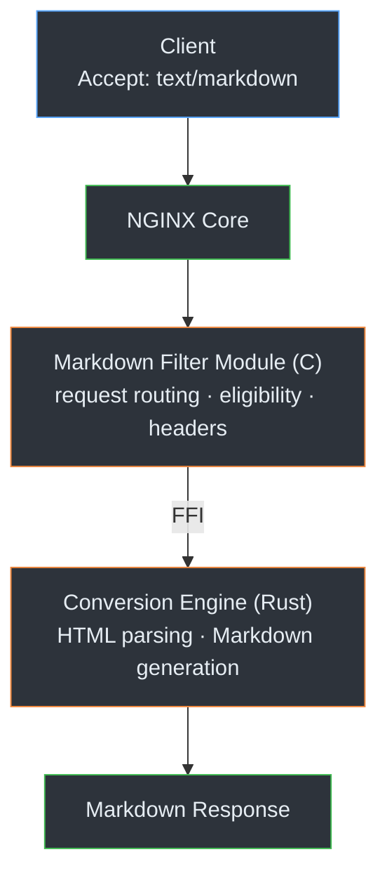

# NGINX Markdown for Agents

[](https://github.com/cnkang/nginx-markdown-for-agents/actions/workflows/ci.yml) [](https://github.com/cnkang/nginx-markdown-for-agents/actions/workflows/codeql.yml) [](https://snyk.io/test/github/cnkang/nginx-markdown-for-agents) [](https://github.com/cnkang/nginx-markdown-for-agents/blob/main/LICENSE) [](https://github.com/cnkang/nginx-markdown-for-agents/blob/main/docs/guides/INSTALLATION.md) [](https://github.com/cnkang/nginx-markdown-for-agents/releases)

English | [简体中文](README_zh-CN.md)

An NGINX filter module that converts HTML responses to Markdown on the fly — so AI agents can consume your web content without scraping.

> Inspired by Cloudflare's [Markdown for Agents](https://blog.cloudflare.com/markdown-for-agents/). This project brings the same idea to any NGINX deployment you control.

## Why?

AI agents fetch web pages as HTML, but raw HTML is expensive for LLMs:

- Boilerplate markup wastes tokens
- Useful content is buried in navigation, scripts, and layout noise
- Every client ends up writing its own HTML-to-text pipeline

This module adds a Markdown variant to your existing pages via standard HTTP content negotiation. Clients send `Accept: text/markdown`, and NGINX returns clean Markdown. No backend changes, no scraping, no extra services.

```
Browser  → Accept: text/html     → HTML (unchanged)
AI Agent → Accept: text/markdown → Markdown ✨
```

## 60-Second Install

For official NGINX builds (PPA, Alpine, Docker images):

```bash
curl -sSL https://raw.githubusercontent.com/cnkang/nginx-markdown-for-agents/main/tools/install.sh | sudo bash
sudo nginx -t && sudo nginx -s reload
```

The script auto-detects your NGINX version, downloads the matching binary, wires up `load_module` and `markdown_filter on;` for you.

**Verify it works:**

```bash
# Should return Content-Type: text/markdown
curl -sD - -o /dev/null -H "Accept: text/markdown" http://localhost/

# Should still return Content-Type: text/html
curl -sD - -o /dev/null -H "Accept: text/html" http://localhost/
```

→ Building from source? See [Installation Guide](docs/guides/INSTALLATION.md).

## Minimal Configuration

```nginx
load_module modules/ngx_http_markdown_filter_module.so;

http {
    server {
        listen 80;

        location /docs/ {
            markdown_filter on;
            proxy_set_header Accept-Encoding "";
            proxy_pass http://backend;
        }
    }
}
```

Start narrow (`markdown_filter on;` on one route), verify, then expand. For production patterns with global enablement, PHP-FPM, gzip, and path exceptions, see [Deployment Examples](docs/guides/DEPLOYMENT_EXAMPLES.md).

## How It Works



### Why C + Rust?

- C is the native language for NGINX modules — request phases, filter chains, buffer management all live here.
- Rust handles the heavy lifting: HTML parsing and Markdown generation benefit from memory safety and strong type guarantees.
- The FFI boundary is clean and stable (`cbindgen`-generated). Operators keep normal NGINX deployment patterns; the Rust converter is just a linked library.

## Key Features

| Feature | Description |
|---------|-------------|
| Content Negotiation | `Accept: text/markdown` triggers conversion; all other requests pass through unchanged |
| Automatic Decompression | Handles gzip/brotli/deflate from upstream transparently |
| ETag Generation | BLAKE3-based ETags for cache-friendly Markdown variants |
| Conditional Requests | Full `If-None-Match` / `If-Modified-Since` support |
| Fail-Open / Fail-Closed | `markdown_on_error pass` or `block` — your choice |
| Size & Timeout Limits | `markdown_max_size` and `markdown_timeout` protect against runaway conversions |
| Security Sanitization | XSS, XXE, SSRF prevention built into the converter |
| Token Estimation | Optional token count in response metadata |
| YAML Front Matter | Optional structured metadata header in output |
| Metrics Endpoint | Built-in conversion metrics via `markdown_metrics` directive |

## Testing

```bash
# Quick smoke test
make test

# Full Rust test suite
cd components/rust-converter && cargo test --all

# NGINX module unit tests (examples)
make -C components/nginx-module/tests unit-eligibility
make -C components/nginx-module/tests unit-headers
```

## Documentation

| What you need | Where to go |
|---------------|-------------|
| Install & deploy | [Installation Guide](docs/guides/INSTALLATION.md) |
| NGINX config examples | [Deployment Examples](docs/guides/DEPLOYMENT_EXAMPLES.md) |
| All directives | [Configuration Guide](docs/guides/CONFIGURATION.md) |
| Monitoring & troubleshooting | [Operations Guide](docs/guides/OPERATIONS.md) |
| Build from source | [Build Instructions](docs/guides/BUILD_INSTRUCTIONS.md) |
| FAQ | [FAQ](docs/FAQ.md) |
| Feature details | [docs/features/](docs/features/) |
| Project status | [Project Status](docs/project/PROJECT_STATUS.md) |
| Contributing | [CONTRIBUTING.md](CONTRIBUTING.md) |
| Changelog | [CHANGELOG.md](CHANGELOG.md) |

## Project Structure

```
├── components/
│   ├── rust-converter/     # Rust HTML→Markdown library (html5ever, BLAKE3)
│   └── nginx-module/       # NGINX C filter module + tests
├── docs/                   # Guides, features, testing, architecture
├── examples/nginx-configs/ # Ready-to-use NGINX config templates
├── tools/                  # Install script, CI helpers
└── Makefile                # Coordinated build system
```

## Roadmap

🟢 **v0.1.0 (current)** — Core functionality complete and released. HTML-to-Markdown conversion, content negotiation, ETag/conditional requests, security sanitization, metrics, token estimation, YAML front matter. See [CHANGELOG](CHANGELOG.md) for full details.

🔜 **Next**
- Performance benchmarking under production-scale workloads
- Streaming conversion (eliminate full-buffering requirement for large pages)
- Broader real-world deployment validation and hardening

🔮 **Exploring**
- External conversion service mode (offload conversion to a sidecar/remote service)
- Prometheus-native metrics export
- Configurable conversion profiles (e.g. minimal vs full-fidelity Markdown)

## License

BSD 2-Clause "Simplified" License. See [LICENSE](LICENSE).
