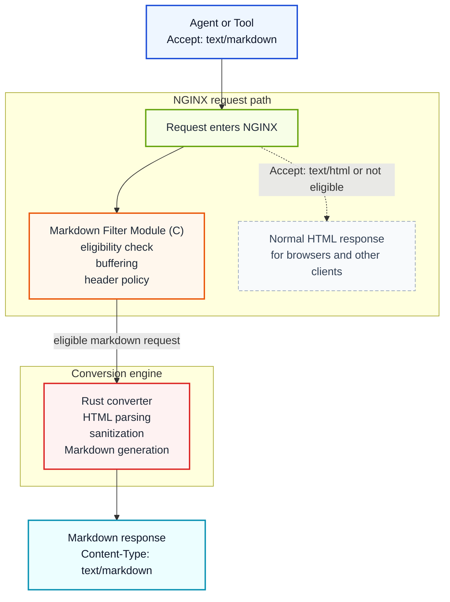

# NGINX Markdown for Agents

[](https://github.com/cnkang/nginx-markdown-for-agents/releases) [](https://github.com/cnkang/nginx-markdown-for-agents/blob/main/docs/guides/INSTALLATION.md) [](https://github.com/cnkang/nginx-markdown-for-agents/actions/workflows/ci.yml) [](https://github.com/cnkang/nginx-markdown-for-agents/actions/workflows/codeql.yml) [](https://github.com/cnkang/nginx-markdown-for-agents/blob/main/LICENSE)

[](https://snyk.io/test/github/cnkang/nginx-markdown-for-agents) [](https://sonarcloud.io/summary/new_code?id=cnkang_nginx-markdown-for-agents)

English | [Simplified Chinese](README_zh-CN.md)

Add a machine-friendly Markdown variant to the HTML pages you already serve through NGINX.

> HTML in. Markdown out. Only when the client asks for it.

Clients that send `Accept: text/markdown` get Markdown. Browsers and normal clients keep getting the original HTML. You do not need to rewrite your application, build a parallel API, or run a scraper beside your site.

This is a practical way to make existing sites easier for agents to consume while keeping deployment, caching, and rollback in the NGINX layer your team already operates.

> Inspired by Cloudflare's [Markdown for Agents](https://blog.cloudflare.com/markdown-for-agents/). This project brings the same operational idea to NGINX deployments you already control.

## What Problem This Solves

AI agents and LLM-powered tools often fetch pages that were built for browsers, not machines:

- HTML includes navigation, layout, scripts, and other noise that adds token cost.
- Useful content is mixed with markup that each client has to strip on its own.
- Teams end up maintaining ad hoc scraping or extraction pipelines for content they already serve.

This module moves that work into the web tier. NGINX negotiates the representation and returns Markdown only when the client asks for it.

```text
Browser      -> Accept: text/html      -> HTML (unchanged)
AI agent     -> Accept: text/markdown  -> Markdown
```

## Why Try It

- Reuse your existing pages and upstreams instead of building a second content pipeline.
- Keep rollout incremental: enable Markdown on one path, one server, or one location first.
- Stay inside standard HTTP behavior with content negotiation and normal caching semantics.
- Preserve operational familiarity: this is an NGINX module, not a separate daemon you must invent workflows around.

## At a Glance

| If you need... | This project gives you... |
|----------------|---------------------------|
| Agent-friendly content from an existing site | Markdown negotiated from your current HTML responses |
| Minimal application change | NGINX-side enablement with per-path control |
| Safe rollout | Fail-open mode, size limits, timeouts, and metrics |
| Cache-aware behavior | Variant `ETag`, `Vary: Accept`, and conditional-request support |

## Quick Start

Three steps are enough for a first trial:

1. Install the module.
2. Enable it on one location.
3. Verify that Markdown and HTML variants both behave as expected.

### 1. Install the module

```bash
curl -sSL https://raw.githubusercontent.com/cnkang/nginx-markdown-for-agents/main/tools/install.sh | sudo bash
sudo nginx -t && sudo nginx -s reload
```

The installer detects the local NGINX version, downloads the matching module artifact, and wires up the basic `load_module` integration for common official NGINX builds.

Building from source or using a custom NGINX build? Start with the [Installation Guide](docs/guides/INSTALLATION.md).
For official NGINX Docker image source builds, see `examples/docker/Dockerfile.official-nginx-source-build` and the Docker section in [docs/guides/INSTALLATION.md](docs/guides/INSTALLATION.md).

### 2. Enable Markdown on one route

```nginx
load_module modules/ngx_http_markdown_filter_module.so;

http {
    upstream backend {
        server 127.0.0.1:8080;
    }

    server {
        listen 80;

        location /docs/ {
            markdown_filter on;
            proxy_set_header Accept-Encoding "";
            proxy_pass http://backend;
        }
    }
}
```

`proxy_set_header Accept-Encoding "";` is the simplest starting point when your upstream may compress responses. Once the basic path works, you can move to the module's built-in compressed-response handling described in [Automatic Decompression](docs/features/AUTOMATIC_DECOMPRESSION.md).

### 3. Verify behavior

```bash
# Markdown variant
curl -sD - -o /dev/null -H "Accept: text/markdown" http://localhost/docs/

# Original HTML remains available
curl -sD - -o /dev/null -H "Accept: text/html" http://localhost/docs/
```

Expected result:

- `Accept: text/markdown` returns `Content-Type: text/markdown; charset=utf-8`
- `Accept: text/html` still returns the original HTML response

If you want a practical production-oriented configuration next, go straight to [docs/guides/DEPLOYMENT_EXAMPLES.md](docs/guides/DEPLOYMENT_EXAMPLES.md).

## When It Is a Good Fit

This project is a strong fit if you:

- already serve HTML through NGINX and want an agent-friendly representation with minimal backend changes
- need Markdown output for crawlers, internal agents, search assistants, or retrieval systems
- want to keep representation control and caching at the edge or reverse-proxy layer

It is a weaker fit if you:

- already have a purpose-built Markdown or JSON content API
- require true streaming Markdown conversion today for very large pages
- want transformation logic completely outside the request path

## What You Get

| Capability | What it does |
|------------|--------------|
| Content negotiation | Converts only when the client asks for `text/markdown` |
| HTML passthrough | Leaves normal browser traffic unchanged |
| Automatic decompression | Handles gzip, brotli, and deflate upstream responses |
| Cache-aware variants | Generates ETags and supports conditional requests |
| Failure policy control | Choose fail-open or fail-closed behavior |
| Resource limits | Bound conversion size and time with NGINX directives |
| Security sanitization | Applies XSS, XXE, and SSRF-oriented protections in the converter |
| Optional metadata | Supports token estimates and YAML front matter |
| Metrics endpoint | Exposes module conversion counters for operations |

## How It Works



The NGINX module handles request eligibility, buffering, and response header management. The Rust converter handles HTML parsing, sanitization, deterministic Markdown generation, and related transformation logic.

## Why C + Rust

The split follows the actual problem boundary.

- C is used where the code must integrate directly with NGINX's module APIs, filter chain, buffers, and request lifecycle.
- Rust is used where the code must parse untrusted HTML, normalize output, and evolve safely over time.
- The FFI boundary stays small so NGINX-facing HTTP logic and conversion logic can change with less coupling.

If you want the full design rationale rather than the short version, read [docs/architecture/SYSTEM_ARCHITECTURE.md](docs/architecture/SYSTEM_ARCHITECTURE.md) and [docs/architecture/ADR/0001-use-rust-for-conversion.md](docs/architecture/ADR/0001-use-rust-for-conversion.md).

If you are trying to understand how specific directives change runtime behavior, use [docs/architecture/CONFIG_BEHAVIOR_MAP.md](docs/architecture/CONFIG_BEHAVIOR_MAP.md).

## Test It Locally

```bash
# Fast build + smoke test
make test

# Full Rust test suite
make test-rust

# Full NGINX module unit suite
make test-nginx-unit
```

See [docs/testing/README.md](docs/testing/README.md) for integration, E2E, and performance-oriented test references.

## Documentation Map

| Goal | Document |
|------|----------|
| Install the module | [docs/guides/INSTALLATION.md](docs/guides/INSTALLATION.md) |
| Build from source | [docs/guides/BUILD_INSTRUCTIONS.md](docs/guides/BUILD_INSTRUCTIONS.md) |
| Configure directives | [docs/guides/CONFIGURATION.md](docs/guides/CONFIGURATION.md) |
| Start from deployment examples | [docs/guides/DEPLOYMENT_EXAMPLES.md](docs/guides/DEPLOYMENT_EXAMPLES.md) |
| Operate and troubleshoot | [docs/guides/OPERATIONS.md](docs/guides/OPERATIONS.md) |
| Understand architecture and design choices | [docs/architecture/README.md](docs/architecture/README.md) |
| Map directives to runtime behavior | [docs/architecture/CONFIG_BEHAVIOR_MAP.md](docs/architecture/CONFIG_BEHAVIOR_MAP.md) |
| Explore implementation details | [docs/features/README.md](docs/features/README.md) |
| Review testing references | [docs/testing/README.md](docs/testing/README.md) |
| Check project status | [docs/project/PROJECT_STATUS.md](docs/project/PROJECT_STATUS.md) |
| Contribute changes | [CONTRIBUTING.md](CONTRIBUTING.md) |

## Choose Your Path

- Evaluating the idea: start here, then read [docs/guides/DEPLOYMENT_EXAMPLES.md](docs/guides/DEPLOYMENT_EXAMPLES.md)
- Installing in a real environment: go to [docs/guides/INSTALLATION.md](docs/guides/INSTALLATION.md)
- Tuning behavior or policy: use [docs/guides/CONFIGURATION.md](docs/guides/CONFIGURATION.md)
- Operating in production: use [docs/guides/OPERATIONS.md](docs/guides/OPERATIONS.md)
- Understanding system design: use [docs/architecture/README.md](docs/architecture/README.md)
- Understanding what directives change in the runtime path: use [docs/architecture/CONFIG_BEHAVIOR_MAP.md](docs/architecture/CONFIG_BEHAVIOR_MAP.md)
- Reading implementation details: use [docs/features/README.md](docs/features/README.md)
- Validating changes: use [docs/testing/README.md](docs/testing/README.md)

## Repository Layout

```text
components/
  nginx-module/        NGINX filter module and NGINX-facing tests
  rust-converter/      HTML-to-Markdown engine and FFI layer
docs/                  User, operator, testing, and architecture docs
examples/nginx-configs/ Example configurations
tools/                 Installers, CI scripts, and developer tooling
Makefile               Top-level build and test entrypoints
```

## Roadmap

Current release focus:

- stable HTML-to-Markdown conversion in the NGINX request path
- cache-aware response handling and conditional requests
- operational safety features such as limits, sanitization, and metrics

Near-term areas of improvement:

- more production-scale benchmarking
- more deployment validation across environments
- future exploration of streaming-oriented conversion approaches

## License

BSD 2-Clause "Simplified" License. See [LICENSE](LICENSE).
