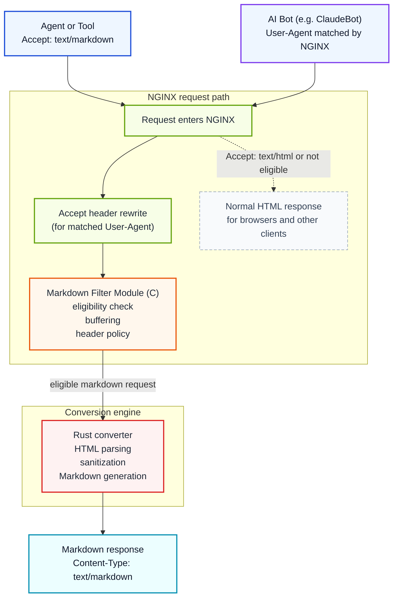

# NGINX Markdown for Agents

[](https://github.com/cnkang/nginx-markdown-for-agents/releases) [](https://github.com/cnkang/nginx-markdown-for-agents/blob/main/docs/guides/INSTALLATION.md) [](https://github.com/cnkang/nginx-markdown-for-agents/actions/workflows/ci.yml) [](https://github.com/cnkang/nginx-markdown-for-agents/actions/workflows/codeql.yml) [](https://github.com/cnkang/nginx-markdown-for-agents/blob/main/LICENSE) [](https://sonarcloud.io/summary/new_code?id=cnkang_nginx-markdown-for-agents)

English | [Simplified Chinese](README_zh-CN.md)

Add a machine-friendly Markdown variant to the HTML pages you already serve through NGINX.

> HTML in. Markdown out. When the client asks for it, or when you decide to serve it.

Clients that send `Accept: text/markdown` get Markdown. Browsers and normal clients keep getting the original HTML. You can also target specific bots by User-Agent — NGINX rewrites the Accept header for matching crawlers so they receive Markdown automatically, even if they never ask for it. You do not need to rewrite your application, build a parallel API, or run a scraper beside your site.

This is a practical way to make existing sites easier for agents to consume while keeping deployment, caching, and rollback in the NGINX layer your team already operates.

> Inspired by Cloudflare's [Markdown for Agents](https://blog.cloudflare.com/markdown-for-agents/). This project brings the same operational idea to NGINX deployments you already control, closer to the origin server where you have more control over content semantics.

## What Problem This Solves

AI agents and LLM-powered tools often fetch pages that were built for browsers, not machines:

- HTML includes navigation, layout, scripts, and other noise that adds token cost.
- Useful content is mixed with markup that each client has to strip on its own.
- Teams end up maintaining ad hoc scraping or extraction pipelines for content they already serve.

Unlike traditional search crawlers that index pages for keyword ranking, AI crawlers extract knowledge for answer generation. They are sensitive to token cost and semantic clarity — a typical HTML page can be 3× or more the token count of its Markdown equivalent, with most of the extra tokens carrying no useful content. For AI systems operating at scale, this cost difference adds up.

This module moves that work into the web tier. NGINX negotiates the representation and returns Markdown when the client asks for it. You can also configure NGINX to serve Markdown to specific bots by User-Agent, so crawlers that never send `Accept: text/markdown` still get a clean, token-efficient representation. Many sites — documentation portals, blogs, developer wikis — already author content in Markdown and render it to HTML for browsers. For these sites, the conversion is effectively recovering the original authoring format.

This follows the HTTP content negotiation model that has always been part of the protocol: the same URL serves different representations to different clients based on what they ask for.

```text
Browser      -> Accept: text/html      -> HTML (unchanged)
AI agent     -> Accept: text/markdown  -> Markdown
AI bot (by User-Agent)                 -> Markdown (via NGINX config)
```

## Why Try It

- Reuse your existing pages and upstreams instead of building a second content pipeline.
- Keep rollout incremental: enable Markdown on one path, one server, or one location first.
- Stay inside standard HTTP behavior with content negotiation and normal caching semantics.
- Preserve operational familiarity: this is an NGINX module, not a separate daemon you must invent workflows around.
- Convert at the reverse-proxy layer closest to your application, where you have full control over the HTML source and conversion configuration.
- Give AI consumers a cleaner, lower-token representation of your content, which can reduce misinterpretation and improve the accuracy of generated answers that reference your site.

## Quick Start

Three steps are enough for a first trial:

1. Install the module.
2. Enable Markdown on a location.
3. Verify that Markdown and HTML variants both behave as expected.

### 1. Install the module

```bash
curl -sSL https://raw.githubusercontent.com/cnkang/nginx-markdown-for-agents/main/tools/install.sh | sudo bash
sudo nginx -t && sudo nginx -s reload
```

The install script auto-detects the local NGINX version, downloads the matching module artifact, and wires up `load_module` and `markdown_filter on` — no manual configuration editing required. It also enforces SHA-256 artifact integrity checks by default.

For alternative installation methods (source builds, Docker, custom NGINX builds), troubleshooting, and detailed instructions, see the [Installation Guide](docs/guides/INSTALLATION.md).

For macOS package-manager installation through the project Homebrew tap (release-tag artifact):

```bash
brew tap cnkang/nginx-markdown
brew install cnkang/nginx-markdown/nginx-markdown-module
```

Tap publication and macOS post-release verification workflows are documented in [docs/guides/HOMEBREW_TAP_RELEASE.md](docs/guides/HOMEBREW_TAP_RELEASE.md).

### 2. Enable Markdown on a location

```nginx
load_module modules/ngx_http_markdown_filter_module.so;

http {
    upstream backend {
        server 127.0.0.1:8080;
    }

    server {
        listen 80;

        location / {
            markdown_filter on;
            proxy_set_header Accept-Encoding "";
            proxy_pass http://backend;
        }
    }
}
```

If your upstream may return compressed responses, `proxy_set_header Accept-Encoding "";` is the easiest way to get started. Once the basic pipeline works, switch to the module's built-in decompression support — see [Automatic Decompression](docs/features/AUTOMATIC_DECOMPRESSION.md).

### 3. Verify behavior

```bash
# Markdown variant
curl -sD - -o /dev/null -H "Accept: text/markdown" http://localhost/

# Original HTML remains available
curl -sD - -o /dev/null -H "Accept: text/html" http://localhost/
```

Expected result:

- `Accept: text/markdown` returns `Content-Type: text/markdown; charset=utf-8`
- `Accept: text/html` still returns the original HTML response

If something doesn't work as expected, see the [Troubleshooting](docs/guides/INSTALLATION.md#10-troubleshooting) section in the installation guide.

If you want a practical production-oriented configuration next, go straight to [docs/guides/DEPLOYMENT_EXAMPLES.md](docs/guides/DEPLOYMENT_EXAMPLES.md).

For complete, ready-to-use production configurations covering all three profiles (balanced, strict_cache, streaming_first), see the [Production Examples](examples/production/) directory.

## Profiles

For production deployments, use `markdown_profile` to apply a tested set of defaults instead of configuring each directive individually:

```nginx
http {
    markdown_profile balanced;

    server {
        listen 80;
        location /docs/ {
            markdown_filter on;
            proxy_pass http://backend;
        }
    }
}
```

Three profiles are available:

| Profile | Use When |
|---------|----------|
| `balanced` | General-purpose (recommended starting point) |
| `strict_cache` | CDN / caching proxy with full ETag support |
| `streaming_first` | AI agent workloads with large documents |

Merge order: explicit directives > profile defaults > built-in defaults. You can override any non-forced profile field with an explicit directive in the same context.

For the full profile reference, defaults table, and conflict rules, see [docs/guides/CONFIGURATION.md](docs/guides/CONFIGURATION.md#profiles).

## Serve Markdown to Specific Bots

Most AI crawlers do not send `Accept: text/markdown`. They use standard browser-like Accept headers. You can use NGINX's `map` directive to rewrite the Accept header for specific User-Agent strings, so matching bots receive Markdown without any changes on their side.

```nginx
load_module modules/ngx_http_markdown_filter_module.so;

http {
    # Rewrite Accept for known AI bots
    map $http_user_agent $bot_accept_override {
        default         "";
        "~*ClaudeBot"   "text/markdown, text/html;q=0.9";
        "~*GPTBot"      "text/markdown, text/html;q=0.9";
        "~*Googlebot"   "text/markdown, text/html;q=0.9";
    }

    map $bot_accept_override $final_accept {
        ""      $http_accept;
        default $bot_accept_override;
    }

    upstream backend {
        server 127.0.0.1:8080;
    }

    server {
        listen 80;

        location /docs/ {
            markdown_filter on;
            proxy_set_header Accept $final_accept;
            proxy_pass http://backend;
        }
    }
}
```

```bash
# Simulate ClaudeBot — returns Markdown
curl -sD - -o /dev/null -A "ClaudeBot/1.0" http://localhost/docs/
# Expected: Content-Type: text/markdown; charset=utf-8

# Normal browser request — returns HTML as usual
curl -sD - -o /dev/null -H "Accept: text/html" http://localhost/docs/
```

This works because the module's content negotiation sees `text/markdown` in the rewritten Accept header and converts the response. All other eligibility checks (status code, content type, size limits) still apply. Browsers and non-matching clients are unaffected.

For a complete template with more bot patterns, see [examples/nginx-configs/06-bot-targeted-conversion.conf](examples/nginx-configs/06-bot-targeted-conversion.conf). For the full walkthrough, see [docs/guides/DEPLOYMENT_EXAMPLES.md](docs/guides/DEPLOYMENT_EXAMPLES.md#bot-targeted-conversion-user-agent-based).

## Key Features & Capabilities

| Capability | What it does |
|------------|--------------|
| **Content negotiation** | Converts when the client asks for `text/markdown`, or for specific bots via User-Agent targeting. |
| **HTML passthrough** | Leaves normal browser traffic completely unchanged. |
| **Automatic decompression** | Handles gzip, brotli, and deflate upstream responses with zero manual pipe-handling. |
| **Cache-aware variants** | Generates ETags and supports standard conditional requests. |
| **Failure policy control** | Choose fail-open or fail-closed behavior to match your operational SLAs. |
| **Resource limits** | Bound conversion size, processing time, streaming buffers, and inflight work with `markdown_limits`. |
| **Security hardening** | Validates emitted links, rejects unsafe forwarded-host inputs, and bounds resource usage to prevent denial of service. |
| **Optional metadata** | Inject token estimates and clean YAML front matter automatically. |
| **Metrics endpoint** | Exposes Prometheus-compatible module conversion counters for cluster observability. |
| **Dual-engine conversion** | Full-buffer (default) for typical responses + a streaming engine for large/chunked responses. |
| **Bounded-memory streaming** | Streaming engine converts with bounded memory (opt-in/auto) with size-based flushing (`markdown_stream_flush_min`). |

## Platform Support

<!-- BEGIN:release-matrix:support-matrix -->

| NGINX | Channel | OS | libc | Arch | Artifact | Tier | Blocking |
|-------|---------|-----|------|------|----------|------|----------|
| 1.31.2 | mainline | linux | glibc | arm64 | dynamic-module | supported | Yes |
| 1.31.2 | mainline | linux | musl | arm64 | dynamic-module | supported | No |
| 1.31.2 | mainline | linux | glibc | amd64 | dynamic-module | supported | Yes |
| 1.31.2 | mainline | linux | musl | amd64 | dynamic-module | supported | No |
| 1.31.2 | mainline | debian12 | glibc | arm64 | docker-image | supported | Yes |
| 1.31.2 | mainline | debian12 | glibc | amd64 | docker-image | supported | Yes |
| 1.31.2 | mainline | alpine3.20 | musl | arm64 | docker-image | supported | Yes |
| 1.31.2 | mainline | alpine3.20 | musl | amd64 | docker-image | supported | Yes |
| 1.30.3 | stable | linux | glibc | arm64 | dynamic-module | supported | Yes |
| 1.30.3 | stable | linux | musl | arm64 | dynamic-module | supported | No |
| 1.30.3 | stable | linux | glibc | amd64 | dynamic-module | supported | Yes |
| 1.30.3 | stable | linux | musl | amd64 | dynamic-module | supported | No |
| 1.28.3 | stable | linux | glibc | arm64 | dynamic-module | supported | Yes |
| 1.28.3 | stable | linux | musl | arm64 | dynamic-module | supported | No |
| 1.28.3 | stable | linux | glibc | amd64 | dynamic-module | supported | Yes |
| 1.28.3 | stable | linux | musl | amd64 | dynamic-module | supported | No |
| 1.26.3 | stable | macos | darwin | arm64 | homebrew-formula | experimental | No |
| 1.26.3 | stable | linux | glibc | arm64 | dynamic-module | supported | Yes |
| 1.26.3 | stable | linux | musl | arm64 | dynamic-module | supported | No |
| 1.26.3 | stable | linux | glibc | amd64 | dynamic-module | supported | Yes |
| 1.26.3 | stable | linux | musl | amd64 | dynamic-module | supported | No |
| 1.26.3 | stable | debian12 | glibc | arm64 | docker-image | supported | Yes |
| 1.26.3 | stable | debian12 | glibc | arm64 | deb-package | supported | Yes |
| 1.26.3 | stable | debian12 | glibc | amd64 | docker-image | supported | Yes |
| 1.26.3 | stable | debian12 | glibc | amd64 | deb-package | supported | Yes |
| 1.26.3 | stable | any | n/a | any | source | best-effort | No |
| 1.26.3 | stable | alpine3.20 | musl | arm64 | docker-image | supported | Yes |
| 1.26.3 | stable | alpine3.20 | musl | amd64 | docker-image | supported | Yes |
| 1.26.3 | stable | almalinux9 | glibc | arm64 | rpm-package | supported | Yes |
| 1.26.3 | stable | almalinux9 | glibc | amd64 | rpm-package | supported | Yes |
| 1.24.0 | oldstable | linux | glibc | arm64 | dynamic-module | supported | Yes |
| 1.24.0 | oldstable | linux | musl | arm64 | dynamic-module | supported | No |
| 1.24.0 | oldstable | linux | glibc | amd64 | dynamic-module | supported | Yes |
| 1.24.0 | oldstable | linux | musl | amd64 | dynamic-module | supported | No |

<!-- END:release-matrix:support-matrix -->

## How It Works



The NGINX module handles request eligibility, buffering, and response header management. For bot-targeted conversion, NGINX's `map` directive rewrites the Accept header before the module sees the request, so the module's standard content negotiation handles the rest. The Rust converter handles HTML parsing, sanitization, deterministic Markdown generation, and related transformation logic.

### Why C + Rust

The split follows the actual problem boundary.

- C is used where the code must integrate directly with NGINX's module APIs, filter chain, buffers, and request lifecycle.
- Rust is used where the code must parse untrusted HTML, normalize output, and evolve safely over time.
- The FFI boundary stays small so NGINX-facing HTTP logic and conversion logic can change with less coupling.

If you want the full design rationale rather than the short version, read [docs/architecture/SYSTEM_ARCHITECTURE.md](docs/architecture/SYSTEM_ARCHITECTURE.md), [docs/architecture/ADR/0001-use-rust-for-conversion.md](docs/architecture/ADR/0001-use-rust-for-conversion.md), and [docs/architecture/ADR/0009-rust-first-e2e-test-architecture.md](docs/architecture/ADR/0009-rust-first-e2e-test-architecture.md).

## Local Development & Testing

```bash
# Fast build + smoke test
make test

# Full Rust test suite
make test-rust

# Full NGINX module unit suite
make test-nginx-unit

# Streaming-specific tests
make test-rust-streaming
make verify-chunked-native-e2e-smoke

# Runtime integration and canonical E2E checks
make test-nginx-integration
make test-e2e-rust
make test-e2e
make test-rust-fuzz-smoke
```

`make test-nginx-integration`, `make test-e2e`, and `make verify-chunked-native-e2e-smoke` require a real `nginx` runtime. If `nginx` is not on `PATH`, set `NGINX_BIN=/absolute/path/to/nginx` so that these commands can find the nginx binary.

See [docs/testing/README.md](docs/testing/README.md) and [docs/testing/E2E_TESTS.md](docs/testing/E2E_TESTS.md) for integration, E2E, and performance-oriented test references.

If you are changing repo contracts, docs validators, or agent workflow rules, run the harness checks as well:

```bash
# Cheap blocker for repo-owned harness truth
make harness-check

# Full harness validation, including docs and release-gate checks
make harness-check-full
```

Use harness checks as the primary guardrail for repo contract and release-gate changes:

```bash
# Static security checks for workflow, shell, secret, Semgrep, and Rust policy changes
make security-static

# Release-supporting supply-chain visibility checks
make supply-chain
```

## Documentation Guide

### Getting Started & Installation
- [Installation Guide](docs/guides/INSTALLATION.md) — Prebuilt binaries, manual steps, Homebrew tap (`brew install cnkang/nginx-markdown/nginx-markdown-module`).
- [Build Instructions](docs/guides/BUILD_INSTRUCTIONS.md) — Compiling from source.
- [Configuration Reference](docs/guides/CONFIGURATION.md) — Directives syntax and behavior.
- [Deployment Examples](docs/guides/DEPLOYMENT_EXAMPLES.md) — Ready-to-use NGINX server blocks and patterns.

### Production Rollout & Operations
- [Streaming Rollout Cookbook](docs/guides/streaming-rollout-cookbook.md) — Step-by-step cookbook for safely introducing bounded streaming.
- [Operations Guide](docs/guides/OPERATIONS.md) — Monitoring, log tuning, and runtime troubleshooting.
- [Migration Guides](docs/guides/MIGRATION-0.9.md) — Upgrading from older versions ([0.8.x → 0.9.x Migration](docs/guides/MIGRATION-0.9.md) / [0.7.x → 0.8.x Migration](docs/guides/MIGRATION-0.8.md)).
- [Dynamic Reloading](docs/guides/DYNAMIC_CONFIG.md) — Fine-tuning dynamic variables and live configuration updates.

### Technical Architecture & Harness
- [System Architecture](docs/architecture/README.md) — Dual-engine model, C + Rust boundary design.
- [Config Behavior Map](docs/architecture/CONFIG_BEHAVIOR_MAP.md) — Mapping configuration parameters to core modules.
- [Harness & Spec Rationale](docs/harness/README.md) — Why we treat harness checks as first-class, repo-owned assets.
- [Harness Maintenance SOP](docs/guides/HARNESS_MAINTENANCE.md) — Custom lint rules and validation scripting.
- [Frequently Asked Questions (FAQ)](docs/FAQ.md) & [Glossary](docs/glossary.md).

## What's New in v0.9.1

v0.9.1 is the **final pre-v1.0 baseline consolidation and compatibility reset**. It combines performance readiness with the last deliberate source-build and public-contract cleanup before the v1.0 freeze. v0.9.0 was intended to be the last breaking release; the freeze was extended through v0.9.1 while v1.0 remained unpublished and adoption was still limited.

- **Rust baseline reset**: source builds now require Rust 1.97+; repository, CI, and release builds use exact Rust 1.97.0 (MSRV 1.97). Prebuilt module users do not need Rust.
- **Single streaming control**: `markdown_streaming off|auto|force` is now the sole processing-path selector. The duplicate `markdown_streaming_engine` directive is reject-only with exact off/auto/on migration hints.
- **Supported flavors clarified**: `markdown_flavor` supports `commonmark` and `gfm`. The experimental `mdx` and `org-mode` values are rejected because they never had distinct production conversion semantics.
- **Hybrid zero-copy streaming output**: `markdown_streaming_zero_copy on` (default off, opt-in) enables `ngx_buf_t` to reference Rust-owned memory directly without intermediate pool-copy, reducing memcpy for non-terminal streaming chunks. NGINX pool cleanup handlers ensure safe Rust buffer lifetime across backpressure and request teardown.
- **Streaming decompression routing (gzip + deflate + Brotli)**: under `streaming_first` profile with `markdown_auto_decompress on` and `markdown_cache_validation` not `full`, gzip, deflate (both zlib-wrapped RFC 1950 and raw RFC 1951), and Brotli responses are decompressed incrementally through the streaming engine instead of forcing full-buffer accumulation. Gzip member boundaries and trailers are validated across chunks. Brotli streaming requires `libbrotlidec` at build time (controlled by `NGX_MARKDOWN_BROTLI_STREAMING=auto|on|off`, enabled by default in official artifacts).
- **Full-buffer copy reduction**: internal optimization (default on, no configuration surface) eliminates redundant memcpy in the full-buffer compressed path by passing contiguous buffers directly to the decompressor and swapping output via pointer assignment.
- **`markdown_auto_decompress` directive**: now officially registered as a configurable directive (default on). Previously an internal field not settable via `nginx.conf`.
- **Performance evidence gate**: module-level benchmark harness (`tools/perf/run_module_benchmark.sh`) with automated release gate (`make release-gates-check-091`) enforcing latency, TTFB, memory slope, and fallback rate thresholds before release promotion.
- **Doctor advice tool**: `python3 tools/perf/doctor_advice.py` analyzes runtime metrics and produces actionable tuning recommendations for operators.
- **New ADRs**: [0020](docs/architecture/ADR/0020-hybrid-zero-copy-pool-cleanup.md), [0021](docs/architecture/ADR/0021-gzip-deflate-streaming-decompression-routing.md), [0022](docs/architecture/ADR/0022-performance-evidence-release-gate.md), [0023](docs/architecture/ADR/0023-single-streaming-policy.md), and [0024](docs/architecture/ADR/0024-brotli-streaming-decompression.md).

For the full list of changes across prior versions (including breaking configuration changes introduced in v0.9.0), please refer to [CHANGELOG.md](CHANGELOG.md).

## Future Roadmap

Post-v0.9.1 and towards the v1.0.0 milestone:

- **Observability Expansion**: Native OpenTelemetry tracing integration inside the NGINX C module filter path.
- **Distribution Expansion**: Official APT and YUM packaging pipelines integrated into standard Linux package indexing.
- **Diagnostic Enhancements**: Extending CLI `nginx-markdown-doctor` checks and telemetry metrics for real-time conversion monitoring.

## License

BSD 2-Clause "Simplified" License. See [LICENSE](LICENSE).

## Document Updates

| Version | Date | Author | Changes |
|---------|------|--------|---------|
| 0.9.1 | 2026-07-19 | Codex | Finalized the v0.9.1 release summary for Brotli streaming decompression, build controls, and release evidence. |
| 0.9.1 | 2026-07-17 | Kang | Optimized README organization, removed historical What's New logs, consolidated capabilities table, and structured docs index for v0.9.1 release. |
| 0.9.0 | 2026-07-02 | Kang | Doc review: added What's New v0.9.0 section, MIGRATION-0.9 link, reason code count fix, CHANGELOG sync with branch commits |
| 0.8.3 | 2026-06-26 | Kang | v0.8.3 closeout: streaming state machine fixes, ExitMany batch unwind, decompression buffer memory safety, snapshot capacity, FFI Box::into_raw fix, full release gate validation |
| 0.8.2 | 2026-06-25 | Kang | v0.8.2 release: streaming decompression hardening, FFI panic safety, implied-closure correctness, decompression budget enforcement, security scan scoping, release-line documentation closeout |
| 0.8.0 | 2026-06-16 | Codex | Synchronized English and Chinese README structure, Quick Start examples, local test commands, platform support heading, and v0.8.0 roadmap wording |
| 0.8.0 | 2026-06-16 | Kang | v0.8.0 streaming release readiness: dual-engine model, auto mode default, bounded-memory conversion, pre-commit safety, 0.6.x compatibility removal, release-gates-check-080, migration guide, and rollout cookbook links |
| 0.7.0 | 2026-06-03 | Kang | P0 correctness, Rust-first architecture, independent decompression budget, Accept negotiation, parse timeout/budget, DEB/RPM packaging, K8s examples, runtime diagnostics, dynconf dry-run/rollback |
| 0.6.3 | 2026-05-14 | Kang | Version bump to 0.6.3, release-matrix refresh, and final hardening notes |
| 0.6.2 | 2026-05-08 | Kang | Version bump to 0.6.2 for release |
| 0.5.0 | 2026-04-21 | docs-standardization | Synchronized Quick Start steps between English and Chinese versions; added update tracking section |
