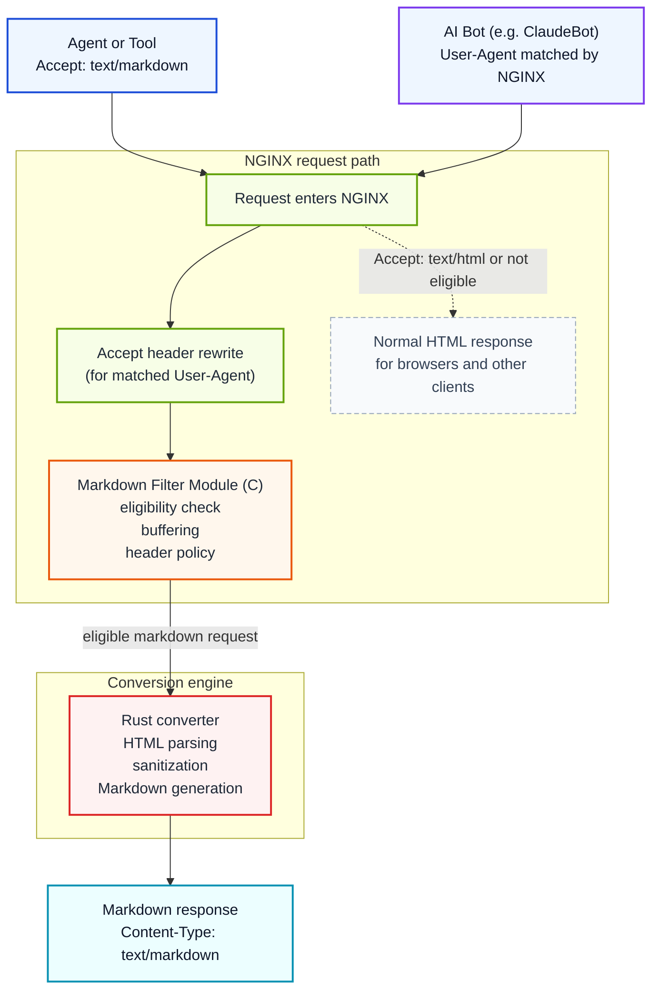

# NGINX Markdown for Agents

[](https://github.com/cnkang/nginx-markdown-for-agents/releases) [](https://github.com/cnkang/nginx-markdown-for-agents/blob/main/docs/guides/INSTALLATION.md) [](https://github.com/cnkang/nginx-markdown-for-agents/actions/workflows/ci.yml) [](https://github.com/cnkang/nginx-markdown-for-agents/actions/workflows/codeql.yml) [](https://github.com/cnkang/nginx-markdown-for-agents/blob/main/LICENSE) [](https://sonarcloud.io/summary/new_code?id=cnkang_nginx-markdown-for-agents)

English | [Simplified Chinese](README_zh-CN.md)

Add a machine-friendly Markdown variant to the HTML pages you already serve through NGINX.

> HTML in. Markdown out. When the client asks for it, or when you decide to serve it.

Clients that send `Accept: text/markdown` get Markdown. Browsers and normal clients keep getting the original HTML. You can also target specific bots by User-Agent — NGINX rewrites the Accept header for matching crawlers so they receive Markdown automatically, even if they never ask for it. You do not need to rewrite your application, build a parallel API, or run a scraper beside your site.

This is a practical way to make existing sites easier for agents to consume while keeping deployment, caching, and rollback in the NGINX layer your team already operates.

> Inspired by Cloudflare's [Markdown for Agents](https://blog.cloudflare.com/markdown-for-agents/). This project brings the same operational idea to NGINX deployments you already control, closer to the origin server where you have more control over content semantics.

## What Problem This Solves

AI agents and LLM-powered tools often fetch pages that were built for browsers, not machines:

- HTML includes navigation, layout, scripts, and other noise that adds token cost.
- Useful content is mixed with markup that each client has to strip on its own.
- Teams end up maintaining ad hoc scraping or extraction pipelines for content they already serve.

Unlike traditional search crawlers that index pages for keyword ranking, AI crawlers extract knowledge for answer generation. They are sensitive to token cost and semantic clarity — a typical HTML page can be 3× or more the token count of its Markdown equivalent, with most of the extra tokens carrying no useful content. For AI systems operating at scale, this cost difference adds up.

This module moves that work into the web tier. NGINX negotiates the representation and returns Markdown when the client asks for it. You can also configure NGINX to serve Markdown to specific bots by User-Agent, so crawlers that never send `Accept: text/markdown` still get a clean, token-efficient representation. Many sites — documentation portals, blogs, developer wikis — already author content in Markdown and render it to HTML for browsers. For these sites, the conversion is effectively recovering the original authoring format.

This follows the HTTP content negotiation model that has always been part of the protocol: the same URL serves different representations to different clients based on what they ask for.

```text
Browser      -> Accept: text/html      -> HTML (unchanged)
AI agent     -> Accept: text/markdown  -> Markdown
AI bot (by User-Agent)                 -> Markdown (via NGINX config)
```

## Why Try It

- Reuse your existing pages and upstreams instead of building a second content pipeline.
- Keep rollout incremental: enable Markdown on one path, one server, or one location first.
- Stay inside standard HTTP behavior with content negotiation and normal caching semantics.
- Preserve operational familiarity: this is an NGINX module, not a separate daemon you must invent workflows around.
- Convert at the reverse-proxy layer closest to your application, where you have full control over the HTML source and conversion configuration.
- Give AI consumers a cleaner, lower-token representation of your content, which can reduce misinterpretation and improve the accuracy of generated answers that reference your site.

## At a Glance

| If you need... | This project gives you... |
|----------------|---------------------------|
| Agent-friendly content from an existing site | Markdown negotiated from your current HTML responses |
| Minimal application change | NGINX-side enablement with per-path control |
| Safe rollout | Fail-open mode, size limits, timeouts, and shared aggregate metrics |
| Cache-aware behavior | Variant `ETag`, `Vary: Accept`, and conditional-request support |
| Flexible configuration | Variable-driven per-request control, User-Agent targeting, and authentication policies |

## Quick Start

Two steps are enough for a first trial:

1. Install the module.
2. Verify that Markdown and HTML variants both behave as expected.

### 1. Install the module

```bash
curl -sSL https://raw.githubusercontent.com/cnkang/nginx-markdown-for-agents/main/tools/install.sh | sudo bash
sudo nginx -t && sudo nginx -s reload
```

The install script auto-detects the local NGINX version, downloads the matching module artifact, and wires up `load_module` and `markdown_filter on` — no manual configuration editing required.

For alternative installation methods (source builds, Docker, custom NGINX builds), troubleshooting, and detailed instructions, see the [Installation Guide](docs/guides/INSTALLATION.md).

### 2. Verify behavior

The install script already enables `markdown_filter on` and wires `load_module`, so the default NGINX welcome page is ready for conversion. No additional configuration is needed for a first trial.

If you want to enable conversion on a specific route with a backend instead, see the [Deployment Examples](docs/guides/DEPLOYMENT_EXAMPLES.md).

```bash
# Markdown variant
curl -sD - -o /dev/null -H "Accept: text/markdown" http://localhost/

# Original HTML remains available
curl -sD - -o /dev/null -H "Accept: text/html" http://localhost/
```

Expected result:

- `Accept: text/markdown` returns `Content-Type: text/markdown; charset=utf-8`
- `Accept: text/html` still returns the original HTML response

If something doesn't work as expected, see the [Troubleshooting](docs/guides/INSTALLATION.md#10-troubleshooting) section in the installation guide.

If you want a practical production-oriented configuration next, go straight to [docs/guides/DEPLOYMENT_EXAMPLES.md](docs/guides/DEPLOYMENT_EXAMPLES.md).

## Serve Markdown to Specific Bots

Most AI crawlers do not send `Accept: text/markdown`. They use standard browser-like Accept headers. You can use NGINX's `map` directive to rewrite the Accept header for specific User-Agent strings, so matching bots receive Markdown without any changes on their side.

```nginx
load_module modules/ngx_http_markdown_filter_module.so;

http {
    # Rewrite Accept for known AI bots
    map $http_user_agent $bot_accept_override {
        default         "";
        "~*ClaudeBot"   "text/markdown, text/html;q=0.9";
        "~*GPTBot"      "text/markdown, text/html;q=0.9";
        "~*Googlebot"   "text/markdown, text/html;q=0.9";
    }

    map $bot_accept_override $final_accept {
        ""      $http_accept;
        default $bot_accept_override;
    }

    upstream backend {
        server 127.0.0.1:8080;
    }

    server {
        listen 80;

        location /docs/ {
            markdown_filter on;
            proxy_set_header Accept $final_accept;
            proxy_pass http://backend;
        }
    }
}
```

```bash
# Simulate ClaudeBot — returns Markdown
curl -sD - -o /dev/null -A "ClaudeBot/1.0" http://localhost/docs/
# Expected: Content-Type: text/markdown; charset=utf-8

# Normal browser request — returns HTML as usual
curl -sD - -o /dev/null -H "Accept: text/html" http://localhost/docs/
```

This works because the module's content negotiation sees `text/markdown` in the rewritten Accept header and converts the response. All other eligibility checks (status code, content type, size limits) still apply. Browsers and non-matching clients are unaffected.

For a complete template with more bot patterns, see [examples/nginx-configs/06-bot-targeted-conversion.conf](examples/nginx-configs/06-bot-targeted-conversion.conf). For the full walkthrough, see [docs/guides/DEPLOYMENT_EXAMPLES.md](docs/guides/DEPLOYMENT_EXAMPLES.md#bot-targeted-conversion-user-agent-based).

## When It Is a Good Fit

This project is a strong fit if you:

- already serve HTML through NGINX and want an agent-friendly representation with minimal backend changes
- need Markdown output for crawlers, internal agents, search assistants, or retrieval systems
- want to serve Markdown to specific AI bots (ClaudeBot, GPTBot, etc.) that do not send `Accept: text/markdown` on their own
- want AI systems that reference your content to work from a cleaner, more semantically accurate representation
- want to keep representation control and caching at the edge or reverse-proxy layer

It is a weaker fit if you:

- already have a purpose-built Markdown or JSON content API
- require true streaming Markdown conversion today for very large pages
- want transformation logic completely outside the request path

## How This Compares to Edge-Layer Conversion

Cloudflare's [Markdown for Agents](https://blog.cloudflare.com/markdown-for-agents/) converts already-rendered HTML at the CDN edge. That approach is effective for lowering adoption friction — site operators can enable it without touching their origin infrastructure.

This project serves `text/markdown` closer to the origin server, typically at the reverse-proxy layer where NGINX sits in front of your application. The practical differences:

- The HTML that NGINX converts is the direct output of your application or CMS. Converting at this layer means you are not dependent on how the page may be restructured or augmented further downstream, making it easier to preserve the original content semantics in the Markdown output.
- Conversion happens within infrastructure you operate, so you control the module version, configuration, failure policy, and rollout scope.
- The approach aligns with the standard HTTP content negotiation model: the origin (or its reverse proxy) selects the best representation of a resource based on the client's Accept header.

Neither approach is universally better. Edge-layer conversion is a good fit when you want zero-touch enablement across many sites. Origin-near conversion is a better fit when you want tighter control over what gets converted, how it gets converted, and where the conversion runs.

## What You Get

| Capability | What it does |
|------------|--------------|
| Content negotiation | Converts when the client asks for `text/markdown`, or for specific bots via User-Agent targeting |
| HTML passthrough | Leaves normal browser traffic unchanged |
| Automatic decompression | Handles gzip, brotli, and deflate upstream responses |
| Cache-aware variants | Generates ETags and supports conditional requests |
| Failure policy control | Choose fail-open or fail-closed behavior |
| Resource limits | Bound conversion size and time with NGINX directives |
| Security sanitization | Applies XSS, XXE, and SSRF-oriented protections in the converter |
| Optional metadata | Supports token estimates and YAML front matter |
| Metrics endpoint | Exposes module conversion counters for operations |
| Variable-driven config | Use NGINX variables for per-request conversion control |
| Authentication-aware | Configurable policies for authenticated requests with cache control |
| Incremental large-response processing | Threshold-based routing to a separate incremental conversion path for large HTML responses; current implementation still buffers before conversion |
| Performance baseline gating | Automated regression detection with dual-threshold system (warning / blocking) for PR and nightly CI |
| Matrix-driven release automation | Automated release pipeline with platform matrix management and artifact completeness verification |

## How It Works



The NGINX module handles request eligibility, buffering, and response header management. For bot-targeted conversion, NGINX's `map` directive rewrites the Accept header before the module sees the request, so the module's standard content negotiation handles the rest. The Rust converter handles HTML parsing, sanitization, deterministic Markdown generation, and related transformation logic.

## Why C + Rust

The split follows the actual problem boundary.

- C is used where the code must integrate directly with NGINX's module APIs, filter chain, buffers, and request lifecycle.
- Rust is used where the code must parse untrusted HTML, normalize output, and evolve safely over time.
- The FFI boundary stays small so NGINX-facing HTTP logic and conversion logic can change with less coupling.

If you want the full design rationale rather than the short version, read [docs/architecture/SYSTEM_ARCHITECTURE.md](docs/architecture/SYSTEM_ARCHITECTURE.md) and [docs/architecture/ADR/0001-use-rust-for-conversion.md](docs/architecture/ADR/0001-use-rust-for-conversion.md).

If you are trying to understand how specific directives change runtime behavior, use [docs/architecture/CONFIG_BEHAVIOR_MAP.md](docs/architecture/CONFIG_BEHAVIOR_MAP.md).

## Test It Locally

```bash
# Fast build + smoke test
make test

# Full Rust test suite
make test-rust

# Full NGINX module unit suite
make test-nginx-unit

# Runtime integration and canonical E2E checks
make test-nginx-integration
make test-e2e
make test-rust-fuzz-smoke
```

`make test-nginx-integration` and `make test-e2e` require a real `nginx` runtime. If `nginx` is not on `PATH`, use `NGINX_BIN=/absolute/path/to/nginx`.

See [docs/testing/README.md](docs/testing/README.md) for integration, E2E, and performance-oriented test references.

## Documentation Map

| Goal | Document |
|------|----------|
| Install the module | [docs/guides/INSTALLATION.md](docs/guides/INSTALLATION.md) |
| Build from source | [docs/guides/BUILD_INSTRUCTIONS.md](docs/guides/BUILD_INSTRUCTIONS.md) |
| Configure directives | [docs/guides/CONFIGURATION.md](docs/guides/CONFIGURATION.md) |
| Start from deployment examples | [docs/guides/DEPLOYMENT_EXAMPLES.md](docs/guides/DEPLOYMENT_EXAMPLES.md) |
| Operate and troubleshoot | [docs/guides/OPERATIONS.md](docs/guides/OPERATIONS.md) |
| Report a vulnerability or review security support | [SECURITY.md](SECURITY.md) |
| Understand architecture and design choices | [docs/architecture/README.md](docs/architecture/README.md) |
| Map directives to runtime behavior | [docs/architecture/CONFIG_BEHAVIOR_MAP.md](docs/architecture/CONFIG_BEHAVIOR_MAP.md) |
| Explore implementation details | [docs/features/README.md](docs/features/README.md) |
| Review testing references | [docs/testing/README.md](docs/testing/README.md) |
| Check project status | [docs/project/PROJECT_STATUS.md](docs/project/PROJECT_STATUS.md) |
| Contribute changes | [CONTRIBUTING.md](CONTRIBUTING.md) |

## Choose Your Path

- Evaluating the idea: start here, then read [docs/guides/DEPLOYMENT_EXAMPLES.md](docs/guides/DEPLOYMENT_EXAMPLES.md)
- Installing in a real environment: go to [docs/guides/INSTALLATION.md](docs/guides/INSTALLATION.md)
- Tuning behavior or policy: use [docs/guides/CONFIGURATION.md](docs/guides/CONFIGURATION.md)
- Operating in production: use [docs/guides/OPERATIONS.md](docs/guides/OPERATIONS.md)
- Reporting a vulnerability: use [SECURITY.md](SECURITY.md)
- Understanding system design: use [docs/architecture/README.md](docs/architecture/README.md)
- Understanding what directives change in the runtime path: use [docs/architecture/CONFIG_BEHAVIOR_MAP.md](docs/architecture/CONFIG_BEHAVIOR_MAP.md)
- Reading implementation details: use [docs/features/README.md](docs/features/README.md)
- Validating changes: use [docs/testing/README.md](docs/testing/README.md)

## Repository Layout

```text
components/
  nginx-module/        NGINX filter module and NGINX-facing tests
  rust-converter/      HTML-to-Markdown engine and FFI layer
docs/                  User, operator, testing, and architecture docs
  architecture/        System design, ADRs, and config behavior maps
  features/            Implementation details for specific features
  guides/              Installation, configuration, deployment, and operations
  project/             Project status and roadmap
  testing/             Testing strategy and references
examples/
  docker/              Docker build examples and configurations
  nginx-configs/       Example NGINX configurations
tests/                 Top-level test corpus and shared test resources
tools/                 Installers, CI scripts, and developer tooling
  build_release/       Release build automation
  ci/                  Continuous integration scripts
  corpus/              Test corpus generation tools
  docs/                Documentation tooling
  e2e/                 End-to-end testing utilities
.github/workflows/     CI/CD pipeline definitions
Makefile               Top-level build and test entrypoints
```

## Roadmap

Current release (0.4.0):

- Prometheus-compatible metrics endpoint for operational monitoring
- Unified decision reason codes for conversion transparency
- Rollout cookbook with selective enablement and canary patterns
- Rollback guide with trigger conditions and executable procedures
- Benchmark corpus with reproducible evidence and regression detection
- Parser path optimizations: noise region pruning, simple structure fast path
- Restructured installation guide with shortest success path
- Incremental processing for large responses
- Matrix-driven release automation pipeline
- Performance baseline gating system
- Variable-driven configuration support
- Enhanced installation tooling
- Shared metrics aggregation and runtime-regression coverage
- Hardened CI/CD pipeline

Near-term focus:

- Performance regression tracking with CI artifact capture
- Deployment validation across diverse environments
- Community feedback integration

Future exploration:

- Streaming-oriented conversion approaches for large documents
- Additional Markdown flavors and output formats
- Expanded observability integrations beyond the built-in shared metrics endpoint

## License

BSD 2-Clause "Simplified" License. See [LICENSE](LICENSE).
