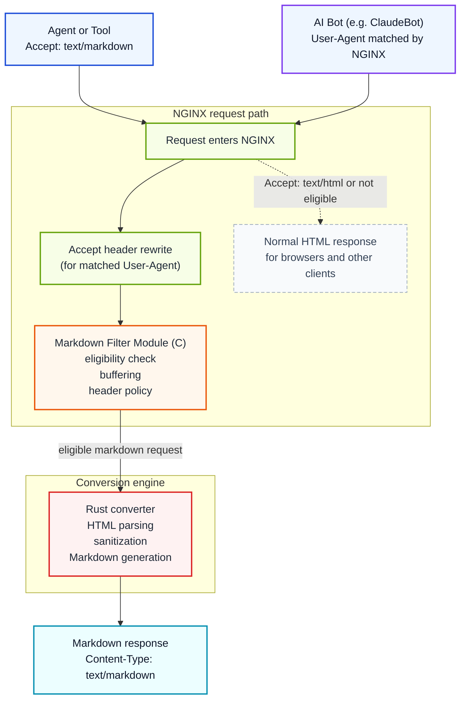

# NGINX Markdown for Agents

[](https://github.com/cnkang/nginx-markdown-for-agents/releases) [](https://github.com/cnkang/nginx-markdown-for-agents/blob/main/docs/guides/INSTALLATION.md) [](https://github.com/cnkang/nginx-markdown-for-agents/actions/workflows/ci.yml) [](https://github.com/cnkang/nginx-markdown-for-agents/actions/workflows/codeql.yml) [](https://github.com/cnkang/nginx-markdown-for-agents/blob/main/LICENSE) [](https://sonarcloud.io/summary/new_code?id=cnkang_nginx-markdown-for-agents)

English | [Simplified Chinese](README_zh-CN.md)

Add a machine-friendly Markdown variant to the HTML pages you already serve through NGINX.

> HTML in. Markdown out. When the client asks for it, or when you decide to serve it.

Clients that send `Accept: text/markdown` get Markdown. Browsers and normal clients keep getting the original HTML. You can also target specific bots by User-Agent — NGINX rewrites the Accept header for matching crawlers so they receive Markdown automatically, even if they never ask for it. You do not need to rewrite your application, build a parallel API, or run a scraper beside your site.

This is a practical way to make existing sites easier for agents to consume while keeping deployment, caching, and rollback in the NGINX layer your team already operates.

> Inspired by Cloudflare's [Markdown for Agents](https://blog.cloudflare.com/markdown-for-agents/). This project brings the same operational idea to NGINX deployments you already control, closer to the origin server where you have more control over content semantics.

## What Problem This Solves

AI agents and LLM-powered tools often fetch pages that were built for browsers, not machines:

- HTML includes navigation, layout, scripts, and other noise that adds token cost.
- Useful content is mixed with markup that each client has to strip on its own.
- Teams end up maintaining ad hoc scraping or extraction pipelines for content they already serve.

Unlike traditional search crawlers that index pages for keyword ranking, AI crawlers extract knowledge for answer generation. They are sensitive to token cost and semantic clarity — a typical HTML page can be 3× or more the token count of its Markdown equivalent, with most of the extra tokens carrying no useful content. For AI systems operating at scale, this cost difference adds up.

This module moves that work into the web tier. NGINX negotiates the representation and returns Markdown when the client asks for it. You can also configure NGINX to serve Markdown to specific bots by User-Agent, so crawlers that never send `Accept: text/markdown` still get a clean, token-efficient representation. Many sites — documentation portals, blogs, developer wikis — already author content in Markdown and render it to HTML for browsers. For these sites, the conversion is effectively recovering the original authoring format.

This follows the HTTP content negotiation model that has always been part of the protocol: the same URL serves different representations to different clients based on what they ask for.

```text
Browser      -> Accept: text/html      -> HTML (unchanged)
AI agent     -> Accept: text/markdown  -> Markdown
AI bot (by User-Agent)                 -> Markdown (via NGINX config)
```

## Why Try It

- Reuse your existing pages and upstreams instead of building a second content pipeline.
- Keep rollout incremental: enable Markdown on one path, one server, or one location first.
- Stay inside standard HTTP behavior with content negotiation and normal caching semantics.
- Preserve operational familiarity: this is an NGINX module, not a separate daemon you must invent workflows around.
- Convert at the reverse-proxy layer closest to your application, where you have full control over the HTML source and conversion configuration.
- Give AI consumers a cleaner, lower-token representation of your content, which can reduce misinterpretation and improve the accuracy of generated answers that reference your site.

## At a Glance

| If you need... | This project gives you... |
|----------------|---------------------------|
| Agent-friendly content from an existing site | Markdown negotiated from your current HTML responses |
| Minimal application change | NGINX-side enablement with per-path control |
| Safe rollout | Fail-open mode, size limits, timeouts, and shared aggregate metrics |
| Cache-aware behavior | Variant `ETag`, `Vary: Accept`, and conditional-request support |
| Flexible configuration | Variable-driven per-request control, User-Agent targeting, and authentication policies |

## Quick Start

Three steps are enough for a first trial:

1. Install the module.
2. Enable Markdown on a location.
3. Verify that Markdown and HTML variants both behave as expected.

### 1. Install the module

```bash
curl -sSL https://raw.githubusercontent.com/cnkang/nginx-markdown-for-agents/main/tools/install.sh | sudo bash
sudo nginx -t && sudo nginx -s reload
```

The install script auto-detects the local NGINX version, downloads the matching module artifact, and wires up `load_module` and `markdown_filter on` — no manual configuration editing required.
It also enforces SHA-256 artifact integrity checks by default.

For alternative installation methods (source builds, Docker, custom NGINX builds), troubleshooting, and detailed instructions, see the [Installation Guide](docs/guides/INSTALLATION.md).

For macOS package-manager installation through the project Homebrew tap (release-tag artifact):

```bash
brew tap cnkang/nginx-markdown
brew install cnkang/nginx-markdown/nginx-markdown-module
```

Tap publication and macOS post-release verification workflows are documented in [docs/guides/HOMEBREW_TAP_RELEASE.md](docs/guides/HOMEBREW_TAP_RELEASE.md).

### 2. Enable Markdown on a location

```nginx
load_module modules/ngx_http_markdown_filter_module.so;

http {
    upstream backend {
        server 127.0.0.1:8080;
    }

    server {
        listen 80;

        location / {
            markdown_filter on;
            proxy_set_header Accept-Encoding "";
            proxy_pass http://backend;
        }
    }
}
```

If your upstream may return compressed responses, `proxy_set_header Accept-Encoding "";` is the easiest way to get started. Once the basic pipeline works, switch to the module's built-in decompression support — see [Automatic Decompression](docs/features/AUTOMATIC_DECOMPRESSION.md).

### 3. Verify behavior

```bash
# Markdown variant
curl -sD - -o /dev/null -H "Accept: text/markdown" http://localhost/

# Original HTML remains available
curl -sD - -o /dev/null -H "Accept: text/html" http://localhost/
```

Expected result:

- `Accept: text/markdown` returns `Content-Type: text/markdown; charset=utf-8`
- `Accept: text/html` still returns the original HTML response

If something doesn't work as expected, see the [Troubleshooting](docs/guides/INSTALLATION.md#10-troubleshooting) section in the installation guide.

If you want a practical production-oriented configuration next, go straight to [docs/guides/DEPLOYMENT_EXAMPLES.md](docs/guides/DEPLOYMENT_EXAMPLES.md).

## Serve Markdown to Specific Bots

Most AI crawlers do not send `Accept: text/markdown`. They use standard browser-like Accept headers. You can use NGINX's `map` directive to rewrite the Accept header for specific User-Agent strings, so matching bots receive Markdown without any changes on their side.

```nginx
load_module modules/ngx_http_markdown_filter_module.so;

http {
    # Rewrite Accept for known AI bots
    map $http_user_agent $bot_accept_override {
        default         "";
        "~*ClaudeBot"   "text/markdown, text/html;q=0.9";
        "~*GPTBot"      "text/markdown, text/html;q=0.9";
        "~*Googlebot"   "text/markdown, text/html;q=0.9";
    }

    map $bot_accept_override $final_accept {
        ""      $http_accept;
        default $bot_accept_override;
    }

    upstream backend {
        server 127.0.0.1:8080;
    }

    server {
        listen 80;

        location /docs/ {
            markdown_filter on;
            proxy_set_header Accept $final_accept;
            proxy_pass http://backend;
        }
    }
}
```

```bash
# Simulate ClaudeBot — returns Markdown
curl -sD - -o /dev/null -A "ClaudeBot/1.0" http://localhost/docs/
# Expected: Content-Type: text/markdown; charset=utf-8

# Normal browser request — returns HTML as usual
curl -sD - -o /dev/null -H "Accept: text/html" http://localhost/docs/
```

This works because the module's content negotiation sees `text/markdown` in the rewritten Accept header and converts the response. All other eligibility checks (status code, content type, size limits) still apply. Browsers and non-matching clients are unaffected.

For a complete template with more bot patterns, see [examples/nginx-configs/06-bot-targeted-conversion.conf](examples/nginx-configs/06-bot-targeted-conversion.conf). For the full walkthrough, see [docs/guides/DEPLOYMENT_EXAMPLES.md](docs/guides/DEPLOYMENT_EXAMPLES.md#bot-targeted-conversion-user-agent-based).

## When It Is a Good Fit

This project is a strong fit if you:

- already serve HTML through NGINX and want an agent-friendly representation with minimal backend changes
- need Markdown output for crawlers, internal agents, search assistants, or retrieval systems
- want to serve Markdown to specific AI bots (ClaudeBot, GPTBot, etc.) that do not send `Accept: text/markdown` on their own
- want AI systems that reference your content to work from a cleaner, more semantically accurate representation
- want to keep representation control and caching at the edge or reverse-proxy layer

It is a weaker fit if you:

- already have a purpose-built Markdown or JSON content API
- want transformation logic completely outside the request path

## How This Compares to Edge-Layer Conversion

Cloudflare's [Markdown for Agents](https://blog.cloudflare.com/markdown-for-agents/) converts already-rendered HTML at the CDN edge. That approach is effective for lowering adoption friction — site operators can enable it without touching their origin infrastructure.

This project serves `text/markdown` closer to the origin server, typically at the reverse-proxy layer where NGINX sits in front of your application. The practical differences:

- The HTML that NGINX converts is the direct output of your application or CMS. Converting at this layer means you are not dependent on how the page may be restructured or augmented further downstream, making it easier to preserve the original content semantics in the Markdown output.
- Conversion happens within infrastructure you operate, so you control the module version, configuration, failure policy, and rollout scope.
- The approach aligns with the standard HTTP content negotiation model: the origin (or its reverse proxy) selects the best representation of a resource based on the client's Accept header.

Neither approach is universally better. Edge-layer conversion is a good fit when you want zero-touch enablement across many sites. Origin-near conversion is a better fit when you want tighter control over what gets converted, how it gets converted, and where the conversion runs.

## What You Get

| Capability | What it does |
|------------|--------------|
| Content negotiation | Converts when the client asks for `text/markdown`, or for specific bots via User-Agent targeting |
| HTML passthrough | Leaves normal browser traffic unchanged |
| Automatic decompression | Handles gzip, brotli, and deflate upstream responses |
| Cache-aware variants | Generates ETags and supports conditional requests |
| Failure policy control | Choose fail-open or fail-closed behavior |
| Resource limits | Bound conversion size and time with NGINX directives |
| Security hardening | Validates emitted links and base URLs, rejects unsafe forwarded-host inputs by default, bounds parser/decompression resources, and avoids executing external content |
| Optional metadata | Supports token estimates and YAML front matter |
| Metrics endpoint | Exposes module conversion counters for operations |
| Variable-driven config | Use NGINX variables for per-request conversion control |
| Authentication-aware | Configurable policies for authenticated requests with cache control |
| Dual-engine conversion | Full-buffer (default) for typical responses plus a streaming engine for large or chunked responses, selected automatically via `auto` mode |
| Bounded-memory streaming | Streaming engine converts in bounded memory with size-based flush (`markdown_stream_flush_min`); pre-commit safety falls back to HTML on conversion error |
| Performance baseline gating | Automated regression detection with dual-threshold system (warning / blocking) for PR and nightly CI |
| Matrix-driven release automation | Automated release pipeline with platform matrix management and artifact completeness verification |

## Platform Support

<!-- BEGIN:release-matrix:support-matrix -->

| NGINX | Channel | OS | libc | Arch | Artifact | Tier | Blocking |
|-------|---------|-----|------|------|----------|------|----------|
| 1.31.1 | mainline | linux | glibc | arm64 | dynamic-module | supported | Yes |
| 1.31.1 | mainline | linux | musl | arm64 | dynamic-module | supported | No |
| 1.31.1 | mainline | linux | glibc | amd64 | dynamic-module | supported | Yes |
| 1.31.1 | mainline | linux | musl | amd64 | dynamic-module | supported | No |
| 1.31.1 | mainline | debian12 | glibc | arm64 | docker-image | supported | Yes |
| 1.31.1 | mainline | debian12 | glibc | amd64 | docker-image | supported | Yes |
| 1.31.1 | mainline | alpine3.20 | musl | arm64 | docker-image | supported | Yes |
| 1.31.1 | mainline | alpine3.20 | musl | amd64 | docker-image | supported | Yes |
| 1.30.2 | stable | linux | glibc | arm64 | dynamic-module | supported | Yes |
| 1.30.2 | stable | linux | musl | arm64 | dynamic-module | supported | No |
| 1.30.2 | stable | linux | glibc | amd64 | dynamic-module | supported | Yes |
| 1.30.2 | stable | linux | musl | amd64 | dynamic-module | supported | No |
| 1.28.3 | stable | linux | glibc | arm64 | dynamic-module | supported | Yes |
| 1.28.3 | stable | linux | musl | arm64 | dynamic-module | supported | No |
| 1.28.3 | stable | linux | glibc | amd64 | dynamic-module | supported | Yes |
| 1.28.3 | stable | linux | musl | amd64 | dynamic-module | supported | No |
| 1.26.3 | stable | macos | darwin | arm64 | homebrew-formula | experimental | No |
| 1.26.3 | stable | linux | glibc | arm64 | dynamic-module | supported | Yes |
| 1.26.3 | stable | linux | musl | arm64 | dynamic-module | supported | No |
| 1.26.3 | stable | linux | glibc | amd64 | dynamic-module | supported | Yes |
| 1.26.3 | stable | linux | musl | amd64 | dynamic-module | supported | No |
| 1.26.3 | stable | debian12 | glibc | arm64 | docker-image | supported | Yes |
| 1.26.3 | stable | debian12 | glibc | arm64 | deb-package | supported | Yes |
| 1.26.3 | stable | debian12 | glibc | amd64 | docker-image | supported | Yes |
| 1.26.3 | stable | debian12 | glibc | amd64 | deb-package | supported | Yes |
| 1.26.3 | stable | any | n/a | any | source | best-effort | No |
| 1.26.3 | stable | alpine3.20 | musl | arm64 | docker-image | supported | Yes |
| 1.26.3 | stable | alpine3.20 | musl | amd64 | docker-image | supported | Yes |
| 1.26.3 | stable | almalinux9 | glibc | arm64 | rpm-package | supported | Yes |
| 1.26.3 | stable | almalinux9 | glibc | amd64 | rpm-package | supported | Yes |
| 1.24.0 | oldstable | linux | glibc | arm64 | dynamic-module | supported | Yes |
| 1.24.0 | oldstable | linux | musl | arm64 | dynamic-module | supported | No |
| 1.24.0 | oldstable | linux | glibc | amd64 | dynamic-module | supported | Yes |
| 1.24.0 | oldstable | linux | musl | amd64 | dynamic-module | supported | No |
<!-- END:release-matrix:support-matrix -->

## How It Works



The NGINX module handles request eligibility, buffering, and response header management. For bot-targeted conversion, NGINX's `map` directive rewrites the Accept header before the module sees the request, so the module's standard content negotiation handles the rest. The Rust converter handles HTML parsing, sanitization, deterministic Markdown generation, and related transformation logic.

## Why C + Rust

The split follows the actual problem boundary.

- C is used where the code must integrate directly with NGINX's module APIs, filter chain, buffers, and request lifecycle.
- Rust is used where the code must parse untrusted HTML, normalize output, and evolve safely over time.
- The FFI boundary stays small so NGINX-facing HTTP logic and conversion logic can change with less coupling.

If you want the full design rationale rather than the short version, read [docs/architecture/SYSTEM_ARCHITECTURE.md](docs/architecture/SYSTEM_ARCHITECTURE.md), [docs/architecture/ADR/0001-use-rust-for-conversion.md](docs/architecture/ADR/0001-use-rust-for-conversion.md), and [docs/architecture/ADR/0009-rust-first-e2e-test-architecture.md](docs/architecture/ADR/0009-rust-first-e2e-test-architecture.md).

If you are trying to understand how specific directives change runtime behavior, use [docs/architecture/CONFIG_BEHAVIOR_MAP.md](docs/architecture/CONFIG_BEHAVIOR_MAP.md).

## Test It Locally

```bash
# Fast build + smoke test
make test

# Full Rust test suite
make test-rust

# Full NGINX module unit suite
make test-nginx-unit

# Streaming-specific tests
make test-rust-streaming
make verify-chunked-native-e2e-smoke

# Runtime integration and canonical E2E checks
make test-nginx-integration
make test-e2e-rust
make test-e2e
make test-rust-fuzz-smoke
```

`make test-nginx-integration`, `make test-e2e`, and `make verify-chunked-native-e2e-smoke` require a real `nginx` runtime. If `nginx` is not on `PATH`, set `NGINX_BIN=/absolute/path/to/nginx` so that these commands can find the nginx binary.

See [docs/testing/README.md](docs/testing/README.md) and [docs/testing/E2E_TESTS.md](docs/testing/E2E_TESTS.md) for integration, E2E, and performance-oriented test references.

If you are changing repo contracts, docs validators, or agent workflow rules,
run the harness checks as well:

```bash
# Cheap blocker for repo-owned harness truth
make harness-check

# Full harness validation, including docs and release-gate checks
make harness-check-full
```

Use harness checks as the primary guardrail for repo contract and release-gate
changes:

```bash
# Static security checks for workflow, shell, secret, Semgrep, and Rust policy changes
make security-static

# Release-supporting supply-chain visibility checks
make supply-chain
```

## Documentation Map

| Goal | Document |
|------|----------|
| Install the module | [docs/guides/INSTALLATION.md](docs/guides/INSTALLATION.md) |
| Build from source | [docs/guides/BUILD_INSTRUCTIONS.md](docs/guides/BUILD_INSTRUCTIONS.md) |
| Configure directives | [docs/guides/CONFIGURATION.md](docs/guides/CONFIGURATION.md) |
| Upgrade from 0.7.x to 0.8.0 | [docs/guides/MIGRATION-0.8.md](docs/guides/MIGRATION-0.8.md) |
| Roll out streaming safely | [docs/guides/streaming-rollout-cookbook.md](docs/guides/streaming-rollout-cookbook.md) |
| Start from deployment examples | [docs/guides/DEPLOYMENT_EXAMPLES.md](docs/guides/DEPLOYMENT_EXAMPLES.md) |
| Operate and troubleshoot | [docs/guides/OPERATIONS.md](docs/guides/OPERATIONS.md) |
| Report a vulnerability or review security support | [SECURITY.md](SECURITY.md) |
| Understand architecture and design choices | [docs/architecture/README.md](docs/architecture/README.md) |
| Understand harness architecture and design rationale | [docs/architecture/HARNESS_ARCHITECTURE.md](docs/architecture/HARNESS_ARCHITECTURE.md) |
| Understand spec routing, risk packs, and harness checks | [docs/harness/README.md](docs/harness/README.md) |
| Maintain repo-owned harness rules and local adapter workflows | [docs/guides/HARNESS_MAINTENANCE.md](docs/guides/HARNESS_MAINTENANCE.md) |
| Map directives to runtime behavior | [docs/architecture/CONFIG_BEHAVIOR_MAP.md](docs/architecture/CONFIG_BEHAVIOR_MAP.md) |
| Explore implementation details | [docs/features/README.md](docs/features/README.md) |
| Review testing references | [docs/testing/README.md](docs/testing/README.md) |
| Check NGINX version compatibility | [docs/COMPATIBILITY.md](docs/COMPATIBILITY.md) |
| Review streaming feature compatibility | [docs/features/STREAMING_COMPATIBILITY.md](docs/features/STREAMING_COMPATIBILITY.md) |
| Configure dynamic reloading | [docs/guides/DYNAMIC_CONFIG.md](docs/guides/DYNAMIC_CONFIG.md) |
| Read FAQ | [docs/FAQ.md](docs/FAQ.md) |
| Look up terminology | [docs/glossary.md](docs/glossary.md) |
| Check project status | [docs/project/PROJECT_STATUS.md](docs/project/PROJECT_STATUS.md) |
| Contribute changes | [CONTRIBUTING.md](CONTRIBUTING.md) |

## Choose Your Path

- Evaluating the idea: start here, then read [docs/guides/DEPLOYMENT_EXAMPLES.md](docs/guides/DEPLOYMENT_EXAMPLES.md)
- Installing in a real environment: go to [docs/guides/INSTALLATION.md](docs/guides/INSTALLATION.md)
- Tuning behavior or policy: use [docs/guides/CONFIGURATION.md](docs/guides/CONFIGURATION.md)
- Upgrading from 0.7.x: use [docs/guides/MIGRATION-0.8.md](docs/guides/MIGRATION-0.8.md) — **0.8.0 is a breaking FFI/ABI change; Rust converter and C module must be upgraded together**
- Rolling out streaming in production: use [docs/guides/streaming-rollout-cookbook.md](docs/guides/streaming-rollout-cookbook.md)
- Operating in production: use [docs/guides/OPERATIONS.md](docs/guides/OPERATIONS.md)
- Reporting a vulnerability: use [SECURITY.md](SECURITY.md)
- Understanding system design: use [docs/architecture/README.md](docs/architecture/README.md)
- Understanding harness architecture and why it is a repo-level asset: use [docs/architecture/HARNESS_ARCHITECTURE.md](docs/architecture/HARNESS_ARCHITECTURE.md)
- Understanding repo-owned agent workflow and spec routing: use [docs/harness/README.md](docs/harness/README.md)
- Maintaining harness rules, risk packs, and local adapter layers: use [docs/guides/HARNESS_MAINTENANCE.md](docs/guides/HARNESS_MAINTENANCE.md)
- Understanding what directives change in the runtime path: use [docs/architecture/CONFIG_BEHAVIOR_MAP.md](docs/architecture/CONFIG_BEHAVIOR_MAP.md)
- Reading implementation details: use [docs/features/README.md](docs/features/README.md)
- Validating changes: use [docs/testing/README.md](docs/testing/README.md)

## Repository Layout

```text
components/
  nginx-module/        NGINX filter module and NGINX-facing tests
  rust-converter/      HTML-to-Markdown engine and FFI layer
docs/                  User, operator, testing, and architecture docs
  architecture/        System design, ADRs, and config behavior maps
  features/            Implementation details for specific features
  guides/              Installation, configuration, deployment, and operations
  harness/             Repo-owned spec routing, risk packs, and harness checks
  project/             Project status and roadmap
  testing/             Testing strategy and references
examples/
  docker/              Docker build examples and configurations
  nginx-configs/       Example NGINX configurations
tests/                 Top-level test corpus and shared test resources
tools/                 Installers, CI scripts, and developer tooling
  build_release/       Release build automation
  ci/                  Continuous integration scripts
  corpus/              Test corpus generation tools
  docs/                Documentation tooling
  e2e/                 End-to-end testing utilities
.github/workflows/     CI/CD pipeline definitions
Makefile               Top-level build and test entrypoints
```

## Contributor Workflow

If you are changing runtime behavior, use the existing test commands.

If you are changing repo contracts, validation tooling, or agent-facing docs,
add the harness workflow to your default path:

1. Update repo-owned truth first:
   `AGENTS.md`, `docs/harness/`, `tools/harness/`, `Makefile`, CI wiring
2. Run `make harness-check`
3. Run `make harness-check-full` before closing broader docs or release-gate work

## What's New in v0.8.0

v0.8.0 introduces true streaming conversion — bounded-memory HTML-to-Markdown processing for large and chunked responses:

- **Dual-engine model** — Full-buffer conversion (the default since v0.5.0) remains for typical responses. A new streaming engine handles large or chunked responses with bounded memory. The `markdown_streaming_engine` directive controls which engine is used (`off`, `on`, or `auto`).
- **`auto` mode (default)** — When set to `auto`, the module automatically routes eligible large or chunked responses to the streaming engine while keeping full-buffer for everything else. **Note:** the default `markdown_conditional_requests full_support` setting prevents streaming from activating because full ETag support requires the full-buffer path. To enable streaming in `auto` mode, set `markdown_conditional_requests if_modified_since_only` or `disabled`.
- **Bounded-memory conversion** — The streaming engine flushes converted Markdown in chunks based on `markdown_stream_flush_min` (size threshold), keeping memory usage bounded regardless of response size.
- **Pre-commit safety** — If a conversion error occurs before the streaming engine has committed output to the client, it falls back to serving the original HTML response. This preserves fail-open semantics during streaming.
- **New streaming controls** — `markdown_stream_threshold`, `markdown_stream_precommit_buffer`, `markdown_stream_flush_min`, and `markdown_stream_excluded_types` make thresholding, replay buffering, flushing, and content-type exclusions explicit.
- **Breaking: v0.6.x compat removed** — `markdown_streaming_auto_threshold` is removed (not deprecated); `nginx -t` will fail if it appears in configuration. Use `markdown_stream_threshold` instead. `markdown_streaming_engine` no longer accepts `$variable` — only `off`/`auto`/`on`.

For upgrade guidance from 0.7.x, see the [Migration Guide](docs/guides/MIGRATION-0.8.md).
For production rollout steps, see the [Streaming Rollout Cookbook](docs/guides/streaming-rollout-cookbook.md).

## What's New in v0.7.0

v0.7.0 is a correctness, distribution, and operability release:

- **Bounded decompression** — `markdown_decompress_max_size` limits decompressed output independently, preventing zip-bomb attacks (error code 9: DecompressionBudgetExceeded)
- **Accept negotiation** — Rust-side RFC 9110 §12.5.1 q-value comparison between `text/markdown` and `text/html` (with §12.4.2 quality value semantics) determines conversion eligibility
- **Parse timeout and budget** — `markdown_parse_timeout` (default 30s) and `markdown_parser_budget` (default 64m) prevent runaway parsing (error codes 10, 11)
- **DEB/RPM package artifacts** — v0.7.0+ release workflows build GitHub Release artifacts for Ubuntu 22.04/24.04, Debian 12, AlmaLinux 9, Amazon Linux 2023 across amd64/arm64 families, with canonical install layout checks
- **Kubernetes deployment examples** — Helm chart, manifests, and Ingress Controller custom image build path with secure stock-image defaults; module-enabled Helm installs require an image containing the module and an explicit `markdown.loadModule`
- **Runtime diagnostics** — `/nginx-markdown/diagnostics` endpoint exposes config snapshot, recent decisions, and metrics
- **Dynconf dry-run and rollback** — Validate configuration changes without applying them; roll back to last-known-good on failure

Additional changes:

- P0 runtime correctness: pending chain on NGX_AGAIN, fail-open dedup, safe output ordering
- Rust conditional request module (If-None-Match, If-Modified-Since)
- Rust decision engine with reason codes
- Rust header mutation plan module
- Rust URL control character validation and link escaping
- FFI ABI layout verification and header drift detection

## Roadmap

Current release (0.8.0):

- Dual-engine streaming model: full-buffer default + streaming engine for large/chunked responses
- `auto` mode as the default `markdown_streaming_engine` setting
- Bounded-memory streaming conversion with size-based flush (`markdown_stream_flush_min`)
- Pre-commit safety: fallback to HTML if conversion error occurs before output is committed
- Streaming release gate: `make release-gates-check-080` validates the 0.8.0 release contract
- Static security gate: `.github/workflows/security-static.yml` runs actionlint,
  shellcheck, gitleaks, focused Semgrep, and cargo-deny for workflow, script,
  secret, and Rust dependency policy changes
- Supply-chain visibility: `.github/workflows/supply-chain.yml` runs
  report-oriented Trivy filesystem/IaC scans, SPDX SBOM generation, and OpenSSF
  Scorecard on PR, push, scheduled, and manual triggers
- Migration guide and rollout cookbook for production adoption

Previous release (0.7.0):

- P0 runtime correctness: pending chain on NGX_AGAIN, fail-open dedup, safe output ordering
- Independent decompression budget (`markdown_decompress_max_size`)
- Parse timeout and parser budget directives
- Rust Accept header negotiation module (RFC 9110 q-value semantics)
- Rust conditional request module (If-None-Match, If-Modified-Since)
- Rust decision engine with reason codes
- Rust header mutation plan module
- Rust URL control character validation and link escaping
- FFI ABI layout verification and header drift detection
- New error codes: DecompressionBudgetExceeded(9), ParseTimeout(10), ParseBudgetExceeded(11)
- DEB/RPM packaging with GitHub Release artifacts; APT/YUM repository publishing is not part of the 0.7.0 GA channel
- Package release gates for canonical module paths, artifact names, checksums, and architecture-matched smoke tests
- Kubernetes deployment examples and Helm chart with secure stock-image defaults plus explicit module-enabled configuration
- Runtime diagnostics endpoint
- Dynconf dry-run validation and last-known-good rollback
- Installation and release docs aligned to Rust 1.91.0+ and current CI expectations

Near-term focus:

- Strengthen cross-environment evidence automation for release gates
- Continue tightening operator diagnostics for conversion drifts and degradations
- Expand streaming telemetry and observability

Post-0.8.0 exploration:

- OpenTelemetry tracing integration
- Additional Markdown flavors and output formats
- Packaging and distribution expansion (apt/yum/brew and ingress-oriented bundles)

## License

BSD 2-Clause "Simplified" License. See [LICENSE](LICENSE).

## Document Updates

| Version | Date | Author | Changes |
|---------|------|--------|---------|
| 0.8.0 | 2026-06-12 | Codex | Synchronized English and Chinese README structure, Quick Start examples, local test commands, platform support heading, and v0.8.0 roadmap wording |
| 0.8.0 | 2026-06-10 | Kang | v0.8.0 streaming release readiness: dual-engine model, auto mode default, bounded-memory conversion, pre-commit safety, 0.6.x compatibility removal, release-gates-check-080, migration guide, and rollout cookbook links |
| 0.7.0 | 2026-06-03 | Kang | P0 correctness, Rust-first architecture, independent decompression budget, Accept negotiation, parse timeout/budget, DEB/RPM packaging, K8s examples, runtime diagnostics, dynconf dry-run/rollback |
| 0.6.3 | 2026-05-14 | Kang | Version bump to 0.6.3, release-matrix refresh, and final hardening notes |
| 0.6.2 | 2026-05-08 | Kang | Version bump to 0.6.2 for release |
| 0.5.0 | 2026-04-21 | docs-standardization | Synchronized Quick Start steps between English and Chinese versions; added update tracking section |
