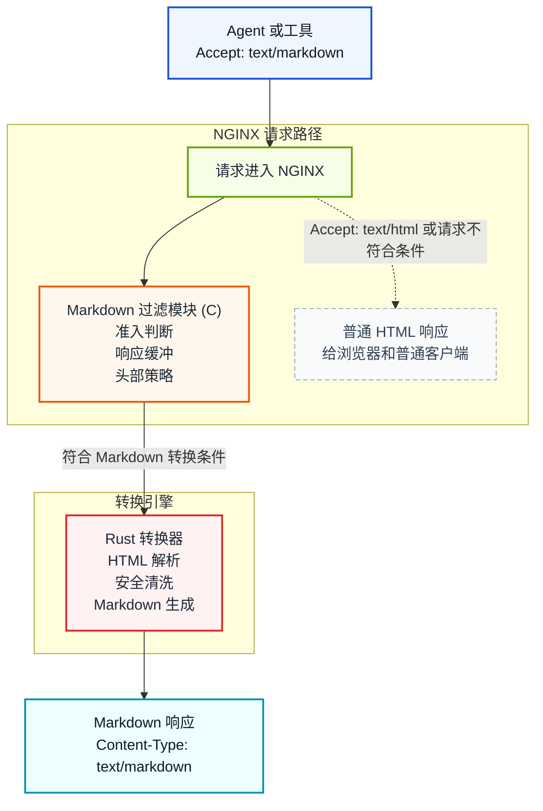

# NGINX Markdown for Agents

[](https://github.com/cnkang/nginx-markdown-for-agents/releases) [](https://github.com/cnkang/nginx-markdown-for-agents/blob/main/docs/guides/INSTALLATION.md) [](https://github.com/cnkang/nginx-markdown-for-agents/actions/workflows/ci.yml) [](https://github.com/cnkang/nginx-markdown-for-agents/actions/workflows/codeql.yml) [](https://github.com/cnkang/nginx-markdown-for-agents/blob/main/LICENSE)

[](https://snyk.io/test/github/cnkang/nginx-markdown-for-agents)

[English](README.md) | 简体中文

让 NGINX 为你已经在提供的 HTML 页面增加一份更适合机器消费的 Markdown 变体。

> HTML 保持原样，Markdown 按需返回。

客户端发送 `Accept: text/markdown` 时得到 Markdown；浏览器和普通调用方仍然拿到原始 HTML。你不需要改造业务应用，不需要额外维护一套抓取器，也不需要单独部署一个转换服务。

这是一种很务实的接入方式：在不动现有站点内容生产流程的前提下，把 Agent 友好能力放到团队已经熟悉的 NGINX 层里完成。

> 灵感来自 Cloudflare 的 [Markdown for Agents](https://blog.cloudflare.com/markdown-for-agents/)。本项目把同样的思路带到你自己可控的 NGINX 部署中。

## 这个项目解决什么问题

AI Agent 和 LLM 工具抓网页时，经常面对的是为浏览器而不是为机器设计的 HTML：

- 导航、布局、脚本等噪音会额外消耗 token。
- 真正有价值的正文内容和大量标记混在一起。
- 每个客户端都要自己维护一套 HTML 抽取或清洗逻辑。

这个模块把转换工作前移到 Web 层。NGINX 根据内容协商决定是否返回 Markdown，只在客户端明确请求 `text/markdown` 时进行转换。

```text
浏览器       -> Accept: text/html      -> HTML（保持不变）
AI Agent     -> Accept: text/markdown  -> Markdown
```

## 为什么值得尝试

- 复用现有页面和上游服务，不必再造一条平行的内容 API。
- 可以渐进式上线，先对一个路径、一个站点或一个 location 启用。
- 基于标准 HTTP 内容协商，缓存与回源行为仍然容易理解和运维。
- 仍然是 NGINX 模块的部署模型，不需要额外引入一个新的常驻服务。

## 一眼看清

| 如果你需要…… | 这个项目提供的是…… |
|--------------|----------------------|
| 让现有站点更适合 Agent 消费 | 从当前 HTML 响应协商出 Markdown 变体 |
| 尽量少动应用层 | 在 NGINX 侧按路径、按站点启用 |
| 可控上线 | 失败透传、大小限制、超时限制和指标 |
| 更符合 HTTP 语义的缓存行为 | 变体 `ETag`、`Vary: Accept` 与条件请求支持 |

## 快速上手
第一次试用只要三步：

1. 安装模块。
2. 在一个 location 上启用。
3. 验证 Markdown 与 HTML 两种返回都符合预期。

### 1. 安装模块

```bash
curl -sSL https://raw.githubusercontent.com/cnkang/nginx-markdown-for-agents/main/tools/install.sh | sudo bash
sudo nginx -t && sudo nginx -s reload
```

安装脚本会识别本机 NGINX 版本，下载匹配的模块制品，并为常见官方 NGINX 构建完成基础 `load_module` 集成。

如果你使用自编译 NGINX 或希望从源码构建，请从 [安装指南](docs/guides/INSTALLATION.md) 开始。
如果你希望基于官方 NGINX Docker 镜像进行源码构建，请参考 `examples/docker/Dockerfile.official-nginx-source-build` 以及 [docs/guides/INSTALLATION.md](docs/guides/INSTALLATION.md) 里的 Docker 小节。

### 2. 在一个路由上开启 Markdown

```nginx
load_module modules/ngx_http_markdown_filter_module.so;

http {
    upstream backend {
        server 127.0.0.1:8080;
    }

    server {
        listen 80;

        location /docs/ {
            markdown_filter on;
            proxy_set_header Accept-Encoding "";
            proxy_pass http://backend;
        }
    }
}
```

如果你的上游可能返回压缩响应，`proxy_set_header Accept-Encoding "";` 是最容易验证的起步方式。等基础链路跑通后，再切换到模块内置的压缩响应处理能力，详见 [Automatic Decompression](docs/features/AUTOMATIC_DECOMPRESSION.md)。

### 3. 验证行为

```bash
# Markdown 变体
curl -sD - -o /dev/null -H "Accept: text/markdown" http://localhost/docs/

# HTML 保持原样
curl -sD - -o /dev/null -H "Accept: text/html" http://localhost/docs/
```

预期结果：

- `Accept: text/markdown` 返回 `Content-Type: text/markdown; charset=utf-8`
- `Accept: text/html` 仍返回原始 HTML

如果你想直接看更贴近生产环境的配置模式，下一步可以看 [docs/guides/DEPLOYMENT_EXAMPLES.md](docs/guides/DEPLOYMENT_EXAMPLES.md)。

## 什么场景最适合

如果你符合下面这些情况，这个项目通常很合适：

- 已经通过 NGINX 提供 HTML 页面，希望最小改动增加 Agent 友好的表示
- 需要给爬虫、内部 Agent、检索系统或助手类产品提供 Markdown 内容
- 想把表示层控制和缓存策略继续放在边缘或反向代理层

下面这些情况就不一定是最佳选择：

- 你已经有专门的 Markdown 或 JSON 内容 API
- 你今天就必须支持超大页面的真正流式 Markdown 转换
- 你希望转换逻辑完全脱离请求路径

## 你能得到什么

| 能力 | 说明 |
|------|------|
| 内容协商 | 只有显式请求 `text/markdown` 时才触发转换 |
| HTML 透传 | 浏览器和普通客户端行为不变 |
| 自动解压 | 支持 gzip、brotli、deflate 上游响应 |
| 缓存友好变体 | 支持 ETag 与条件请求 |
| 失败策略可控 | 可选失败透传或失败拦截 |
| 资源限制 | 可配置大小与超时上限 |
| 安全清洗 | 在转换器中处理 XSS、XXE、SSRF 相关风险 |
| 可选元数据 | 支持 token 估算与 YAML front matter |
| 指标端点 | 提供转换计数等运行指标 |

## 工作原理



NGINX 模块负责请求是否可转换、响应缓冲和头部管理。Rust 转换器负责 HTML 解析、安全清洗、确定性 Markdown 生成等核心逻辑。

## 为什么是 C + Rust

这个拆分是沿着真实的问题边界做的。

- C 负责直接接入 NGINX 模块 API、过滤链、缓冲区和请求生命周期。
- Rust 负责解析不可信 HTML、做内容清洗和生成可预测的 Markdown 输出。
- FFI 边界保持得很小，这样 NGINX 侧的 HTTP 逻辑和转换逻辑可以相对独立演进。

如果你想看完整的设计理由，而不只是这里的简版说明，可以继续读 [docs/architecture/SYSTEM_ARCHITECTURE.md](docs/architecture/SYSTEM_ARCHITECTURE.md) 和 [docs/architecture/ADR/0001-use-rust-for-conversion.md](docs/architecture/ADR/0001-use-rust-for-conversion.md)。

如果你想理解某个 directive 到底会改变哪一段运行时行为，可以继续看 [docs/architecture/CONFIG_BEHAVIOR_MAP.md](docs/architecture/CONFIG_BEHAVIOR_MAP.md)。

## 本地试一下

```bash
# 快速构建 + 冒烟测试
make test

# 完整 Rust 测试
make test-rust

# 完整 NGINX 模块单元测试
make test-nginx-unit
```

更完整的集成测试、E2E 与性能基线说明见 [docs/testing/README.md](docs/testing/README.md)。

## 文档导航

| 目标 | 文档 |
|------|------|
| 安装模块 | [docs/guides/INSTALLATION.md](docs/guides/INSTALLATION.md) |
| 从源码构建 | [docs/guides/BUILD_INSTRUCTIONS.md](docs/guides/BUILD_INSTRUCTIONS.md) |
| 配置指令 | [docs/guides/CONFIGURATION.md](docs/guides/CONFIGURATION.md) |
| 查看部署示例 | [docs/guides/DEPLOYMENT_EXAMPLES.md](docs/guides/DEPLOYMENT_EXAMPLES.md) |
| 运维与排障 | [docs/guides/OPERATIONS.md](docs/guides/OPERATIONS.md) |
| 了解架构与设计取舍 | [docs/architecture/README.md](docs/architecture/README.md) |
| 理解配置如何映射到运行时行为 | [docs/architecture/CONFIG_BEHAVIOR_MAP.md](docs/architecture/CONFIG_BEHAVIOR_MAP.md) |
| 深入实现细节 | [docs/features/README.md](docs/features/README.md) |
| 查看测试说明 | [docs/testing/README.md](docs/testing/README.md) |
| 项目状态 | [docs/project/PROJECT_STATUS.md](docs/project/PROJECT_STATUS.md) |
| 参与贡献 | [CONTRIBUTING.md](CONTRIBUTING.md) |

## 阅读路径建议

- 想快速判断是否适合接入：先看本页，再看 [docs/guides/DEPLOYMENT_EXAMPLES.md](docs/guides/DEPLOYMENT_EXAMPLES.md)
- 准备落地安装：看 [docs/guides/INSTALLATION.md](docs/guides/INSTALLATION.md)
- 需要配置和策略细节：看 [docs/guides/CONFIGURATION.md](docs/guides/CONFIGURATION.md)
- 准备上线运维：看 [docs/guides/OPERATIONS.md](docs/guides/OPERATIONS.md)
- 想理解系统结构和技术选型：看 [docs/architecture/README.md](docs/architecture/README.md)
- 想理解 directive 会改动哪段运行时路径：看 [docs/architecture/CONFIG_BEHAVIOR_MAP.md](docs/architecture/CONFIG_BEHAVIOR_MAP.md)
- 想深入实现：看 [docs/features/README.md](docs/features/README.md)
- 想了解验证方式：看 [docs/testing/README.md](docs/testing/README.md)

## 仓库结构

```text
components/
  nginx-module/        NGINX 过滤模块与 NGINX 侧测试
  rust-converter/      HTML 到 Markdown 的转换引擎与 FFI 层
docs/                  用户、运维、测试与架构文档
examples/nginx-configs/ 示例配置
tools/                 安装脚本、CI 脚本与开发工具
Makefile               顶层构建与测试入口
```

## 路线方向

当前版本重点：

- 在 NGINX 请求路径里稳定完成 HTML 到 Markdown 转换
- 处理缓存变体与条件请求
- 提供资源限制、安全清洗和指标等运行保障

接下来会继续加强：

- 更贴近生产环境的性能基准
- 更多部署环境下的验证
- 对流式转换方案的持续探索

## 许可证

BSD 2-Clause "Simplified" License。详见 [LICENSE](LICENSE)。
