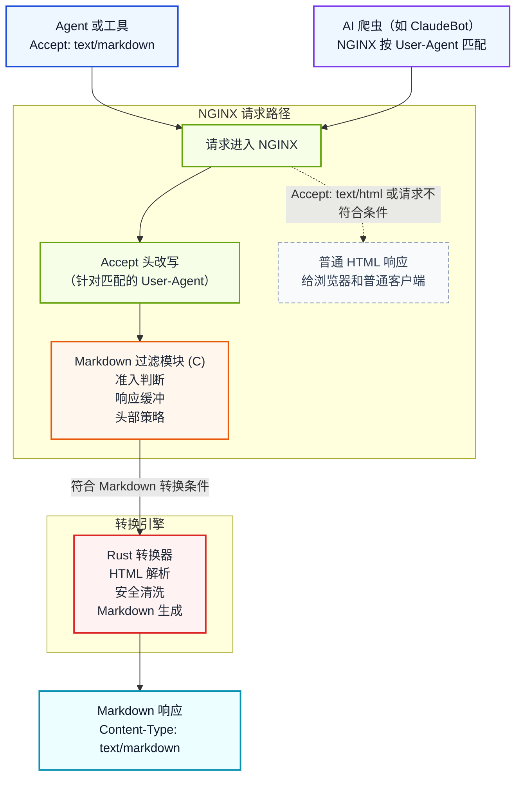

# NGINX Markdown for Agents

[](https://github.com/cnkang/nginx-markdown-for-agents/releases) [](https://github.com/cnkang/nginx-markdown-for-agents/blob/main/docs/guides/INSTALLATION.md) [](https://github.com/cnkang/nginx-markdown-for-agents/actions/workflows/ci.yml) [](https://github.com/cnkang/nginx-markdown-for-agents/actions/workflows/codeql.yml) [](https://github.com/cnkang/nginx-markdown-for-agents/blob/main/LICENSE) [](https://sonarcloud.io/summary/new_code?id=cnkang_nginx-markdown-for-agents)

[English](README.md) | 简体中文

让 NGINX 为你已经在提供的 HTML 页面增加一份更适合机器消费的 Markdown 变体。

> HTML 保持原样，Markdown 按需返回——客户端主动请求，或者你指定哪些 bot 自动获得。

客户端发送 `Accept: text/markdown` 时得到 Markdown；浏览器和普通调用方仍然拿到原始 HTML。你也可以通过 NGINX 配置针对特定的 AI 爬虫（如 ClaudeBot、GPTBot）按 User-Agent 自动改写 Accept 头，让这些 bot 即使没有主动请求 Markdown 也能收到转换后的内容。你不需要改造业务应用，不需要额外维护一套抓取器，也不需要单独部署一个转换服务。

这是一种很务实的接入方式：在不动现有站点内容生产流程的前提下，把 Agent 友好能力放到团队已经熟悉的 NGINX 层里完成。

> 灵感来自 Cloudflare 的 [Markdown for Agents](https://blog.cloudflare.com/markdown-for-agents/)。本项目把同样的思路带到你自己可控的 NGINX 部署中，在更靠近源站的反向代理层完成转换。

## 这个项目解决什么问题

AI Agent 和 LLM 工具抓网页时，经常面对的是为浏览器而不是为机器设计的 HTML：

- 导航、布局、脚本等噪音会额外消耗 token。
- 真正有价值的正文内容和大量标记混在一起。
- 每个客户端都要自己维护一套 HTML 抽取或清洗逻辑。

与传统搜索爬虫为关键词排序建立索引不同，AI 爬虫的目标是提取知识用于生成答案。它们对 token 成本和语义清晰度更敏感——一个典型 HTML 页面的 token 数量可以是其 Markdown 等价内容的 3 倍甚至更多，而多出来的 token 大部分不携带有用信息。对于大规模运行的 AI 系统，这个成本差异会显著累积。

这个模块把转换工作前移到 Web 层。NGINX 根据内容协商决定是否返回 Markdown，只在客户端明确请求 `text/markdown` 时进行转换。你也可以通过配置让 NGINX 针对特定 User-Agent 的 AI 爬虫自动注入 `text/markdown`，这样即使爬虫本身不会发送该头部，也能拿到干净、省 token 的 Markdown 内容。很多站点——技术文档、博客、开发者 Wiki——本身就是用 Markdown 编写内容再渲染成 HTML 发布的。对这类站点来说，这个转换实际上是在恢复内容的原始编写格式。

这遵循的是 HTTP 协议一直以来就有的内容协商模型：同一个 URL 根据客户端的请求为不同消费方提供不同的表示。

```text
浏览器       -> Accept: text/html      -> HTML（保持不变）
AI Agent     -> Accept: text/markdown  -> Markdown
AI 爬虫（按 User-Agent 匹配）          -> Markdown（通过 NGINX 配置）
```

## 为什么值得尝试

- 复用现有页面和上游服务，不必再造一条平行的内容 API。
- 可以渐进式上线，先对一个路径、一个站点或一个 location 启用。
- 基于标准 HTTP 内容协商，缓存与回源行为仍然容易理解和运维。
- 仍然是 NGINX 模块的部署模型，不需要额外引入一个新的常驻服务。
- 在最靠近应用的反向代理层做转换，对 HTML 来源和转换配置有完整的控制权。
- 为 AI 消费方提供更干净、更省 token 的内容表示，减少生成式回答引用你的站点时出现误解或信息丢失的风险。

## 一眼看清

| 如果你需要…… | 这个项目提供的是…… |
|--------------|----------------------|
| 让现有站点更适合 Agent 消费 | 从当前 HTML 响应协商出 Markdown 变体 |
| 尽量少动应用层 | 在 NGINX 侧按路径、按站点启用 |
| 大响应不占满内存 | 双引擎模型——`auto` 模式自动将大响应路由到有界内存流式转换 |
| 可控上线 | 失败透传、提交前安全回退、大小限制、超时限制和跨 worker 聚合指标 |
| 更符合 HTTP 语义的缓存行为 | 变体 `ETag`、`Vary: Accept` 与条件请求支持 |
| 灵活的配置 | 变量驱动的按请求控制、按 User-Agent 定向 bot 以及认证策略 |

## 快速上手
第一次试用只要三步：

1. 安装模块。
2. 在一个 location 上启用。
3. 验证 Markdown 与 HTML 两种返回都符合预期。

### 1. 安装模块

```bash
curl -sSL https://raw.githubusercontent.com/cnkang/nginx-markdown-for-agents/main/tools/install.sh | sudo bash
sudo nginx -t && sudo nginx -s reload
```

安装脚本会识别本机 NGINX 版本，下载匹配的模块制品，并自动接入 `load_module` 与 `markdown_filter on`，无需手动编辑配置。
默认会强制进行 SHA-256 制品完整性校验。

其他安装方式（源码构建、Docker、自定义 NGINX 构建）、故障排查和详细说明见 [安装指南](docs/guides/INSTALLATION.md)。

如果你在 macOS 上通过项目 Homebrew tap 安装（基于 release tag 制品）：

```bash
brew tap cnkang/nginx-markdown
brew install cnkang/nginx-markdown/nginx-markdown-module
```

tap 发布与 GitHub macOS 发布后校验流程见 [docs/guides/HOMEBREW_TAP_RELEASE.md](docs/guides/HOMEBREW_TAP_RELEASE.md)。

### 2. 在一个路由上开启 Markdown

```nginx
load_module modules/ngx_http_markdown_filter_module.so;

http {
    upstream backend {
        server 127.0.0.1:8080;
    }

    server {
        listen 80;

        location / {
            markdown_filter on;
            proxy_set_header Accept-Encoding "";
            proxy_pass http://backend;
        }
    }
}
```

如果你的上游可能返回压缩响应，`proxy_set_header Accept-Encoding "";` 是最容易验证的起步方式。等基础链路跑通后，再切换到模块内置的压缩响应处理能力，详见 [Automatic Decompression](docs/features/AUTOMATIC_DECOMPRESSION.md)。

### 3. 验证行为

```bash
# Markdown 变体
curl -sD - -o /dev/null -H "Accept: text/markdown" http://localhost/

# HTML 保持原样
curl -sD - -o /dev/null -H "Accept: text/html" http://localhost/
```

预期结果：

- `Accept: text/markdown` 返回 `Content-Type: text/markdown; charset=utf-8`
- `Accept: text/html` 仍返回原始 HTML

如果行为不符合预期，请查看安装指南里的 [Troubleshooting](docs/guides/INSTALLATION.md#10-troubleshooting) 小节。

如果你想直接查看面向生产环境的完整配置示例，参见
[生产示例](examples/production/) 目录（覆盖 balanced、strict_cache、
streaming_first 三种 profile）。

## Profiles（v0.9.0+）

生产部署推荐使用 `markdown_profile` 指令，一行配置即可应用一组经过测试的默认值，
无需逐一设置每个指令：

```nginx
http {
    markdown_profile balanced;

    server {
        listen 80;
        location /docs/ {
            markdown_filter on;
            proxy_pass http://backend;
        }
    }
}
```

三个可用 profile：

| Profile | 适用场景 |
|---------|----------|
| `balanced` | 通用部署（推荐起步选择） |
| `strict_cache` | CDN / 缓存代理，需要完整 ETag 支持 |
| `streaming_first` | AI Agent 工作负载，面向大文档 |

合并优先级：显式指令 > profile 默认值 > 内置默认值。你可以在同一
context 中用显式指令覆盖 profile 的任何非强制字段。

完整的 profile 参考、默认值表和冲突规则见
[docs/guides/CONFIGURATION.md](docs/guides/CONFIGURATION.md#profiles)。

## 针对特定 Bot 返回 Markdown

大多数 AI 爬虫不会发送 `Accept: text/markdown`，它们使用和浏览器类似的 Accept 头。你可以用 NGINX 的 `map` 指令根据 User-Agent 改写 Accept 头，让匹配的 bot 自动收到 Markdown，而不需要 bot 自身做任何改变。

```nginx
load_module modules/ngx_http_markdown_filter_module.so;

http {
    # 为已知 AI bot 改写 Accept 头
    map $http_user_agent $bot_accept_override {
        default         "";
        "~*ClaudeBot"   "text/markdown, text/html;q=0.9";
        "~*GPTBot"      "text/markdown, text/html;q=0.9";
        "~*Googlebot"   "text/markdown, text/html;q=0.9";
    }

    map $bot_accept_override $final_accept {
        ""      $http_accept;
        default $bot_accept_override;
    }

    upstream backend {
        server 127.0.0.1:8080;
    }

    server {
        listen 80;

        location /docs/ {
            markdown_filter on;
            proxy_set_header Accept $final_accept;
            proxy_pass http://backend;
        }
    }
}
```

```bash
# 模拟 ClaudeBot — 返回 Markdown
curl -sD - -o /dev/null -A "ClaudeBot/1.0" http://localhost/docs/
# 预期: Content-Type: text/markdown; charset=utf-8

# 普通浏览器请求 — 仍然返回 HTML
curl -sD - -o /dev/null -H "Accept: text/html" http://localhost/docs/
```

原理是模块的内容协商逻辑看到改写后的 Accept 头中包含 `text/markdown`，就会对符合条件的 `text/html` 响应进行转换。所有其他准入检查（状态码、Content-Type、大小限制等）仍然正常生效。浏览器和不匹配的客户端完全不受影响。

完整的配置模板（包含更多 bot 模式）见 [examples/nginx-configs/06-bot-targeted-conversion.conf](examples/nginx-configs/06-bot-targeted-conversion.conf)。详细说明见 [docs/guides/DEPLOYMENT_EXAMPLES.md](docs/guides/DEPLOYMENT_EXAMPLES.md#bot-targeted-conversion-user-agent-based)。

## 什么场景最适合

如果你符合下面这些情况，这个项目通常很合适：

- 已经通过 NGINX 提供 HTML 页面，希望最小改动增加 Agent 友好的表示
- 需要给爬虫、内部 Agent、检索系统或助手类产品提供 Markdown 内容
- 想针对特定 AI 爬虫（ClaudeBot、GPTBot 等）主动返回 Markdown，即使它们不会发送 `Accept: text/markdown`
- 希望 AI 系统在引用你的内容时，能基于更干净、语义更准确的表示来工作
- 想把表示层控制和缓存策略继续放在边缘或反向代理层

下面这些情况就不一定是最佳选择：

- 你已经有专门的 Markdown 或 JSON 内容 API
- 你要求 streaming 全量强制开启，无法使用 auto 阈值模式
- 你希望转换逻辑完全脱离请求路径

## 与边缘层转换的对比

Cloudflare 的 [Markdown for Agents](https://blog.cloudflare.com/markdown-for-agents/) 在 CDN 边缘对已经渲染好的 HTML 进行转换。这种方式在降低接入门槛方面很有效——站点运营者不需要改动源站基础设施就能启用。

本项目在更靠近源站的位置提供 `text/markdown` 表示，通常是在 NGINX 作为反向代理部署在应用前面的那一层。实际区别在于：

- NGINX 转换的 HTML 是应用或 CMS 的直接输出。在这一层做转换意味着不依赖页面在后续链路中可能经历的结构变化或内容增补，更容易保留原始内容语义。
- 转换发生在你自己运维的基础设施内，模块版本、配置、失败策略和上线范围都由你控制。
- 这种方式更贴合标准 HTTP 内容协商模型：由源站（或其反向代理）根据客户端的 Accept 头选择资源的最佳表示。

两种方式没有绝对的优劣。边缘层转换适合希望零改动、跨站点快速启用的场景。靠近源站的转换更适合希望精确控制转换对象、转换方式和运行位置的团队。

## 你能得到什么

| 能力 | 说明 |
|------|------|
| 内容协商 | 客户端请求 `text/markdown` 时触发转换，也支持按 User-Agent 针对特定 bot 自动转换 |
| HTML 透传 | 浏览器和普通客户端行为不变 |
| 自动解压 | 支持 gzip、brotli、deflate 上游响应 |
| 缓存友好变体 | 支持 ETag 与条件请求 |
| 失败策略可控 | 可选失败透传或失败拦截 |
| 资源限制 | 通过 `markdown_max_size` 等 NGINX 指令配置大小与超时上限 |
| 安全加固 | 校验输出链接和 base URL，默认拒绝不安全的 forwarded-host 输入，限制解析/解压资源，并避免执行外部内容 |
| 可选元数据 | 支持 token 估算与 YAML front matter |
| 指标端点 | 提供转换计数等运行指标 |
| 变量驱动配置 | 使用 NGINX 变量实现按请求的转换控制 |
| 认证感知 | 可配置的认证请求策略与缓存控制 |
| 双引擎转换 | 典型响应走全缓冲（默认），大响应或 chunked 响应走流式引擎，并可通过 `auto` 模式自动选择 |
| 有界内存流式转换 | 流式引擎以有界内存转换，并按 `markdown_stream_flush_min` 做基于大小的 flush；提交前错误可回退到 HTML |
| 性能基线门禁 | 自动化回归检测，采用双阈值体系（警告/阻断），覆盖 PR 和 Nightly CI |
| 矩阵驱动的发布自动化 | 自动化发布流水线，支持平台矩阵管理与制品完整性验证 |

## 平台支持

<!-- BEGIN:release-matrix:support-matrix -->

| NGINX | Channel | OS | libc | Arch | Artifact | Tier | Blocking |
|-------|---------|-----|------|------|----------|------|----------|
| 1.31.1 | mainline | linux | glibc | arm64 | dynamic-module | supported | Yes |
| 1.31.1 | mainline | linux | musl | arm64 | dynamic-module | supported | No |
| 1.31.1 | mainline | linux | glibc | amd64 | dynamic-module | supported | Yes |
| 1.31.1 | mainline | linux | musl | amd64 | dynamic-module | supported | No |
| 1.31.1 | mainline | debian12 | glibc | arm64 | docker-image | supported | Yes |
| 1.31.1 | mainline | debian12 | glibc | amd64 | docker-image | supported | Yes |
| 1.31.1 | mainline | alpine3.20 | musl | arm64 | docker-image | supported | Yes |
| 1.31.1 | mainline | alpine3.20 | musl | amd64 | docker-image | supported | Yes |
| 1.30.2 | stable | linux | glibc | arm64 | dynamic-module | supported | Yes |
| 1.30.2 | stable | linux | musl | arm64 | dynamic-module | supported | No |
| 1.30.2 | stable | linux | glibc | amd64 | dynamic-module | supported | Yes |
| 1.30.2 | stable | linux | musl | amd64 | dynamic-module | supported | No |
| 1.28.3 | stable | linux | glibc | arm64 | dynamic-module | supported | Yes |
| 1.28.3 | stable | linux | musl | arm64 | dynamic-module | supported | No |
| 1.28.3 | stable | linux | glibc | amd64 | dynamic-module | supported | Yes |
| 1.28.3 | stable | linux | musl | amd64 | dynamic-module | supported | No |
| 1.26.3 | stable | macos | darwin | arm64 | homebrew-formula | experimental | No |
| 1.26.3 | stable | linux | glibc | arm64 | dynamic-module | supported | Yes |
| 1.26.3 | stable | linux | musl | arm64 | dynamic-module | supported | No |
| 1.26.3 | stable | linux | glibc | amd64 | dynamic-module | supported | Yes |
| 1.26.3 | stable | linux | musl | amd64 | dynamic-module | supported | No |
| 1.26.3 | stable | debian12 | glibc | arm64 | docker-image | supported | Yes |
| 1.26.3 | stable | debian12 | glibc | arm64 | deb-package | supported | Yes |
| 1.26.3 | stable | debian12 | glibc | amd64 | docker-image | supported | Yes |
| 1.26.3 | stable | debian12 | glibc | amd64 | deb-package | supported | Yes |
| 1.26.3 | stable | any | n/a | any | source | best-effort | No |
| 1.26.3 | stable | alpine3.20 | musl | arm64 | docker-image | supported | Yes |
| 1.26.3 | stable | alpine3.20 | musl | amd64 | docker-image | supported | Yes |
| 1.26.3 | stable | almalinux9 | glibc | arm64 | rpm-package | supported | Yes |
| 1.26.3 | stable | almalinux9 | glibc | amd64 | rpm-package | supported | Yes |
| 1.24.0 | oldstable | linux | glibc | arm64 | dynamic-module | supported | Yes |
| 1.24.0 | oldstable | linux | musl | arm64 | dynamic-module | supported | No |
| 1.24.0 | oldstable | linux | glibc | amd64 | dynamic-module | supported | Yes |
| 1.24.0 | oldstable | linux | musl | amd64 | dynamic-module | supported | No |
<!-- END:release-matrix:support-matrix -->

## 工作原理



NGINX 模块负责请求是否可转换、响应缓冲和头部管理。对于按 bot 定向转换的场景，NGINX 的 `map` 指令在模块处理请求之前改写 Accept 头，模块的标准内容协商逻辑照常工作。Rust 转换器负责 HTML 解析、安全清洗、确定性 Markdown 生成等核心逻辑。

## 为什么是 C + Rust

这个拆分是沿着真实的问题边界做的。

- C 负责直接接入 NGINX 模块 API、过滤链、缓冲区和请求生命周期。
- Rust 负责解析不可信 HTML、做内容清洗和生成可预测的 Markdown 输出。
- FFI 边界保持得很小，这样 NGINX 侧的 HTTP 逻辑和转换逻辑可以相对独立演进。

如果你想看完整的设计理由，而不只是这里的简版说明，可以继续读 [docs/architecture/SYSTEM_ARCHITECTURE.md](docs/architecture/SYSTEM_ARCHITECTURE.md)、[docs/architecture/ADR/0001-use-rust-for-conversion.md](docs/architecture/ADR/0001-use-rust-for-conversion.md) 与 [docs/architecture/ADR/0009-rust-first-e2e-test-architecture.md](docs/architecture/ADR/0009-rust-first-e2e-test-architecture.md)。

如果你想理解某个 directive 到底会改变哪一段运行时行为，可以继续看 [docs/architecture/CONFIG_BEHAVIOR_MAP.md](docs/architecture/CONFIG_BEHAVIOR_MAP.md)。

## 本地试一下

```bash
# 快速构建 + 冒烟测试
make test

# 完整 Rust 测试
make test-rust

# 完整 NGINX 模块单元测试
make test-nginx-unit

# 流式专项测试
make test-rust-streaming
make verify-chunked-native-e2e-smoke

# 运行时集成与 canonical E2E 检查
make test-nginx-integration
make test-e2e-rust
make test-e2e
make test-rust-fuzz-smoke
```

`make test-nginx-integration`、`make test-e2e` 和 `make verify-chunked-native-e2e-smoke` 需要真实 `nginx` 运行时；如果 `PATH` 中没有 `nginx`，请设置 `NGINX_BIN=/absolute/path/to/nginx`，让这些命令能找到 nginx 二进制。

更完整的集成测试、E2E 与性能基线说明见 [docs/testing/README.md](docs/testing/README.md) 与 [docs/testing/E2E_TESTS.md](docs/testing/E2E_TESTS.md)。

如果你修改的是仓库 contract、文档校验器或 agent 工作流规则，还需要运行 harness 检查：

```bash
# 仓库级 harness 真相面的廉价阻断检查
make harness-check

# 包含文档与 release-gate 的完整 harness 校验
make harness-check-full
```

把 harness 检查当作仓库 contract 和 release-gate 变更的主入口：

```bash
# workflow、shell、secret、Semgrep 与 Rust 依赖策略的静态安全检查
make security-static

# 面向发布辅助的供应链可见性检查
make supply-chain
```

## 文档导航

| 目标 | 文档 |
|------|------|
| 安装模块 | [docs/guides/INSTALLATION.md](docs/guides/INSTALLATION.md) |
| 从源码构建 | [docs/guides/BUILD_INSTRUCTIONS.md](docs/guides/BUILD_INSTRUCTIONS.md) |
| 配置指令 | [docs/guides/CONFIGURATION.md](docs/guides/CONFIGURATION.md) |
| 查看部署示例 | [docs/guides/DEPLOYMENT_EXAMPLES.md](docs/guides/DEPLOYMENT_EXAMPLES.md) |
| 运维与排障 | [docs/guides/OPERATIONS.md](docs/guides/OPERATIONS.md) |
| 0.7.x → 0.8.0 升级 | [docs/guides/MIGRATION-0.8.md](docs/guides/MIGRATION-0.8.md) |
| 流式转换上线指南 | [docs/guides/streaming-rollout-cookbook.md](docs/guides/streaming-rollout-cookbook.md) |
| 报告漏洞或查看安全支持范围 | [SECURITY.md](SECURITY.md) |
| 了解架构与设计取舍 | [docs/architecture/README.md](docs/architecture/README.md) |
| 了解 harness 的架构设计 | [docs/architecture/HARNESS_ARCHITECTURE.md](docs/architecture/HARNESS_ARCHITECTURE.md) |
| 理解 spec 路由、risk pack 与 harness 检查 | [docs/harness/README.md](docs/harness/README.md) |
| 维护 repo-owned harness 规则与本地适配流程 | [docs/guides/HARNESS_MAINTENANCE.md](docs/guides/HARNESS_MAINTENANCE.md) |
| 理解配置如何映射到运行时行为 | [docs/architecture/CONFIG_BEHAVIOR_MAP.md](docs/architecture/CONFIG_BEHAVIOR_MAP.md) |
| 深入实现细节 | [docs/features/README.md](docs/features/README.md) |
| 查看测试说明 | [docs/testing/README.md](docs/testing/README.md) |
| 项目状态 | [docs/project/PROJECT_STATUS.md](docs/project/PROJECT_STATUS.md) |
| 参与贡献 | [CONTRIBUTING.md](CONTRIBUTING.md) |

## 阅读路径建议

- 想快速判断是否适合接入：先看本页，再看 [docs/guides/DEPLOYMENT_EXAMPLES.md](docs/guides/DEPLOYMENT_EXAMPLES.md)
- 准备落地安装：看 [docs/guides/INSTALLATION.md](docs/guides/INSTALLATION.md)
- 从 0.7.x 升级到 0.8.0：看 [docs/guides/MIGRATION-0.8.md](docs/guides/MIGRATION-0.8.md) — **0.8.0 是 FFI/ABI 破坏性变更；Rust 转换器和 C 模块必须一起升级**
- 安全启用流式转换：看 [docs/guides/streaming-rollout-cookbook.md](docs/guides/streaming-rollout-cookbook.md)
- 需要配置和策略细节：看 [docs/guides/CONFIGURATION.md](docs/guides/CONFIGURATION.md)
- 准备上线运维：看 [docs/guides/OPERATIONS.md](docs/guides/OPERATIONS.md)
- 报告漏洞：看 [SECURITY.md](SECURITY.md)
- 想理解系统结构和技术选型：看 [docs/architecture/README.md](docs/architecture/README.md)
- 想理解 harness 为什么是仓库级资产以及它如何工作：看 [docs/architecture/HARNESS_ARCHITECTURE.md](docs/architecture/HARNESS_ARCHITECTURE.md)
- 想理解 repo-owned agent 工作流与 spec 路由：看 [docs/harness/README.md](docs/harness/README.md)
- 想维护 harness 规则、risk pack 与本地适配层：看 [docs/guides/HARNESS_MAINTENANCE.md](docs/guides/HARNESS_MAINTENANCE.md)
- 想理解 directive 会改动哪段运行时路径：看 [docs/architecture/CONFIG_BEHAVIOR_MAP.md](docs/architecture/CONFIG_BEHAVIOR_MAP.md)
- 想深入实现：看 [docs/features/README.md](docs/features/README.md)
- 想了解验证方式：看 [docs/testing/README.md](docs/testing/README.md)

## 仓库结构

```text
components/
  nginx-module/        NGINX 过滤模块与 NGINX 侧测试
  rust-converter/      HTML 到 Markdown 的转换引擎与 FFI 层
docs/                  用户、运维、测试与架构文档
  architecture/        系统设计、ADR 与配置行为映射
  features/            具体功能的实现细节
  guides/              安装、配置、部署与运维指南
  harness/             repo-owned spec 路由、risk pack 与 harness 检查
  project/             项目状态与路线图
  testing/             测试策略与参考文档
examples/
  docker/              Docker 构建示例与配置
  nginx-configs/       NGINX 配置示例
tests/                 顶层测试语料库与共享测试资源
tools/                 安装脚本、CI 脚本与开发工具
  build_release/       发布构建自动化
  ci/                  持续集成脚本
  corpus/              测试语料生成工具
  docs/                文档工具
  e2e/                 端到端测试工具
.github/workflows/     CI/CD 流水线定义
Makefile               顶层构建与测试入口
```

## 贡献者工作流

如果你改的是运行时行为，请继续使用现有测试入口。

如果你改的是仓库 contract、验证工具或 agent-facing 文档，请把 harness 工作流纳入默认路径：

1. 优先更新 repo-owned truth：  
   `AGENTS.md`、`docs/harness/`、`tools/harness/`、`Makefile`、CI wiring
2. 运行 `make harness-check`
3. 在结束更广义的文档或 release-gate 改动前，运行 `make harness-check-full`

## v0.8.0 新特性

v0.8.0 引入真正的流式转换——面向大响应和 chunked 响应的有界内存 HTML-to-Markdown 处理：

- **双引擎模型** — 自 v0.5.0 起默认的全缓冲转换仍用于典型响应。新的流式引擎以有界内存处理大响应或 chunked 响应。`markdown_streaming_engine` 指令控制使用 `off`、`on` 还是 `auto`。
- **`auto` 模式（默认）** — 设置为 `auto` 时，模块会自动把符合条件的大响应或 chunked 响应路由到流式引擎，其余响应保持全缓冲。**注意：**默认的 `markdown_conditional_requests full_support` 会阻止流式激活，因为完整 ETag 支持需要全缓冲路径。要在 `auto` 模式启用流式，请设置 `markdown_conditional_requests if_modified_since_only` 或 `disabled`。
- **有界内存转换** — 流式引擎根据 `markdown_stream_flush_min`（大小阈值）分块 flush 已转换的 Markdown，无论响应多大都保持有界内存。
- **提交前安全回退** — 如果转换错误发生在流式引擎向客户端提交输出之前，会回退为返回原始 HTML 响应，从而保持流式路径的 fail-open 语义。
- **新流式控制项** — `markdown_stream_threshold`、`markdown_stream_precommit_buffer`、`markdown_stream_flush_min` 和 `markdown_stream_excluded_types` 让阈值选择、replay buffering、flush 和 content-type 排除规则显式化。
- **破坏性变更：v0.6.x 兼容层已移除** — `markdown_streaming_auto_threshold` 已移除（非弃用），`nginx -t` 会因 "unknown directive" 报错。请改用 `markdown_stream_threshold`。`markdown_streaming_engine` 不再接受 `$variable`，仅支持 `off`/`auto`/`on`。

0.7.x 升级指引见 [迁移指南](docs/guides/MIGRATION-0.8.md)。
生产 rollout 步骤见 [Streaming Rollout Cookbook](docs/guides/streaming-rollout-cookbook.md)。

## v0.7.0 新特性

v0.7.0 是一个正确性、分发和可运维性版本：

- **有界解压** — `markdown_decompress_max_size` 独立限制解压输出大小，防止 zip bomb 攻击（错误码 9: DecompressionBudgetExceeded）
- **Accept 协商** — Rust 侧 RFC 9110 §12.5.1 q-value 比较（含 §12.4.2 quality value 语义），在 `text/markdown` 和 `text/html` 之间决定是否转换
- **解析超时与预算** — `markdown_parse_timeout`（默认 30s）和 `markdown_parser_budget`（默认 64m）防止解析失控（错误码 10、11）
- **DEB/RPM 包分发** — 预构建包覆盖 Ubuntu 22.04/24.04、Debian 12、AlmaLinux 9、Amazon Linux 2023，支持 amd64/arm64，并校验 canonical install layout
- **Kubernetes 部署示例** — Helm chart、manifest 和 Ingress Controller 自定义镜像构建路径；默认适配 stock NGINX 镜像，启用模块时需要包含模块的镜像和显式 `markdown.loadModule`
- **运行时诊断** — `/nginx-markdown/diagnostics` 端点暴露配置快照、最近决策和指标
- **Dynconf dry-run 与回滚** — 验证配置变更但不应用；失败时回滚到 last-known-good

其他变更：

- P0 运行时正确性：NGX_AGAIN pending chain、fail-open 去重、安全输出排序
- Rust 条件请求模块（If-None-Match、If-Modified-Since）
- Rust 决策引擎与 reason code
- Rust 响应头计划模块
- Rust URL 控制字符验证与 link 转义
- FFI ABI 布局验证与 header 漂移检测

## v0.8.3 新特性

v0.8.3 是 0.8.x 版本线的收口加固发布：

- **流式状态机修复** — 修正 `pop_contexts_up_to` 返回顺序（内层优先），并在 `ol`/`ul` 衍生状态分支中增加 `CodeBlock` 处理，防止标签汤回归。
- **流式 emitter ExitMany** — 新增 `ExitMany` 动作，支持从栈中间批量解上下文，修复嵌套块级元素的隐式闭合排序问题。
- **解压缓冲区内存安全** — 将解压工作区从 `ngx_alloc`/`ngx_free`（堆）切换到 `ngx_pnalloc`/`ngx_pfree`（池分配），避免混合分配生命周期并防止池扩展副作用（Rule 43）。
- **快照容量提升** — 在流提交路径中将快照最大值从 4 提升到 8，支持更复杂的多 header 变更计划。
- **FFI Box::into_raw 正确性** — 修复转换器句柄分配中的 use-after-free 模式，确保 `Box::into_raw` 在初始化成功后调用。
- **Release manifest 完整性** — 解析 `SHA256SUMS` 并校验 package 与 manifest 摘要；非 tag workflow manifest 会明确声明未签名的 checksum-only 完整性语义。
- **版本一致性检测器 (Rule 55)** — 新增 harness 检测器验证 Cargo.toml、Chart.yaml 和内部依赖的版本对齐，防止发布过程中的版本漂移问题。
- **完整发布门禁验证** — 所有 0.8.x 发布门禁通过：`make harness-check`（15/15）、`make test-harness`（全部检测器）、`make release-gates-check-08x`、`make test-nginx-unit`、`make test-rust-fuzz-smoke`。

完整变更列表见 [CHANGELOG.md](CHANGELOG.md)。

## v0.8.2 新特性

v0.8.2 是一个加固 0.8.x 流式线路的补丁版本：

- **流式解压预算强制执行** — 流式解压路径现在会强制执行配置的解压预算，并根据模块内存预算跟踪流式内存消耗（Rule 3、Rule 44）。
- **FFI panic 安全** — 所有 FFI 导出现在都用 `catch_unwind` 包装，使 Rust panic 返回错误码而不是未定义行为；回退路径将输出结构体初始化为安全默认值（fail-closed）。
- **隐式闭合正确性** — 结构性闭合现在在闭合块状态之前从内到外展开，修复了 HTML sanitizer 隐式闭合排序问题（Rule 6）。
- **C 模块去重** — 从五个 C 源文件中提取共享辅助函数，减少重复并提高可维护性（Rule 31）。
- **inflate 解压语义** — 在 inflate 循环中分离 `Z_OK` 和 `Z_BUF_ERROR` 处理，使部分填充缓冲区条件不再与成功输出混淆（Rule 44）。
- **harness 检测器改进** — 新增 `detect_ngx_log_arg_count.sh` 和 `detect_nosonar_discipline.sh` 检测器，支持 `--strict` 模式；改进 AST/CWE-22 检测器和路径验证。
- **安全扫描范围限定** — gitleaks 现在覆盖 Git 跟踪的工作树内容，同时排除被忽略的适配器状态和缓存（Rule 48）。

完整变更列表见 [CHANGELOG.md](CHANGELOG.md)。

## 路线方向

当前版本线 (0.8.x；最新 patch 0.8.3)：

- 双引擎流式模型：全缓冲默认路径 + 面向大响应/chunked 响应的流式引擎
- `auto` 模式作为默认 `markdown_streaming_engine` 设置
- 基于 `markdown_stream_flush_min` 的有界内存流式转换与按大小 flush
- 提交前安全回退：输出提交前发生转换错误时回退到 HTML
- 流式发布门禁：`make release-gates-check-08x`（`release-gates-check-080` 的别名）验证 0.8.x 发布合约
- 静态安全门禁：`.github/workflows/security-static.yml` 针对 workflow、shell、
  Python 工具脚本、secret、Semgrep 规则与 Rust 依赖策略运行 actionlint、
  shellcheck、gitleaks、聚焦 Semgrep 和 cargo-deny；Semgrep 规则重点覆盖
  明显的 subprocess 误用，以及在 harness 验证 helper 之前直接使用
  CLI 派生路径进行 I/O 的模式、NGINX C 模块里的不安全 libc API，
  以及仍然包含 panic/unwrap/expect 路径的 Rust FFI 导出函数；
  还会覆盖 Dockerfile 里下载后直接执行未验签 rustup 安装器的路径
- 供应链可见性：`.github/workflows/supply-chain.yml` 在 PR、push、定时与
  手动触发时运行报告型 Trivy filesystem/IaC 扫描、SPDX SBOM 生成与
  OpenSSF Scorecard
- 面向生产采用的迁移指南和 rollout cookbook

上一版本（0.7.0）：

- P0 运行时正确性：NGX_AGAIN pending chain、fail-open 去重、安全输出排序
- 独立解压预算（`markdown_decompress_max_size`）
- 解析超时与解析器预算指令
- Rust Accept 头协商模块（RFC 9110 q-value 语义）
- Rust 条件请求模块（If-None-Match、If-Modified-Since）
- Rust 决策引擎与 reason code
- Rust 响应头计划模块
- Rust URL 控制字符验证与 link 转义
- FFI ABI 布局验证与 header 漂移检测
- 新错误码：DecompressionBudgetExceeded(9)、ParseTimeout(10)、ParseBudgetExceeded(11)
- DEB/RPM GitHub Release artifact 分发；APT/YUM 仓库发布不属于当前 GA 渠道
- Package release gate 覆盖 canonical module path、artifact name、checksum 与架构匹配的 smoke test
- Kubernetes 部署示例与默认适配 stock NGINX、显式支持模块启用配置的 Helm chart
- 运行时诊断端点
- Dynconf dry-run 验证与 last-known-good 回滚
- 安装与发布文档已对齐 Rust 1.91.0+ 和当前 CI 预期

近期重点：

- 强化 release gate 的跨环境证据自动化
- 持续增强 conversion drift/degradation 的运维诊断能力
- 扩展流式 telemetry 和可观测性

后续探索：

- OpenTelemetry tracing 集成
- 更多 Markdown 风格与输出格式
- 扩展分发形态（apt/yum/brew 与 ingress-oriented bundles）

## 许可证

BSD 2-Clause "Simplified" License。详见 [LICENSE](LICENSE)。

## Document Updates

| Version | Date | Author | Changes |
|---------|------|--------|---------|
| 0.8.3 | 2026-06-26 | Kang | v0.8.3 收口：流式状态机修复、ExitMany 批量解上下文、解压缓冲区内存安全、快照容量提升、FFI Box::into_raw 修复、完整发布门禁验证 |
| 0.8.2 | 2026-06-25 | Kang | v0.8.2 发布：流式解压加固、FFI panic 安全、隐式闭合正确性、解压预算强制执行、安全扫描范围限定、版本线文档收口 |
| 0.8.0 | 2026-06-16 | Codex | 同步中英文 README 结构、Quick Start 示例、本地测试命令、平台支持标题和 v0.8.0 路线说明 |
| 0.8.0 | 2026-06-16 | Kang | 0.8.0 正式发布文档就绪：双引擎流式转换（auto 默认）、有界内存增量处理、提交前安全回退、旧阈值指令兼容、新流式指令、可观测性与 release-gates-check-080 |
| 0.7.0 | 2026-06-03 | Kang | P0 正确性修复、Rust-first 架构、独立解压预算、Accept 协商、解析超时/预算、DEB/RPM 包分发、K8s 示例、运行时诊断、dynconf dry-run/回滚 |
| 0.6.3 | 2026-05-14 | Kang | 版本号更新至 0.6.3，并补充 release matrix 与发布前最终加固说明 |
| 0.6.2 | 2026-05-08 | Kang | 版本号更新至 0.6.2 以配合发布 |
| 0.5.0 | 2026-04-21 | docs-standardization | Synchronized Quick Start steps between English and Chinese versions; added update tracking section |
