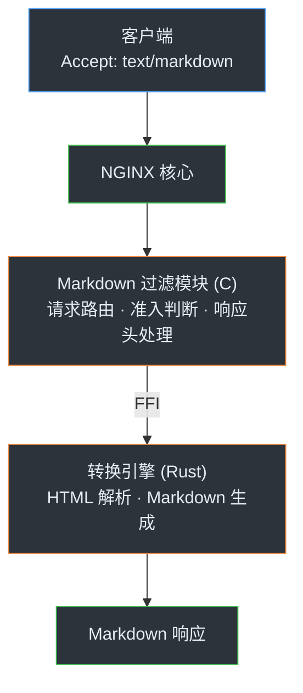

# NGINX Markdown for Agents

[](https://github.com/cnkang/nginx-markdown-for-agents/actions/workflows/ci.yml) [](https://github.com/cnkang/nginx-markdown-for-agents/actions/workflows/codeql.yml) [](https://snyk.io/test/github/cnkang/nginx-markdown-for-agents) [](https://github.com/cnkang/nginx-markdown-for-agents/blob/main/LICENSE) [](https://github.com/cnkang/nginx-markdown-for-agents/blob/main/docs/guides/INSTALLATION.md) [](https://github.com/cnkang/nginx-markdown-for-agents/releases)

[English](README.md) | Simplified Chinese

一个 NGINX 过滤模块，实时将 HTML 响应转为 Markdown — 让 AI Agent 直接读懂你的网页，无需爬虫。

> 灵感来自 Cloudflare 的 [Markdown for Agents](https://blog.cloudflare.com/markdown-for-agents/)。本项目把同样的思路做成了可自托管的 NGINX 模块，部署在你自己的基础设施上。

## 为什么需要这个？

AI Agent 抓取网页拿到的是 HTML，但原始 HTML 对大模型来说又贵又吵：

- 大量样板标签白白消耗 token
- 真正有用的内容埋在导航栏、脚本和布局代码里
- 每个客户端都得自己造一套 HTML 转文本的轮子

这个模块利用标准的 HTTP 内容协商机制，给你现有的页面加上一个 Markdown 版本。客户端只需发送 `Accept: text/markdown`，NGINX 就会返回干净的 Markdown。后端不用改，不用写爬虫，也不用加额外的服务。

```
浏览器     → Accept: text/html     → HTML（原样返回）
AI Agent  → Accept: text/markdown → Markdown ✨
```

## 60 秒安装

适用于官方 NGINX 构建版本（PPA、Alpine 包、Docker 官方镜像）：

```bash
curl -sSL https://raw.githubusercontent.com/cnkang/nginx-markdown-for-agents/main/tools/install.sh | sudo bash
sudo nginx -t && sudo nginx -s reload
```

安装脚本会自动识别你的 NGINX 版本，下载对应的预编译模块，并帮你配好 `load_module` 和 `markdown_filter on;`。

**验证一下：**

```bash
# 应返回 Content-Type: text/markdown
curl -sD - -o /dev/null -H "Accept: text/markdown" http://localhost/

# 应仍返回 Content-Type: text/html
curl -sD - -o /dev/null -H "Accept: text/html" http://localhost/
```

→ 想从源码编译？参见[安装指南](docs/guides/INSTALLATION.md)。

## 最小配置

```nginx
load_module modules/ngx_http_markdown_filter_module.so;

http {
    server {
        listen 80;

        location /docs/ {
            markdown_filter on;
            proxy_set_header Accept-Encoding "";
            proxy_pass http://backend;
        }
    }
}
```

建议先从小范围开始 — 在一个路由上开启 `markdown_filter on;`，验证没问题后再逐步扩大。全局启用、PHP-FPM、gzip 压缩、路径排除等生产环境常见模式，参见[部署示例](docs/guides/DEPLOYMENT_EXAMPLES.md)。

## 工作原理



### 为什么选择 C + Rust？

- C 是 NGINX 模块的原生语言 — 请求生命周期、过滤链、缓冲区管理，这些都是 NGINX 的 C API。
- Rust 负责核心转换逻辑：HTML 解析和 Markdown 生成这类密集计算，天然受益于内存安全和强类型约束。
- FFI 边界由 `cbindgen` 自动生成，干净且稳定。对运维来说，部署方式和普通 NGINX 模块没有区别，Rust 转换器只是一个静态链接库。

## 核心特性

| 特性 | 说明 |
|------|------|
| 内容协商 | 请求头带 `Accept: text/markdown` 时触发转换，其余请求原样通过 |
| 自动解压 | 上游返回 gzip/brotli/deflate 压缩内容时自动解压，无需额外配置 |
| ETag 生成 | 基于 BLAKE3 哈希生成 ETag，Markdown 变体也能享受缓存优化 |
| 条件请求 | 完整支持 `If-None-Match` / `If-Modified-Since` |
| 失败策略可控 | `markdown_on_error pass`（失败透传）或 `block`（失败拦截），按需选择 |
| 资源保护 | `markdown_max_size` 和 `markdown_timeout` 防止大文档或慢转换拖垮服务 |
| 安全防护 | 转换器内置 XSS、XXE、SSRF 防护 |
| Token 估算 | 可选功能，在响应头中返回预估 token 数 |
| YAML Front Matter | 可选功能，在输出开头附加结构化元数据 |
| 指标端点 | 通过 `markdown_metrics` 指令暴露转换统计数据 |

## 测试

```bash
# 快速冒烟测试
make test

# 完整 Rust 测试套件
cd components/rust-converter && cargo test --all

# NGINX 模块单元测试（示例）
make -C components/nginx-module/tests unit-eligibility
make -C components/nginx-module/tests unit-headers
```

## 文档

| 想做什么 | 看哪个文档 |
|----------|-----------|
| 安装和部署 | [安装指南](docs/guides/INSTALLATION.md) |
| NGINX 配置示例 | [部署示例](docs/guides/DEPLOYMENT_EXAMPLES.md) |
| 所有指令 | [配置指南](docs/guides/CONFIGURATION.md) |
| 监控和故障排除 | [运维指南](docs/guides/OPERATIONS.md) |
| 从源码构建 | [构建说明](docs/guides/BUILD_INSTRUCTIONS.md) |
| 常见问题 | [FAQ](docs/FAQ.md) |
| 特性详情 | [docs/features/](docs/features/) |
| 项目状态 | [项目状态](docs/project/PROJECT_STATUS.md) |
| 贡献指南 | [CONTRIBUTING.md](CONTRIBUTING.md) |
| 更新日志 | [CHANGELOG.md](CHANGELOG.md) |

## 项目结构

```
├── components/
│   ├── rust-converter/     # Rust HTML→Markdown 库（html5ever、BLAKE3）
│   └── nginx-module/       # NGINX C 过滤模块 + 测试
├── docs/                   # 使用指南、特性说明、测试文档、架构设计
├── examples/nginx-configs/ # 开箱即用的 NGINX 配置模板
├── tools/                  # 安装脚本、CI 辅助工具
└── Makefile                # 协调构建系统
```

## 路线图

🟢 **v0.1.0（当前版本）** — 核心功能已完成并发布。包括 HTML 到 Markdown 转换、内容协商、ETag / 条件请求、安全防护、指标统计、token 估算、YAML front matter 等。详见 [CHANGELOG](CHANGELOG.md)。

🔜 **接下来**
- 面向生产规模的性能基准测试
- 流式转换（去掉大页面必须完整缓冲的限制）
- 更多真实环境下的部署验证与加固

🔮 **探索中**
- 外部转换服务模式（把转换逻辑卸载到 sidecar 或远程服务）
- Prometheus 原生指标导出
- 可配置的转换策略（比如精简模式 vs 完整保真模式）

## 许可证

BSD 2-Clause "Simplified" License。详见 [LICENSE](LICENSE)。
