# Configuration to Behavior Map

This document maps the public NGINX directives to the runtime behavior they control.

Use it when you already know the directive names, but need to answer questions such as:

- which phase does this directive affect
- which branch of the request lifecycle does it change
- which part of the implementation should I inspect

For the full request flow, read [REQUEST_LIFECYCLE.md](REQUEST_LIFECYCLE.md). For operator-facing syntax and examples, read [../guides/CONFIGURATION.md](../guides/CONFIGURATION.md).

## How to Read This Map

The map describes each directive in four dimensions:

- behavior: what it changes from the user's point of view
- lifecycle impact: which phase or branch it affects
- implementation areas: where that behavior primarily lives in code
- practical note: how to think about it during rollout or debugging

```mermaid
flowchart LR
    subgraph HeaderPhase["Header Filter Phase"]
        MF["markdown_filter"]
        MW["markdown_accept"]
        AP["markdown_auth_policy"]
        AC["markdown_auth_cookies"]
        CV["markdown_cache_validation"]
        LV["markdown_log_verbosity"]
        SP["markdown_streaming"]
        AD["markdown_auto_decompress"]
        SE["markdown_stream_excluded_types"]
    end

    subgraph BodyPhase["Body Filter Phase"]
        ML["markdown_limits"]
        OE["markdown_error_policy"]
        FL["markdown_flavor"]
        TF["markdown_trusted_proxies"]
    end

    subgraph Metrics["Metrics"]
        MM["markdown_metrics"]
        MSHM["markdown_metrics_shm_size"]
    end

    HeaderPhase --> BodyPhase --> Metrics
```

## Core Enablement and Negotiation

### `markdown_filter`

| Aspect | Detail |
|--------|--------|
| Behavior | Enables or disables Markdown conversion for the current context; can be static or variable-driven |
| Lifecycle impact | Header filter entry decision; cached per request before body processing begins |
| Implementation areas | `components/nginx-module/src/ngx_http_markdown_request_impl.h`, `components/nginx-module/src/ngx_http_markdown_eligibility.c` |
| Practical note | This is the top-level switch. If it resolves to off in header phase, the body filter will not revisit that decision. Because `markdown_filter` accepts NGINX variables, operators can combine it with `map` directives to implement User-Agent-based bot targeting — for example, rewriting the Accept header for known AI crawlers so they receive Markdown automatically. See the bot-targeted conversion examples in [../guides/DEPLOYMENT_EXAMPLES.md](../guides/DEPLOYMENT_EXAMPLES.md#bot-targeted-conversion-user-agent-based). |

### `markdown_accept`

| Aspect | Detail |
|--------|--------|
| Behavior | Extends content negotiation so wildcard `Accept` values can trigger Markdown conversion |
| Lifecycle impact | Header-phase negotiation decision before eligibility checks |
| Implementation areas | `components/nginx-module/src/ngx_http_markdown_accept.c`, `components/nginx-module/src/ngx_http_markdown_request_impl.h` |
| Practical note | Use this only when wildcard clients should really receive Markdown; it broadens the set of requests entering the conversion path. |

## Resource and Failure Controls

### `markdown_limits`

| Aspect | Detail |
|--------|--------|
| Behavior | Unified resource limits block with eight bounded keys: conversion/parser timeouts and memory, streaming buffer, decompressed size, decompression ratio, and max in-flight requests |
| Lifecycle impact | Body-phase buffering budget, conversion timeout, streaming memory, and inflight guard |
| Implementation areas | `components/nginx-module/src/ngx_http_markdown_buffer.c`, `components/nginx-module/src/ngx_http_markdown_config_handlers_impl.h` |
| Practical note | Each key is independently inherited and validated. Unknown, duplicate, zero, out-of-range, and overflow values fail closed. |

### `markdown_error_policy`

| Aspect | Detail |
|--------|--------|
| Behavior | Chooses fail-open (`pass`) or fail-closed (`reject`) behavior when conversion or related processing fails |
| Lifecycle impact | Buffering failure, decompression failure, conditional-processing failure, and conversion failure branches |
| Implementation areas | `components/nginx-module/src/ngx_http_markdown_payload_impl.h`, `components/nginx-module/src/ngx_http_markdown_conversion_impl.h`, `components/nginx-module/src/ngx_http_markdown_error.c` |
| Practical note | This directive shapes the operational posture of the system more than the conversion result itself. |

## Output Shape and Metadata

### `markdown_flavor`

| Aspect | Detail |
|--------|--------|
| Behavior | Selects the Markdown flavor emitted by the Rust converter |
| Lifecycle impact | Rust conversion options preparation before FFI call |
| Implementation areas | `components/nginx-module/src/ngx_http_markdown_conversion_impl.h`, `components/rust-converter/src/converter.rs` |
| Practical note | `commonmark` and `gfm` are the supported values. The former `mdx` and `org-mode` selectors were rejected in 0.9.1 because they never provided distinct conversion semantics. |

### `markdown_token_estimate`

| Aspect | Detail |
|--------|--------|
| Behavior | Enables token estimation and the related response metadata |
| Lifecycle impact | Rust conversion options and successful-response header update |
| Implementation areas | `components/nginx-module/src/ngx_http_markdown_conversion_impl.h`, `components/nginx-module/src/ngx_http_markdown_headers.c`, `components/rust-converter/src/token_estimator.rs` |
| Practical note | Useful for agent-facing consumers, but it adds work to the successful conversion path. |

### `markdown_front_matter`

| Aspect | Detail |
|--------|--------|
| Behavior | Prepends YAML front matter to the generated Markdown |
| Lifecycle impact | Rust conversion options and output rendering path |
| Implementation areas | `components/nginx-module/src/ngx_http_markdown_conversion_impl.h`, `components/rust-converter/src/metadata.rs`, `components/rust-converter/src/converter.rs` |
| Practical note | This changes output shape for downstream consumers and may affect caches or clients that expect plain Markdown only. |

## Authentication and Cache Policy

### `markdown_auth_policy`

| Aspect | Detail |
|--------|--------|
| Behavior | Allows or denies conversion for authenticated requests |
| Lifecycle impact | Eligibility branch in header phase and cache-policy adjustment on successful output |
| Implementation areas | `components/nginx-module/src/ngx_http_markdown_auth.c`, `components/nginx-module/src/ngx_http_markdown_eligibility.c`, `components/nginx-module/src/ngx_http_markdown_headers.c` |
| Practical note | This directive affects both whether conversion happens and how cache headers are rewritten if it does. |

### `markdown_auth_cookies`

| Aspect | Detail |
|--------|--------|
| Behavior | Defines which cookie names count as authentication signals |
| Lifecycle impact | Auth detection during eligibility checks and authenticated-response handling |
| Implementation areas | `components/nginx-module/src/ngx_http_markdown_auth.c` |
| Practical note | If authenticated traffic is unexpectedly converted or bypassed, inspect this mapping first. |

## Cache and Conditional Request Behavior

### `markdown_cache_validation`

| Aspect | Detail |
|--------|--------|
| Behavior | Controls conditional request handling and ETag generation: `off`, `ims_only`, or `full` (Config V2, 0.9.0) |
| Lifecycle impact | Conditional resolution branch after buffering and before full conversion; ETag generation on success path |
| Implementation areas | `components/nginx-module/src/ngx_http_markdown_conversion_impl.h`, `components/nginx-module/src/ngx_http_markdown_conditional.c`, `components/nginx-module/src/ngx_http_markdown_headers.c` |
| Practical note | Replaces the removed `markdown_etag` and `markdown_conditional_requests` directives. `full` generates a transformed ETag; `ims_only` supports If-Modified-Since via upstream Last-Modified; `off` disables both. |

## Logging and Observability

### `markdown_log_verbosity`

| Aspect | Detail |
|--------|--------|
| Behavior | Sets the module-local threshold for emitted module logs |
| Lifecycle impact | Logging across header filter, body filter, decompression, conditional handling, conversion, and metrics paths |
| Implementation areas | `components/nginx-module/src/ngx_http_markdown_config_handlers_impl.h`, `components/nginx-module/src/ngx_http_markdown_config_core_impl.h`, `components/nginx-module/src/ngx_http_markdown_request_impl.h`, `components/nginx-module/src/ngx_http_markdown_payload_impl.h`, `components/nginx-module/src/ngx_http_markdown_conversion_impl.h`, `components/nginx-module/src/ngx_http_markdown_metrics_impl.h` |
| Practical note | This does not change runtime behavior directly, but it changes how visible each branch becomes during debugging. |

### `markdown_metrics`

| Aspect | Detail |
|--------|--------|
| Behavior | Enables a dedicated metrics endpoint at a location |
| Lifecycle impact | Separate location-handler path, not the normal conversion filter chain |
| Implementation areas | `components/nginx-module/src/ngx_http_markdown_config_handlers_impl.h`, `components/nginx-module/src/ngx_http_markdown_config_directives_impl.h`, `components/nginx-module/src/ngx_http_markdown_metrics_impl.h` |
| Practical note | The wire format is exclusively Prometheus text 0.0.4 with exactly twelve bounded families; Accept negotiation cannot restore removed JSON or legacy text output. |

## Transfer and Streaming-Oriented Controls

### `markdown_stream_excluded_types`

| Aspect | Detail |
|--------|--------|
| Behavior | Prevents selected media types from entering the streaming path |
| Lifecycle impact | Header-phase streaming eligibility branch |
| Implementation areas | `components/nginx-module/src/ngx_http_markdown_request_impl.h`, `components/nginx-module/src/ngx_http_markdown_streaming_impl.h` |
| Practical note | Excluded responses may still use bounded full-buffer conversion when other eligibility checks pass. |

### `markdown_auto_decompress`

| Aspect | Detail |
|--------|--------|
| Behavior | Automatically decompresses upstream responses (gzip, deflate, br) before conversion |
| Lifecycle impact | Header filter detection; body filter decompression flow |
| Implementation areas | `components/nginx-module/src/ngx_http_markdown_decompression.c` |
| Practical note | Default is `on`. If `off`, compressed responses are passed through unchanged. |

### `markdown_streaming`

| Aspect | Detail |
|--------|--------|
| Behavior | Selects the processing path: `off` requires full-buffer, `auto` routes by size/response shape, and `force` prefers streaming for every eligible response |
| Lifecycle impact | Header-phase routing and body-filter path selection after hard eligibility and cache-validation gates |
| Implementation areas | `components/nginx-module/src/ngx_http_markdown_request_impl.h`, `components/nginx-module/src/ngx_http_markdown_streaming_impl.h` |
| Practical note | This is the sole public streaming selector in 0.9.2. The removed `markdown_streaming_engine` directive is absent from the command table; using it reports an `unknown directive` error at `nginx -t` time. |

## Practical Use Cases

### “Why did this request stay as HTML?”

Start with directives that affect entry and bypass:

- `markdown_filter`
- `markdown_accept`
- `markdown_auth_policy`
- `markdown_stream_excluded_types`

Then move to [REQUEST_LIFECYCLE.md](REQUEST_LIFECYCLE.md) and trace header-phase eligibility.

### “Why did this request fail open?”

Start with:

- `markdown_error_policy`
- `markdown_limits`
- `markdown_cache_validation`

Then inspect the failure branches in [REQUEST_LIFECYCLE.md](REQUEST_LIFECYCLE.md).

### “Which directives affect the Rust converter call?”

Mostly:

- `markdown_flavor`
- `markdown_limits`
- `markdown_token_estimate`
- `markdown_front_matter`
- `markdown_cache_validation`

Those are the knobs most directly reflected in the conversion options passed through FFI.

## Document Updates

| Version | Date | Author | Changes |
|---------|------|--------|---------|
| 0.9.1 | 2026-07-14 | Codex | Make markdown_streaming the sole public processing-path selector and document removal of non-semantic flavor values |
| 0.9.1 | 2026-07-13 | Kang | Align legacy directive references with 0.9.0 Config V2 implementation (markdown_limits, markdown_error_policy, markdown_accept, markdown_cache_validation; retire markdown_large_body_threshold) |
| 0.6.2 | 2026-05-08 | Kang | Unified version narrative to 0.6.2 current release line |
| 0.5.0 | 2026-04-21 | docs-standardization | Standardized formatting, added mermaid diagrams where applicable, verified directive accuracy against code, added update tracking section |
