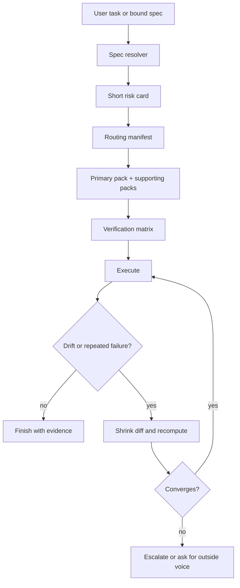

# Harness Architecture

This document explains the repo-owned harness that coordinates agent-facing
workflow rules in `nginx-markdown-for-agents`.

Use it when you need to understand:

- why the harness exists as a repository asset instead of a local-only prompt
- which files own durable harness truth
- how spec resolution, routing, verification, and maintenance fit together
- how the harness stays compatible with optional local `.kiro/` data without
  making the public repository depend on it

## Problem Statement

The repository already had strong runtime architecture docs and a large body of
historical fixes captured in `AGENTS.md`, but agent workflow behavior was still
spread across:

- `AGENTS.md`
- local `.kiro/steering/` files
- local `.kiro/specs/`
- CI and Make targets
- reviewer and maintainer habits

That layout worked for one local setup, but it was not a stable open-source
contract. The project needed a repo-owned harness that could:

- keep Codex-first rules visible in public history
- consume optional local spec context without requiring private files
- expose executable checks instead of only prose guidance
- preserve human-readable documentation and machine-readable routing from one
  canonical source

## Design Goals

- Keep repo-owned truth in tracked files.
- Keep local adaptation optional.
- Make cheap validation easy to run and full validation explicit.
- Separate durable rules from short-lived execution memory.
- Preserve correctness and safety boundaries even when specs or local tools
  suggest a more aggressive path.

## Non-Goals

- Re-explaining runtime HTML conversion, NGINX filter flow, or FFI semantics.
- Storing private spec contents or replay annotations in tracked files.
- Turning the repository into a full agent platform or orchestration service.
- Replacing contributor judgment with automatic routing in ambiguous cases.

## System Model

## Truth Surfaces

The harness has one public contract surface and two supporting layers.

### 1. Map and contract

- `AGENTS.md`

`AGENTS.md` remains the top-level contract for repository-specific engineering
rules. It points to the harness, but it does not duplicate the full harness
implementation.

### 2. Repo-owned harness truth

- `docs/harness/README.md`
- `docs/harness/core.md`
- `docs/harness/routing-manifest.json`
- `docs/harness/routing-manifest.md`
- `docs/harness/risk-packs/*.md`
- `tools/harness/*.py`

This is the canonical tracked harness surface. It is designed to be readable by
humans and consumable by tools.

### 3. Optional local inputs and adapters

- `.kiro/specs/`
- `.kiro/active-spec.json`
- `.kiro/active-spec.txt`
- `.kiro/steering/*.md`

These files are optional. Public clones must still pass repo validation without
them. When present, they refine local resolution and adapter behavior, but they
do not replace repo-owned truth.

## Core Components

### Spec resolver

The resolver binds a task to a concrete spec when enough evidence exists.

Resolution order:

1. explicit user-provided spec
2. optional local active-spec pointer
3. explainable hint-based matching

If confidence remains low, the resolver must degrade explicitly instead of
guessing silently.

### Routing manifest

`docs/harness/routing-manifest.json` is the canonical structured source for:

- truth surfaces
- verification families
- risk pack metadata
- pack-to-check relationships

`docs/harness/routing-manifest.md` is the readable summary of that same model.
The markdown view must not introduce hidden semantics.

### Risk packs

Risk packs are organized by technical hazard, not by task label. The current
tracked set covers:

- runtime streaming behavior
- FFI boundary synchronization
- observability and metrics correctness
- docs and tooling drift

Each task may activate one primary pack plus zero or more supporting packs.

### Verification matrix

The verification matrix is phased:

1. cheap blockers
2. focused semantic checks
3. broader umbrella or release-level checks

Verification may raise the effective risk above the initial route. The first
guess never outranks later evidence.

This design intentionally favors a cheap fast path. Broader scans, replay, and
history-heavy analysis are escalation tools, not default taxes on every task.

### State carrier

The harness keeps short-lived execution memory in a user-local state carrier,
not in repo docs. The state carrier is used for:

- retry counts
- drift evidence
- bounded reflection notes
- promotion evidence for future rule updates

This avoids polluting tracked documentation with ephemeral task history while
still giving maintenance flows a durable signal source.

## Public vs Local Execution

The harness supports one public behavior model with adaptive checks.

- Public repo truth is always checked.
- Optional local `.kiro/` inputs add stricter checks when present.
- Missing local files become `SKIP_NOT_PRESENT`, not repository failures.

This keeps the project open-source friendly while still supporting richer local
author workflows.

## Maintenance Loop

The harness is not intended to freeze after initial rollout.

Two maintenance paths are expected:

- sync maintenance: keep repo truth, adapters, Make targets, and CI aligned
- rule evolution: update packs or routing when repeated fixes, replay evidence,
  or historical commit patterns justify a stronger rule

The sync gate exists to keep those truth surfaces from drifting apart. The
maintenance loop is not only social process; it is backed by executable checks.

The maintenance loop is supported by:

- `make harness-check`
- `make harness-check-full`
- `tools/harness/check_harness_sync.py`
- `tools/harness/state_store.py`
- local maintenance skills outside the repository

## Failure Boundaries

The harness is designed to fail explicitly in four common situations:

- no confident spec binding
- route confidence too low to pick a single safe path
- repeated drift after one recompute attempt
- a spec or user request appears to violate repository correctness or safety
  boundaries

In those cases the harness should either:

- downgrade to core plus candidate packs
- request explicit human confirmation
- or ask for outside voice from a different model family

## Validation Sequencing

The harness design reviews settled on a dual proving-ground strategy:

1. runtime-risk first
2. static-quality second

This sequencing is deliberate. It proves the harness against the most expensive
correctness and safety surfaces before widening to style, lint, or broader
quality-discipline scenarios.

## Relationship to Other Docs

- Runtime system architecture: [SYSTEM_ARCHITECTURE.md](SYSTEM_ARCHITECTURE.md)
- Request lifecycle: [REQUEST_LIFECYCLE.md](REQUEST_LIFECYCLE.md)
- Repository layout: [REPOSITORY_STRUCTURE.md](REPOSITORY_STRUCTURE.md)
- Harness entrypoint: [../harness/README.md](../harness/README.md)
- Harness maintenance procedures: [../guides/HARNESS_MAINTENANCE.md](../guides/HARNESS_MAINTENANCE.md)
- Decision record for this design: [ADR/0005-repo-owned-harness.md](ADR/0005-repo-owned-harness.md)
