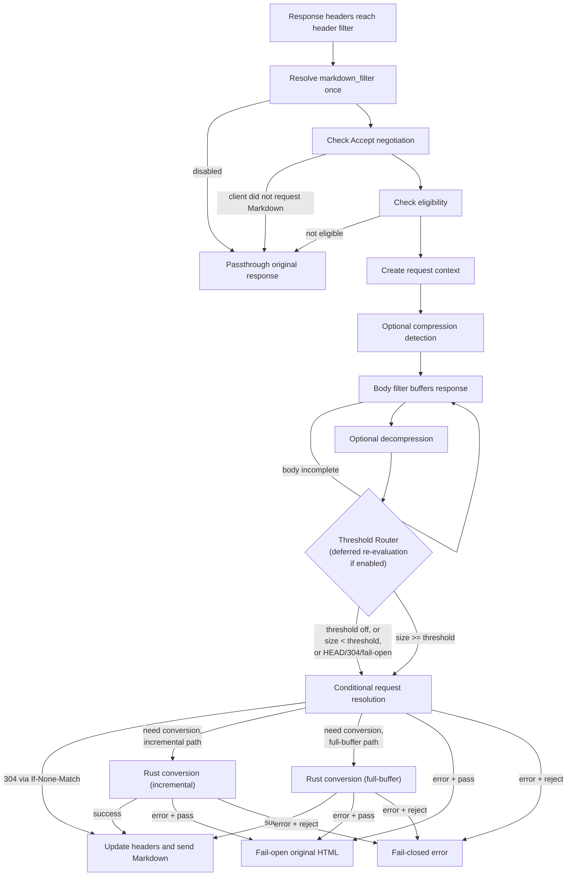

# Request Lifecycle

This document explains how a request moves through the NGINX module at runtime, from header evaluation to final response delivery.

It focuses on control flow, decision points, and the major branches that affect behavior:

- normal Markdown conversion
- passthrough and bypass paths
- decompression
- conditional requests
- fail-open and fail-closed behavior
- the dedicated metrics endpoint
- the streaming processing path for large responses (default `auto`)

## Two Runtime Modes

At a high level, the module runs in one of two modes:

- normal filter-chain mode for application responses
- dedicated handler mode for the `markdown_metrics` location

The metrics endpoint does not go through the normal conversion path. It is served directly by a location handler.

## Main Conversion Flow

For a normal request, the lifecycle is split across the NGINX header filter and body filter.



## Phase 1: Header Filter

The header filter decides whether the module should even attempt conversion for this request.

### 1. Resolve `markdown_filter`

The module evaluates `markdown_filter` in the header phase and caches that decision in the request context. This matters when `markdown_filter` is driven by a variable or complex value.

The body phase does not re-evaluate it. That avoids header/body inconsistencies for dynamic expressions.

### 2. Check whether the client asked for Markdown

If negotiation does not indicate a Markdown response should be attempted, the module passes the response through untouched.

This decision is driven by the configured negotiation behavior, including:

- explicit `Accept: text/markdown`
- optional wildcard handling
- other eligibility rules controlled by configuration

### 3. Check response eligibility

Even when Markdown is requested, the response may still be bypassed. Eligibility checks cover module policy and response shape, such as:

- request method
- response status
- response content type
- authenticated-request policy
- stream-type exclusions
- other conditions that make conversion unsafe or inappropriate

If the response is not eligible, the module stays out of the way and the original response continues through NGINX.

### 4. Create the conversion context

If the response is eligible, the module creates a request-scoped context and
selects either streaming or full-buffer processing from the effective profile,
cache requirements, response shape, and content coding.

That context carries the per-request state used by the body filter, including:

- whether conversion is still eligible
- the selected streaming/full-buffer path and pending input/output state
- whether headers have already been forwarded
- whether decompression is needed
- whether conversion has already been attempted

### 5. Detect compression if auto-decompression is enabled

Before the body arrives, the module inspects response headers to determine whether the upstream payload is compressed.

Possible outcomes:

- no compression detected: continue on the fast path
- gzip or deflate detected with streaming selected and cache validation not
  `full`: use incremental decompression before streaming conversion
- Brotli, or a supported coding whose validation requirements force buffering:
  use bounded full-buffer decompression
- unsupported compression detected: mark the request ineligible and fall back to passthrough behavior

At this point the module does not emit converted headers yet. It waits until the body phase has enough information to produce a correct response.

## Phase 2: Body Filter

The body filter performs the actual runtime work once body chunks begin arriving.

### 1. Fast exits

Before doing anything expensive, the body filter checks a few short-circuit paths:

- no module config: pass through
- no request context: pass through
- filter disabled for this request: pass through
- already marked ineligible: forward original headers and pass through
- conversion already attempted: do not run conversion twice

These exits keep the non-conversion path cheap.

### 2. Process the selected path

For the streaming path, each upstream chunk is incrementally decompressed when
it uses gzip or deflate, then fed to the streaming converter. Pending input and
output remain request-owned across downstream `NGX_AGAIN`; source positions are
advanced only after actual consumption. Gzip member boundaries may occur
inside a chunk or between chunks, and decompression budgets remain cumulative
across member resets.

For the full-buffer path, the module buffers the upstream body until the full
response has arrived. This path remains required for full cache validation and
Brotli in 0.9.1.

Full-buffer details:

- buffering is initialized lazily on first body chunk
- the module may pre-reserve capacity using `Content-Length`
- if the last buffer has not arrived yet, the filter returns and waits for more input
- buffering remains bounded by the configured memory limits

If buffering fails because of allocation or size-limit conditions, the next branch depends on `markdown_error_policy`:

- `pass`: fail open and return original HTML
- `fail_closed`: fail closed and return an error to the client

## Phase 3: Optional Full-Buffer Decompression

If the full-buffer request was marked as compressed in header phase, the body
filter decompresses the buffered payload before conversion. Streaming gzip and
deflate have already been decompressed incrementally in Phase 2.

This step only runs when needed.

On success, the module:

- replaces the buffered payload with decompressed bytes
- records decompression metrics
- removes `Content-Encoding` from the outgoing response metadata

On failure, behavior again follows the configured error policy:

- fail open to original HTML when configured to pass
- fail closed when configured to reject

## Phase 4: Conditional Request Resolution

Before invoking the Rust converter for a normal 200 Markdown response, the module checks whether the request can be satisfied as `304 Not Modified`.

This is the Markdown-variant conditional-request path.

Possible outcomes:

- Markdown variant matches `If-None-Match`: send `304 Not Modified`
- no match, but the conditional path already produced a conversion result: reuse it
- error during conditional handling: fail open or fail closed based on policy
- no conditional shortcut available: continue to full conversion

This keeps cache-aware behavior inside the Markdown variant rather than relying only on the upstream HTML representation.

## Phase 5: Rust Conversion

If no conditional shortcut applies, the module prepares a `MarkdownOptions` structure and calls the Rust converter through FFI.

Options passed across the boundary include current configuration such as:

- Markdown flavor
- timeout
- ETag generation
- token estimation
- front matter
- content type
- base URL used for resolving relative links

The module also constructs a request-specific base URL before the FFI call. When `markdown_trusted_proxies` is configured with trusted CIDR blocks, forwarded headers from those proxies are preferred; otherwise the module uses the NGINX request scheme and host information.

### Success path

On success, the module:

- records conversion metrics
- updates response headers for the Markdown variant
- forwards headers downstream
- sends the Markdown body, or no body for `HEAD`

### Failure path

If the converter returns an error, the module classifies it into a failure category such as:

- conversion failure
- resource-limit failure
- system failure

It then records the relevant counters and applies `markdown_error_policy`:

- `pass`: send original HTML
- `reject`: fail the request

## Streaming Processing Path

The module supports a streaming conversion path for large responses. This path is governed by the `markdown_streaming_engine` directive. When set to `auto` (default), the module uses a size-based threshold to decide between full-buffer and streaming paths.

### Threshold Router
After the body filter has buffered the response (or while buffering), a threshold router decides which conversion path to use. The decision is controlled by the `markdown_stream_threshold` configuration directive:

```nginx
# Default: 1m
markdown_stream_threshold 1m;
```

The router evaluates in this order:
1. If `markdown_streaming_engine` is `off`: all requests use the full-buffer path.
2. If `markdown_streaming_engine` is `on`: all eligible responses use the streaming path.
3. If `markdown_streaming_engine` is `auto` (default):
   - If the request is HEAD, 304, or a fail-open replay: always use the full-buffer path.
   - If `Content-Length` is present and meets or exceeds `markdown_stream_threshold`: use the streaming path.
   - If `Content-Length` is absent: buffer the response. Once the buffered size exceeds the threshold, switch to the streaming path. Otherwise, continue on the full-buffer path.

The selected path is recorded in the request context and tracked through path-hit metrics.

### Streaming Conversion
When the streaming path is selected, the module feeds response data to the Rust `IncrementalConverter` through FFI:
1. Create a converter instance with the current conversion options.
2. Feed input data in chunks as they arrive.
3. Finalize the conversion and obtain the result.

Error handling on the streaming path follows the same `markdown_error_policy` as the full-buffer path: fail-open returns original HTML, fail-closed returns an error to the client.

## Header Updates on Successful Conversion

When conversion succeeds, the module updates the response so it is a correct Markdown variant rather than a mutated HTML response.

That includes behavior such as:

- setting `Content-Type: text/markdown; charset=utf-8`
- ensuring `Vary: Accept`
- generating or clearing variant `ETag` according to configuration
- setting token-estimate headers when enabled
- removing headers that no longer apply to the transformed body
- adjusting cache behavior for authenticated responses when policy allows conversion

## Fail-Open Behavior

Fail-open is important enough to call out separately because it has more than one runtime form.

### Fail open before full conversion

If the module decides not to convert before consuming the full body, it can usually forward the original response through the normal chain.

### Fail open after partial or full buffering

If the module has already consumed body data into its own buffer, it must replay the original buffered HTML itself. That is why the implementation contains the following dedicated helpers:

- sending the fully buffered original response
- replaying a buffered prefix and then forwarding the remaining upstream chain

This preserves correctness when the module abandons conversion after it has already intercepted body chunks.

## Metrics Endpoint Lifecycle

The `markdown_metrics` location is handled separately from normal conversion.

Its lifecycle is:

1. request matches a location configured with `markdown_metrics`
2. the location handler runs directly
3. method is checked (`GET` and `HEAD` only)
e.g. the la
4. client address is restricted to localhost by the handler
5. output format is selected and from `Accept`
6. metrics are rendered as plain text or JSON
7. response headers and body are sent directly

This path does not use the response conversion filters.

## What This Means for Readers of the Code

If you are debugging a behavior, the module's runtime behavior is:

- header filter decides intent
- body filter executes the expensive path
- the threshold router selects full-buffer or streaming conversion based on response size (when `markdown_streaming_engine auto` is used)
- helper functions handle branching details for decompression, conditionals, and failure policy
- the Rust converter is called only after the module has enough buffered state to do so safely

## Related Documents

- Runtime structure: [SYSTEM_ARCHITECTURE.md](SYSTEM_ARCHITECTURE.md)
- Code layout: [REPOSITORY_STRUCTURE.md](REPOSITORY_STRUCTURE.md)
- Why Rust: [ADR/0001-use-rust-for-conversion.md](ADR/0001-use-rust-for-conversion.md)
- Why full buffering: [ADR/0002-full-buffering-approach.md](ADR/0002-full-buffering-approach.md)
- Large response optimization: [LARGE_RESPONSE_DESIGN.md](LARGE_RESPONSE_DESIGN.md)
- Operator-facing behavior: [../guides/CONFIGURATION.md](../guides/CONFIGURATION.md)

## Document Updates

| Version | Date | Author | Changes |
|---------|------|--------|---------|
| 0.5.0 | 2026-04-21 | docs-standardization | Standardized formatting, added mermaid diagrams where applicable, verified directive accuracy against code, added update tracking section |
| 0.6.2 | 2026-05-08 | Kang | Unified version narrative to 0.6.2 current release line |
| 0.9.1 | 2026-07-13 | Kang | Align legacy directive references with 0.9.0 Config V2 implementation (markdown_limits, markdown_error_policy, markdown_accept, markdown_cache_validation; retire markdown_large_body_threshold) |
