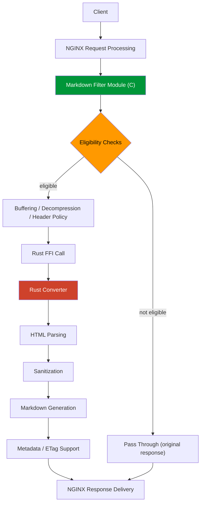
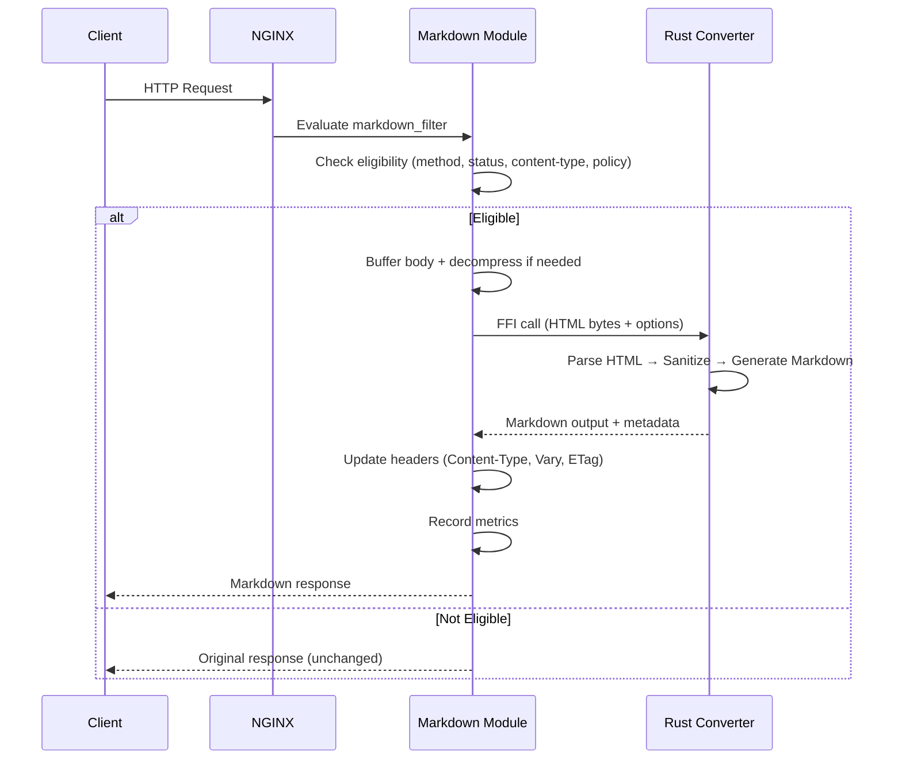

# System Architecture

This document explains the runtime structure of `nginx-markdown-for-agents`. It covers the responsibilities of each component and the reasoning behind the main technology choices.

## Design Goals

The system has four design goals:

- add a Markdown representation to existing HTML responses without changing the application
- keep request handling inside standard NGINX deployment and operations patterns
- keep HTML parsing and conversion safe, deterministic, and testable
- keep failure behavior explicit and observable

## High-Level Structure

At runtime, the system has two main components:

- the NGINX module in C, which participates in the NGINX request and filter pipeline
- the conversion engine in Rust, which parses HTML and produces Markdown through a small FFI boundary

## Why C + Rust

The split is deliberate.

### Why the NGINX-facing layer is C

NGINX modules are built around NGINX's C APIs, request phases, memory pools, buffers, and filter-chain model. Putting the request-path integration in C lets the module:

- fit naturally into normal NGINX module loading and configuration
- manage NGINX request and response objects directly
- participate in header and body filtering without an additional translation layer
- preserve familiar deployment and debugging workflows for operators

### Why the conversion engine is Rust

HTML parsing and Markdown generation are the parts most exposed to malformed or hostile input. They are also the parts most likely to grow in complexity over time. Rust is a better fit there because it provides:

- stronger memory-safety guarantees for parsing untrusted input
- a strong ecosystem for HTML parsing and supporting utilities
- better ergonomics for testing, property testing, and output normalization
- clearer ownership and error-handling rules than a pure C implementation

### Why not pure C

A pure C implementation would reduce build complexity. However, it would move the riskiest parsing and transformation code into the least forgiving part of the stack. For this project, maintainability and input safety matter more than keeping the entire system in one language.

### Why not an external service

An external converter service would simplify NGINX module logic. However, it would add network hops, new failure modes, deployment overhead, and an extra operational surface. This project is explicitly designed to keep conversion inline with the existing reverse-proxy path.

## Responsibility Split

### NGINX module responsibilities

The C module is responsible for:

- deciding whether a request/response pair is eligible for conversion
- handling configuration, request policy, and negotiation rules
- buffering response bodies and coordinating decompression when needed
- applying response-header changes for Markdown variants
- selecting fail-open or fail-closed behavior on conversion failure
- exposing runtime metrics

Internally, the module now keeps these concerns in separate implementation units:

- config wiring plus a dedicated directive registry table
- config object lifecycle, markdown_filter resolution, merged-config logging, and shared-metrics bootstrap
- custom directive parsing and validation
- request-path state transitions in the header/body filter entrypoints
- request-body buffering, decompression coordination, and fail-open replay
- conversion input preparation, FFI execution, and Markdown-output shaping
- worker lifecycle setup/teardown
- dedicated metrics-handler formatting and access control

### Rust converter responsibilities

The Rust converter is responsible for:

- parsing incoming HTML
- removing or neutralizing unsafe or non-content elements
- generating deterministic Markdown output
- producing optional metadata such as token estimates and front matter
- returning structured results through a stable C-compatible interface

Inside the converter crate, the Markdown renderer splits into distinct units. These units cover traversal, block handling, inline handling, table rendering, front-matter emission, and normalization helpers. The FFI boundary splits into ABI, option-decoding, conversion, memory-management, and export units. Metadata extraction and URL resolution live in separate helper modules. This split keeps logic concentrated in smaller files. It leaves the public API and the C ABI unchanged.

## Why the FFI Boundary Is Small

The C/Rust boundary is intentionally narrow. The NGINX module does not ask Rust to understand NGINX internals. The Rust converter does not try to manage the HTTP lifecycle.

That keeps the contract easier to reason about:

- C owns request-path orchestration
- Rust owns conversion logic
- the boundary passes bytes, options, and results

This reduces coupling and makes it easier to test each side independently.

### FFI Classification: INTERNAL_ONLY

The project classifies the FFI boundary as `INTERNAL_ONLY`. Rust/C struct layouts,
function signatures, and numeric constants may change between any two versions
without notice. The Rust static library and NGINX module ship as one
product. This project does not publish the generated header as a third-party
SDK or promise ABI compatibility to external callers.

A 4-tuple ABI handshake executes during module preconfiguration, before any
business FFI call: `(numeric_abi_version, generated_header_hash,
exported_symbol_set_hash, abi_layout_fingerprint)`. On any mismatch, NGINX
logs each independent failure and refuses to start (`NGX_ERROR`).

## Request Flow

For an eligible Markdown request, the runtime flow is:

Step-by-step:

1. NGINX receives the request and evaluates the configured `markdown_filter` behavior.
2. The module checks request and response eligibility such as method, status, content type, and policy exclusions.
3. If needed, the module buffers the upstream body and decompresses supported encodings.
4. The module passes the buffered payload to the Rust converter through FFI.
5. The converter returns Markdown output and optional metadata.
6. The module updates headers such as `Content-Type`, `Vary`, and variant `ETag`, records shared metrics, then sends the Markdown response.

For non-eligible requests, the module stays out of the way and the original response continues through NGINX unchanged.

## Key Architectural Tradeoffs

### Dual-engine: Full buffering + Streaming (since v0.8.0)

The architecture supports two conversion engines:

- **Full-buffer engine** (default for small responses): buffers the full eligible response before conversion. This makes correctness, deterministic output, and header handling simpler. Tradeoffs:
  - larger responses consume more memory
  - conversion cannot start streaming output immediately
  - you should usually bypass very large or streaming-style content

- **Streaming engine** (since v0.8.0, enabled via `markdown_streaming`): processes HTML incrementally through a bounded-memory pipeline. The pipeline runs charset detection, tokenization, sanitization, a state machine, and emission. Tradeoffs:
  - bounded memory per request (configurable via `markdown_limits streaming_buffer=<size>`)
  - first Markdown bytes available before upstream finishes
  - more complex state machine (fallback to full-buffer or passthrough on errors)

The full-buffer tradeoff appears in [ADR-0002](ADR/0002-full-buffering-approach.md). The streaming contract is in [RFC-0008](RFC-0008-streaming-conversion-support-contract.md) and [ADR-0011](ADR/0011-true-streaming-contract.md).

### Shared observability state

The module aggregates runtime metrics in shared memory. The metrics endpoint reports cross-worker totals. It reports totals instead of whichever worker handled the metrics request. This keeps alerting and capacity signals aligned with the whole NGINX instance rather than a single worker view.

### Inline conversion instead of offline publishing

The project chooses inline conversion because it keeps representation negotiation close to the request and avoids duplicating content pipelines. The tradeoff is that conversion now sits inside the request path, so limits, failure policy, and observability become first-class concerns.

### Origin-near positioning

Conversion runs at the reverse-proxy layer closest to the application, not at the CDN edge. This means the module converts the direct output of the application or CMS. It converts it before any downstream infrastructure has modified the page. It also means the operator controls the module configuration, failure policy, and rollout scope within their own infrastructure.

This positioning aligns with the HTTP content negotiation model. The origin (or its reverse proxy) selects the best representation of a resource based on the client's Accept header. Cache semantics are simpler because the CDN layer caches the already-converted variant like any other response.

The tradeoff is that conversion cost falls on the origin or reverse-proxy server. It is not distributed across edge nodes. The operator must be able to install and configure the module. Edge-layer conversion (as Cloudflare's Markdown for Agents demonstrates) serves a different operational model. It offers zero-touch enablement without origin changes. The two approaches can coexist.

This decision appears in [ADR-0003](ADR/0003-inline-origin-near-conversion.md).

## Where to Go Next

- Runtime decision rationale: [ADR/README.md](ADR/README.md)
- Rust-selection decision: [ADR/0001-use-rust-for-conversion.md](ADR/0001-use-rust-for-conversion.md)
- Buffering decision: [ADR/0002-full-buffering-approach.md](ADR/0002-full-buffering-approach.md)
- Origin-near positioning decision: [ADR/0003-inline-origin-near-conversion.md](ADR/0003-inline-origin-near-conversion.md)
- True streaming support contract: [RFC-0008-streaming-conversion-support-contract.md](RFC-0008-streaming-conversion-support-contract.md)
- Streaming fallback state machine: [ADR/0012-fallback-state-machine.md](ADR/0012-fallback-state-machine.md)
- Streaming default policy: [ADR/0013-streaming-default-policy.md](ADR/0013-streaming-default-policy.md)
- Release matrix source of truth: [ADR/0014-release-matrix-source-of-truth.md](ADR/0014-release-matrix-source-of-truth.md)
- Repository layout: [REPOSITORY_STRUCTURE.md](REPOSITORY_STRUCTURE.md)
- Operator-facing behavior: [../guides/CONFIGURATION.md](../guides/CONFIGURATION.md)

## v0.8.0 Streaming Architecture

v0.8.0 adds a true streaming path alongside the existing full-buffer path.
The NGINX module still owns request lifecycle, header ordering, policy gates,
and backpressure handling. Rust owns conversion logic and exposes both
full-buffer and incremental streaming FFI entrypoints.

### Processing-Path Selection and Defaults
`markdown_streaming` defaults to `auto`. In auto mode, known small
responses remain on the full-buffer path while large or chunked responses can
enter the streaming path. The module fixes the threshold internally at 1 MiB. It is
not a directive. The v0.6.x
`markdown_streaming_auto_threshold` directive and the v0.9.2-removed
`markdown_stream_threshold` directive have no replacement. The internal
threshold is not operator-configurable.

### Streaming Body Filter
The streaming body filter consumes upstream buffers incrementally and emits
Markdown chunks without making the complete response body the default working
set. Before the module commits any Markdown output, it can replay the
original HTML from `markdown_limits streaming_buffer=` if conversion fails.
After commit, failures are terminal because the response representation has
already changed.

### Streaming FFI Contract
The C side passes incremental chunks, EOF state, flush thresholds, and budget
limits through the streaming converter ABI. Rust reports structured streaming
events and errors back to C so the module can preserve NGINX return-code
semantics, apply fallback policy before commit, and update metrics only on the
correct success or failure path.

### Observability and Release Gate
The module exposes streaming decisions, fallbacks, and post-commit failures
through Prometheus metrics and diagnostics reason codes. `make release-gates-check-080` validates the 0.8.0 release contract. This gate layers streaming,
documentation, release-matrix, and clean-checkout checks on top of the earlier
0.7.0 gates.

## v0.7.0 Subsystems

v0.7.0 introduced the following Rust-first subsystems. They move
pure-logic decisions from C into Rust, improving testability and safety:

### Accept Negotiator (`negotiator.rs`)
Parses `Accept` headers per RFC 9110 §12.5.1, performs q-value comparison
between `text/markdown` and `text/html`, and determines whether conversion
should proceed. Exposed via `FFIAcceptResult` and `markdown_negotiate_accept`
FFI.

### Conditional Request Handler (`conditional.rs`)
Implements `If-None-Match` (ETag strong/weak comparison) and
`If-Modified-Since` (HTTP-date parsing and time comparison) for 304 Not
Modified responses. Used internally by the C conditional-request path.

### Decision Engine (`decision/mod.rs` + `decision/reason_code.rs`)
Pure function `make_decision(DecisionContext) -> Decision` (where `Decision`
is `Convert` or `Skip(SkipReason)`) that centralizes the conversion/skip
decision logic. Each decision path maps to a canonical `ReasonCode`
discriminant (the single source of truth in `decision/reason_code.rs`) for
logging and metrics.

### Header Plan (`header_plan.rs`)
Builder for response header mutations (Content-Type, Content-Length, ETag,
Vary). Generates an operation list that the C module can apply atomically.

### Security Extensions (`security.rs` additions)
URL control-character rejection, X-Forwarded-Host/Proto parsing with host
validation, and Markdown link label/destination escaping for injection
prevention.

### Bounded Decompression
The `markdown_limits decompressed_size=` key limits decompressed output
independently from `markdown_limits conversion_memory=`, preventing zip-bomb
attacks. C classifies `DecompressionBudgetExceeded` (FFI code 9) as
`resource_limit`.

### Parser Timeout and Budget
The `markdown_limits parser_timeout=` (default 10s) and `markdown_limits
parser_memory=` (default 32m) keys limit parsing time and memory. Error codes
`Timeout` (9) and `BudgetExceeded` (10) map to
`resource_limit`.

### Diagnostics Endpoint (`ngx_http_markdown_diagnostics.c`)
A dedicated HTTP handler exposes runtime state at
`/nginx-markdown/diagnostics` when you configure `markdown_diagnostics on`. It
returns JSON containing a bounded configuration identity/effective state,
recent decision summaries (reason codes, durations), and runtime module
metrics.
The handler is loopback-only by default and denies external peers before
rendering. Standard NGINX `allow`/`deny` directives may add restrictions but
cannot broaden that boundary.

### Dynconf Dry-run and Last-Known-Good (`ngx_http_markdown_dynconf_snapshot.c`)
`markdown_dynconf_dry_run on` validates a new configuration file during the
dynconf reload cycle
without replacing the active snapshot. Validation results use bounded
categorical error reasons. On successful reload, the
module preserves the previous active snapshot as last-known-good (LKG) for diagnostics
and failed-reload protection. There is no worker-local runtime restore API.
Operators restore a prior valid file atomically and let the normal watcher
validate and apply it. Atomic rename prevents partial-file reads, but each
worker has its own watcher cycle and may briefly expose a different
`config_version`. Diagnostics or request behavior verifies convergence. A
controlled NGINX reload is the strong synchronization boundary.
`applied_mtime` updates only after successful application (Rule 35).

### Reason Code FFI Accessor (`reason_code.rs` + FFI)
A Rust enum defines the reason codes (single source of truth). C
accesses reason code values and display strings through the
`markdown_reason_code_str()` / `markdown_reason_code_metric_key()` FFI
exports (wrapped C-side by `ngx_http_markdown_get_reason_code_str()` and
`ngx_http_markdown_get_reason_code_metric_key()`). C-side independent
`#define` constants no longer exist. All consumers go through the FFI accessor.
This ensures Rust enum, C usage, docs, and metrics labels stay aligned.

### Header Plan Atomic Application (`ngx_http_markdown_header_plan.c`)
The C module applies `FFIHeaderPlan` operations (set, delete, modify)
atomically. All header mutations succeed, or the module rolls them all back.
This prevents partial header state when an allocation failure occurs mid-plan.
The plan is built by Rust and returned as a single FFI struct. C iterates
the operation list and applies changes to `r->headers_out`.

## v0.9.2 Current State

v0.9.2 is the final pre-1.0 breaking release. It consolidates the public
surface before the 1.0 LTS compatibility freeze:

- **Directive consolidation**: The configuration surface shrinks from 63
  directives to 25. The project removed all reject-only migration stubs and
  the `markdown_streaming_zero_copy`, per-path metrics, shadow comparison,
  profile, and OTel directives. Removed names fail `nginx -t`
  with the standard `unknown directive` error.
- **`markdown_limits` keys**: conversion_timeout, parser_timeout,
  conversion_memory, parser_memory, streaming_buffer, decompressed_size,
  decompression_ratio, and max_inflight replace the former standalone
  limit directives.
- **Metrics freeze**: The production endpoint emits the twelve-family v1
  contract (see [observability-schema-v2.md](observability-schema-v2.md)).
  Legacy multi-format, per-path, shadow, and debug families no longer exist.
- **Streaming threshold**: The streaming auto-route threshold stays fixed
  internally at 1 MiB and is not operator-configurable.
- **ABI and FFI**: The bundled Rust/C boundary is at ABI version 2.

The sections below describe subsystems and prior release lines. Where they
describe directives that no longer exist in 0.9.2, treat the behavior as
historical.

## v0.9.1 Feature Set (historical)

v0.9.1 introduced critical performance and robustness enhancements to the conversion pipeline:

### Zero-Copy Output
To reduce CPU overhead and memory pressure in high-throughput streaming paths, 0.9.1 introduces a zero-copy output mechanism. When you enable `markdown_streaming_zero_copy`, the module can deliver converted chunks directly to the NGINX response chain with minimal internal copying.

> **0.9.2**: 0.9.2 removed `markdown_streaming_zero_copy`. Zero-copy delivery
> now selects automatically from buffer ownership and backpressure state. It
> is not operator-configurable.

### Streaming Decompression
Streaming conversion now supports on-the-fly gzip, deflate, and Brotli
decompression. Deflate accepts both zlib-wrapped and raw framing. Gzip
preserves member and trailer integrity across arbitrary chunks, and
backpressure resumes. Brotli streaming (compiled in when the build defines
`NGX_HTTP_BROTLI`) shares the streaming, backpressure, and response-wide
accounting invariants of gzip and deflate. It also enforces Brotli's
single-stream completion rules. The module rejects tail data and detects
and rejects truncated final streams.

### Full-Buffer Copy Reduction
The project applied internal optimizations to the full-buffer path. They reduce unnecessary data duplication during the transition from the NGINX buffer to the Rust converter and back.

### Performance Evidence & Gates
Strict performance evidence gates guard the 0.9.1 release. The `make release-gates-check-091` target must pass, and operators monitor performance regression via `make perf-evidence-check`. Operators can use `python3 tools/perf/doctor_advice.py` and `tools/perf/run_module_benchmark.sh` to tune the module for their specific workload.
