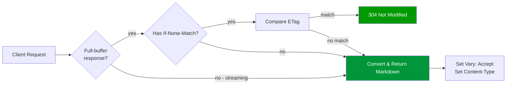

# Cache-Aware Responses

## Overview



This module generates cache-aware responses with proper ETags, Vary headers, and conditional request support on the full-buffer path only. Streaming responses bypass ETag generation and `If-None-Match` validation entirely. They emit no ETag for clients or caches to revalidate. This ensures that browsers, CDNs, and reverse proxies cache Markdown variants correctly and efficiently.

## Key Features

### ETag Generation (Full-Buffer Responses Only)

The module generates ETags only for full-buffer Markdown responses, based on
the converted output. Committed streaming responses deliberately emit no ETag
and cannot be conditionally validated with `If-None-Match`. For full-buffer
responses, this ensures that:
- Identical HTML input produces identical ETags
- Cache validation works correctly
- 304 Not Modified responses save bandwidth

### Vary Header

The module adds `Vary: Accept` whenever Accept negotiation determines whether
the response is the Markdown representation or the original HTML
representation. That includes negotiated pass-through responses. For example,
when the client prefers HTML, unrelated fail-open paths do not claim an
Accept-dependent cache variant.

### Conditional Requests

The module supports `If-None-Match` (ETag-based) validation only on the
full-buffer path. Streaming responses bypass ETag generation and cannot be
conditionally validated by this module. Converted responses also clear the
source HTML `Last-Modified`. Only responses that pass through the original
representation retain source validators. This prevents an HTML validator from
validating a different Markdown representation.

## How It Works

### ETag Generation Flow

```
HTML Response
  └─> Convert to Markdown
       ├─> Full-buffer: generate ETag and add it to the response
       │    └─> Next request includes If-None-Match
       │         └─> Module compares ETags and returns 304 if matched
       └─> Streaming commit: no ETag; If-None-Match is not validated
```

### ETag Format

The module generates ETags as quoted strings:

```http
ETag: "a1b2c3d4e5f6"
```

The module computes the ETag value from the Markdown output using a hash function. The same HTML input always produces the same ETag (deterministic output).

### Vary Header Behavior

The module ensures `Vary: Accept` is present on every representation selected
through Accept negotiation:

**Original Response**:
```http
Content-Type: text/html
```

**Converted Response**:
```http
Content-Type: text/markdown; charset=utf-8
Vary: Accept
ETag: "a1b2c3d4e5f6"
```

**If Upstream Has Vary**:
```http
Upstream:  Vary: User-Agent
Module:    Vary: User-Agent, Accept
```

## Configuration

### Enable ETag Generation

The module enables ETags with `markdown_cache_validation full`:

```nginx
location /docs/ {
    markdown_filter on;
    markdown_cache_validation full;  # Generate transformed ETag + conditional support
}
```

### Disable ETag Generation

To disable ETag generation (not recommended):

```nginx
location /docs/ {
    markdown_filter on;
    markdown_cache_validation off;
}
```

Disabling ETags reduces CPU overhead slightly but prevents efficient cache validation.

### Conditional Request Support

Configure conditional request handling:

```nginx
location /docs/ {
    markdown_filter on;

    # IMS-only: source-representation IMS only (no Markdown ETag)
    markdown_cache_validation ims_only;

    # Or full support (Markdown ETag + If-None-Match; source If-Modified-Since
    # does not validate the transformed response)
    # markdown_cache_validation full;

    # Or disable
    # markdown_cache_validation off;
}
```

**Modes**:

- `ims_only` (default): Skip module-side `If-None-Match` processing. NGINX
  may use `If-Modified-Since` only when the module passes through the original
  response. A converted Markdown response clears the source `Last-Modified`
  and returns a fresh 200.
- `full`: Support Markdown-variant `If-None-Match` (ETag). Converted
  responses use their Markdown ETag only. Source `If-Modified-Since` does not
  validate the transformed body.
- `off`: No conditional request support for Markdown variants

**Performance Note**: `full` requires conversion to generate a Markdown-variant ETag for comparison, which has performance implications for conditional requests.

## Conditional Request Handling

### If-None-Match (ETag-Based)

When a client sends `If-None-Match`:

```http
GET /page.html HTTP/1.1
Accept: text/markdown
If-None-Match: "a1b2c3d4e5f6"
```

The module:
1. Converts the HTML to Markdown
2. Generates the ETag from the Markdown output
3. Compares with the client's ETag
4. Returns 304 if they match, 200 with body if they do not

**304 Response**:
```http
HTTP/1.1 304 Not Modified
ETag: "a1b2c3d4e5f6"
Vary: Accept
```

**200 Response** (ETag mismatch):
```http
HTTP/1.1 200 OK
Content-Type: text/markdown; charset=utf-8
ETag: "b2c3d4e5f6a1"
Vary: Accept

# Updated content...
```

### If-Modified-Since (Time-Based)

The module delegates `If-Modified-Since` evaluation to NGINX core only for
responses that keep the original upstream representation. A converted
Markdown response clears both the source `Last-Modified` metadata and its
header-list entries, so an HTML timestamp cannot produce a 304 for Markdown:

```http
GET /page.html HTTP/1.1
Accept: text/markdown
If-Modified-Since: Wed, 21 Oct 2015 07:28:00 GMT
```

NGINX core handles this before the module runs, so the module only processes requests that pass the time-based check.

**Semantic note**: an original-representation response may retain the
upstream HTML timestamp and receive a source-based 304. A transformed
response must not retain that timestamp: its representation-specific
validator is the Markdown ETag when operators enable `full` mode, and an
IMS-only request receives a fresh 200.

## Caching Strategies

### Browser Caching

Browsers cache Markdown responses using ETags:

```http
# First request
GET /page.html
Accept: text/markdown

# Response
HTTP/1.1 200 OK
Content-Type: text/markdown; charset=utf-8
ETag: "a1b2c3d4e5f6"
Vary: Accept
Cache-Control: max-age=3600

# Second request (within cache lifetime)
GET /page.html
Accept: text/markdown
If-None-Match: "a1b2c3d4e5f6"

# Response
HTTP/1.1 304 Not Modified
```

### CDN Caching

CDNs must respect the `Vary: Accept` header to cache variants correctly:

```nginx
location /docs/ {
    markdown_filter on;

    # CDN-friendly caching
    add_header Cache-Control "public, max-age=3600";

    proxy_pass http://backend;
}
```

The CDN will cache:
- HTML variant (Accept: text/html)
- Markdown variant (Accept: text/markdown)

Separately, with different ETags.

### NGINX Proxy Cache

When using NGINX as a reverse proxy with caching:

```nginx
proxy_cache_path /var/cache/nginx levels=1:2 keys_zone=my_cache:10m;

server {
    location /docs/ {
        markdown_filter on;

        proxy_cache my_cache;
        proxy_cache_key "$scheme$request_method$host$request_uri$http_accept";
        proxy_cache_valid 200 10m;

        proxy_pass http://backend;
    }
}
```

**Important**: Include `$http_accept` in the cache key to cache variants separately.

## Authentication-Aware Caching

For authenticated requests, the module adjusts cache control:

```nginx
location /private/ {
    markdown_filter on;
    markdown_auth_policy deny;
    markdown_auth_cookies "session_id auth_token";

    proxy_pass http://backend;
}
```

When the module detects authentication:
- `Cache-Control: public` → `Cache-Control: private`
- `Cache-Control: max-age=3600` → `Cache-Control: private, max-age=3600`

This prevents shared caches (CDNs) from caching authenticated content.

## Deterministic Output

ETags rely on deterministic output. The same HTML input must always produce the same Markdown output.

The module ensures deterministic output through:
- Consistent whitespace normalization
- Stable attribute ordering
- Predictable list formatting
- Consistent newline handling

See [deterministic-output.md](deterministic-output.md) for details.

## Testing Cache Behavior

### Test ETag Generation

```bash
# First request
curl -D - -H "Accept: text/markdown" http://localhost/page.html

# Look for ETag header
# ETag: "a1b2c3d4e5f6"
```

### Test Conditional Request

```bash
# Get ETag from first request
ETAG=$(curl -sD - -H "Accept: text/markdown" http://localhost/page.html | grep -i '^etag:' | cut -d' ' -f2 | tr -d '\r')

# Send conditional request
curl -D - -H "Accept: text/markdown" -H "If-None-Match: $ETAG" http://localhost/page.html

# Should return 304 Not Modified
```

### Test Vary Header

```bash
curl -D - -H "Accept: text/markdown" http://localhost/page.html | grep -i '^vary:'

# Should show: Vary: Accept
```

### Test Cache Key Separation

```bash
# Request HTML
curl -D - -H "Accept: text/html" http://localhost/page.html > html.txt

# Request Markdown
curl -D - -H "Accept: text/markdown" http://localhost/page.html > markdown.txt

# Compare ETags (should be different)
grep -i '^etag:' html.txt
grep -i '^etag:' markdown.txt
```

## Performance Considerations

### ETag Generation Cost

ETag generation adds minimal overhead:
- Hash computation is fast (< 1ms for typical responses)
- Deterministic output ensures consistent ETags
- Benefit: Reduced bandwidth and backend load

### Conditional Request Cost

With `full` mode:
- Conditional requests still require conversion
- The module must generate an ETag to compare
- Cost: Same as normal conversion
- Benefit: Saves bandwidth if ETag matches

With `ims_only` mode:
- Conditional requests skip module processing
- No conversion or ETag generation
- Cost: Minimal
- Limitation: No ETag-based validation for Markdown variants

### Caching Benefits

Proper caching reduces:
- Backend load (fewer conversions)
- Bandwidth usage (304 responses)
- Latency (cached responses)

## Troubleshooting

### ETags Not Generated

Check:
1. `markdown_cache_validation full` is set
2. Conversion is happening (check Content-Type)
3. Response is successful (200 OK)

### 304 Not Returned

Check:
1. Client sends `If-None-Match` with correct ETag
2. `markdown_cache_validation` is not `off`
3. Content hasn't changed (ETag should match)

### Wrong Variant from Cache

Check:
1. `Vary: Accept` header is present
2. Cache key includes Accept header
3. CDN/cache respects Vary header

### Cache Hit Rate Low

Check:
1. Cache key is consistent
2. Vary header is not too broad
3. Cache-Control headers are appropriate
4. Authentication detection is correct

## Related Documentation

- [deterministic-output.md](deterministic-output.md) - Deterministic output implementation
- [CONTENT_NEGOTIATION.md](CONTENT_NEGOTIATION.md) - Content negotiation
- [CONFIGURATION.md](../guides/CONFIGURATION.md) - Configuration directives
- [OPERATIONS.md](../guides/OPERATIONS.md) - Operations and troubleshooting

## Implementation Details

The cache-aware response logic lives in:
- `src/ngx_http_markdown_headers.c` - Header manipulation
- `src/ngx_http_markdown_conditional.c` - Conditional request handling
- `components/rust-converter/src/etag_generator.rs` - ETag generation

For implementation details, see the source code and inline comments.


## Document Updates

| Version | Date | Author | Changes |
|---------|------|--------|---------|
| 0.9.2 | 2026-08-27 | Codex | Document representation-specific validator semantics and clear source Last-Modified after conversion |
| 0.9.1 | 2026-07-13 | Kang | Align legacy directive references with 0.9.0 Config V2 implementation (markdown_limits, markdown_error_policy, markdown_accept, markdown_cache_validation; retire markdown_large_body_threshold) |
| 0.6.2 | 2026-05-08 | Kang | Unified version narrative to 0.6.2 current release line |
| 0.5.0 | 2026-04-21 | docs-standardization | Standardized formatting, added mermaid diagrams where applicable, verified directive accuracy against code, added update tracking section |
