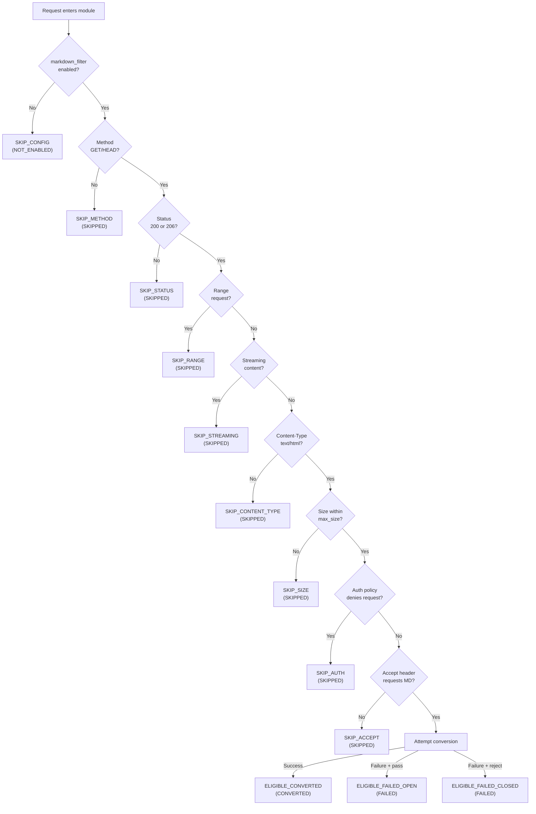

# Decision Chain Model

## Overview

Every request that reaches the Markdown filter module passes through an ordered sequence of checks called the decision chain. The first failing check determines the outcome and assigns a reason code. If all checks pass, conversion is attempted and the outcome depends on whether conversion succeeds or fails.

This document describes the check order, explains what each check evaluates, and defines how the outcome is determined. See the [Reason Code Reference](#reason-code-reference) below for the complete reason code table. Rollout procedures and observation guidance are in the [Rollout Cookbook](../guides/ROLLOUT_COOKBOOK.md). Rollback procedures are documented in the [Rollback Guide](../guides/ROLLBACK_GUIDE.md).

## Decision Chain Flowchart

## Check Order

The decision chain evaluates checks in a fixed order. The first check that fails stops evaluation and assigns the corresponding reason code. This "short-circuit" behavior means a request that fails multiple checks always gets the reason code of the earliest failing check in the sequence.

| Order | Check | What It Evaluates | Reason Code on Failure |
|-------|-------|--------------------|------------------------|
| 1 | Scope enablement | Is `markdown_filter` enabled (`on`, `1`, `true`, `yes`, or a variable that resolves to a truthy value) for this request's location/server/http context? | `SKIP_CONFIG` |
| 2 | HTTP method | Is the request method `GET` or `HEAD`? Other methods (POST, PUT, DELETE, etc.) are not eligible. | `SKIP_METHOD` |
| 3 | Response status | Is the upstream response status `200 OK` or `206 Partial Content`? Non-200/206 responses (redirects, errors, etc.) are not eligible. | `SKIP_STATUS` |
| 4 | Range request | Is this a range request (`Range` header present)? Range requests are not eligible because partial content cannot be converted. | `SKIP_RANGE` |
| 5 | Streaming content | Is the response a streaming content type (matching `markdown_stream_types`)? Streaming responses are not eligible. | `SKIP_STREAMING` |
| 6 | Content-Type | Is the upstream `Content-Type` header `text/html` (with any charset parameter)? Non-HTML content types are not eligible. | `SKIP_CONTENT_TYPE` |
| 7 | Response size | Is the response body size within the configured `markdown_max_size` limit? Oversized responses are not eligible. | `SKIP_SIZE` |
| 8 | Auth policy | Is the request authenticated and `markdown_auth_policy` set to `deny`? Authenticated requests are detected through the existing `Authorization` header and auth-cookie checks. | `SKIP_AUTH` |
| 9 | Accept negotiation | Does the `Accept` header contain `text/markdown`? When `markdown_on_wildcard` is `off` (default), only explicit `text/markdown` triggers conversion. When `on`, `text/*` and `*/*` also qualify. | `SKIP_ACCEPT` |
| 10 | Conversion attempt | All checks passed. The module attempts HTML-to-Markdown conversion. | _(see outcome determination below)_ |

## First-Failing-Check Rule

The module evaluates checks 1 through 10 in the order listed above. As soon as one check fails, the module assigns the corresponding reason code and stops. No subsequent checks are evaluated.

For example, if a `POST` request arrives for a path where `markdown_filter` is `on`, the module assigns `SKIP_METHOD` (check 2) without evaluating status, content-type, size, auth, or Accept checks.

This behavior is important for operators diagnosing why a request was skipped. The reason code always points to the first condition that prevented conversion, not to all conditions that would have prevented it.

## Outcome Determination

When all ten eligibility checks pass (checks 1–10), the module attempts conversion. The outcome depends on whether conversion succeeds and, if it fails, on the `markdown_on_error` configuration:

### Success: ELIGIBLE_CONVERTED

Conversion succeeded. The client receives the Markdown representation of the HTML response. The reason code is `ELIGIBLE_CONVERTED` and the request state is CONVERTED.

### Failure with `markdown_on_error pass`: ELIGIBLE_FAILED_OPEN

Conversion was attempted but failed (HTML parse error, timeout, resource limit, or system error). Because `markdown_on_error` is set to `pass` (the default), the module serves the original HTML response unchanged. The client is unaffected. The reason code is `ELIGIBLE_FAILED_OPEN` and the request state is FAILED.

This is the recommended configuration for production rollouts. Conversion failures never break client responses.

### Failure with `markdown_on_error reject`: ELIGIBLE_FAILED_CLOSED

Conversion was attempted but failed. Because `markdown_on_error` is set to `reject`, the module returns a `502 Bad Gateway` error. The reason code is `ELIGIBLE_FAILED_CLOSED` and the request state is FAILED.

Use `reject` only when you need strict guarantees that clients never receive HTML when they requested Markdown. This is not recommended during initial rollout.

## Failure Sub-Classification

When conversion fails (either `ELIGIBLE_FAILED_OPEN` or `ELIGIBLE_FAILED_CLOSED`), the module also records a failure sub-classification that provides more detail about what went wrong:

| Failure Reason Code | Meaning |
|---------------------|---------|
| `FAIL_CONVERSION` | HTML parse or conversion error — the input HTML could not be processed |
| `FAIL_RESOURCE_LIMIT` | Timeout (`markdown_timeout` exceeded) or memory limit reached |
| `FAIL_SYSTEM` | Internal or system error (unexpected condition) |

These sub-classification codes appear in decision log entries as additional context. They do not change the primary outcome (`ELIGIBLE_FAILED_OPEN` or `ELIGIBLE_FAILED_CLOSED`), which is determined solely by the `markdown_on_error` setting.

## Request States

Every request that enters the decision chain ends up in one of four mutually exclusive states. The request state is derived from the reason code — no additional runtime field is stored.

| Request State | Reason Codes | Meaning |
|---------------|-------------|---------|
| NOT_ENABLED | `SKIP_CONFIG` | Module is disabled for this scope. The request was never evaluated for eligibility. |
| SKIPPED | `SKIP_METHOD`, `SKIP_STATUS`, `SKIP_RANGE`, `SKIP_STREAMING`, `SKIP_CONTENT_TYPE`, `SKIP_SIZE`, `SKIP_AUTH`, `SKIP_ACCEPT` | Module is enabled but the request did not pass one of the eligibility checks. |
| CONVERTED | `ELIGIBLE_CONVERTED` | All checks passed and conversion succeeded. |
| FAILED | `ELIGIBLE_FAILED_OPEN`, `ELIGIBLE_FAILED_CLOSED` | All checks passed, conversion was attempted, but it did not succeed. |

Operators can determine request state counts from metrics and logs:
- NOT_ENABLED: count of `reason=SKIP_CONFIG` in decision log entries (`grep "reason=SKIP_CONFIG" error.log`)
- SKIPPED: count of all other `reason=SKIP_*` in decision log entries (excluding `SKIP_CONFIG`)
- CONVERTED: `conversions_succeeded` field in the metrics endpoint
- FAILED: `conversions_failed` field in the metrics endpoint (breakdown: `failures_conversion` + `failures_resource_limit` + `failures_system`)

## Reason Code Reference

The complete mapping from reason codes to eligibility enums, error categories, request states, and descriptions:

| Reason Code | Eligibility Enum | Error Category | Request State | Description |
|---|---|---|---|---|
| `SKIP_CONFIG` | `NGX_HTTP_MARKDOWN_INELIGIBLE_CONFIG` | — | NOT_ENABLED | Module disabled by configuration |
| `SKIP_METHOD` | `NGX_HTTP_MARKDOWN_INELIGIBLE_METHOD` | — | SKIPPED | Request method not GET/HEAD |
| `SKIP_STATUS` | `NGX_HTTP_MARKDOWN_INELIGIBLE_STATUS` | — | SKIPPED | Response status not 200 or 206 |
| `SKIP_RANGE` | `NGX_HTTP_MARKDOWN_INELIGIBLE_RANGE` | — | SKIPPED | Range request |
| `SKIP_STREAMING` | `NGX_HTTP_MARKDOWN_INELIGIBLE_STREAMING` | — | SKIPPED | Unbounded streaming response |
| `SKIP_CONTENT_TYPE` | `NGX_HTTP_MARKDOWN_INELIGIBLE_CONTENT_TYPE` | — | SKIPPED | Content-Type not text/html |
| `SKIP_SIZE` | `NGX_HTTP_MARKDOWN_INELIGIBLE_SIZE` | — | SKIPPED | Response exceeds `markdown_max_size` |
| `SKIP_AUTH` | `NGX_HTTP_MARKDOWN_INELIGIBLE_AUTH` | — | SKIPPED | Auth policy denies conversion for authenticated requests |
| `SKIP_ACCEPT` | _(Accept negotiation)_ | — | SKIPPED | Accept header does not request Markdown |
| `ELIGIBLE_CONVERTED` | `NGX_HTTP_MARKDOWN_ELIGIBLE` | — | CONVERTED | Conversion succeeded |
| `ELIGIBLE_FAILED_OPEN` | `NGX_HTTP_MARKDOWN_ELIGIBLE` | _(any)_ | FAILED | Conversion failed, original HTML served |
| `ELIGIBLE_FAILED_CLOSED` | `NGX_HTTP_MARKDOWN_ELIGIBLE` | _(any)_ | FAILED | Conversion failed, error returned |
| `FAIL_CONVERSION` | — | `NGX_HTTP_MARKDOWN_ERROR_CONVERSION` | — | HTML parse or conversion error |
| `FAIL_RESOURCE_LIMIT` | — | `NGX_HTTP_MARKDOWN_ERROR_RESOURCE_LIMIT` | — | Timeout or memory limit |
| `FAIL_SYSTEM` | — | `NGX_HTTP_MARKDOWN_ERROR_SYSTEM` | — | Internal/system error |

All reason codes use uppercase snake_case format. The same strings appear in both decision log entries and Prometheus metrics labels, so operators can correlate log entries with metric counters without translation.

## Implementation Details

The check order matches the existing `ngx_http_markdown_check_eligibility()` implementation in `components/nginx-module/src/ngx_http_markdown_eligibility.c`, with three additions in the header filter:

- Scope enablement (check 1) is evaluated before `ngx_http_markdown_check_eligibility()` is called.
- Auth policy (check 8) is evaluated after the core eligibility checks and before Accept negotiation.
- Accept negotiation (check 9) is evaluated after auth policy passes.

The reason code lookup functions are implemented in `components/nginx-module/src/ngx_http_markdown_reason.c`. These map the existing `ngx_http_markdown_eligibility_t` and `ngx_http_markdown_error_category_t` enum values to stable `ngx_str_t` reason code strings.

## Related Documentation

- [Rollout Cookbook](../guides/ROLLOUT_COOKBOOK.md) — staged rollout procedures with observation checkpoints
- [Rollback Guide](../guides/ROLLBACK_GUIDE.md) — how to disable or narrow conversion scope
- [Configuration Guide](../guides/CONFIGURATION.md) — directive reference and configuration examples
- [Content Negotiation](CONTENT_NEGOTIATION.md) — Accept header parsing and wildcard behavior
- [Operations Guide](../guides/OPERATIONS.md) — monitoring and troubleshooting
