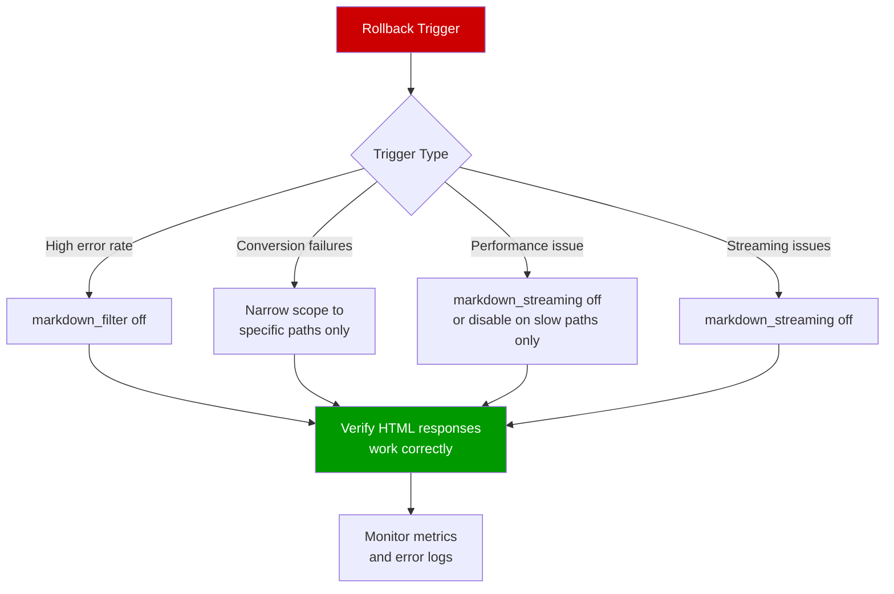

# Operational Rollback Guide — Disabling or Narrowing Markdown Conversion

This document covers **runtime operational mitigation**: disabling or
narrowing Markdown conversion with a configuration change and reload, without
replacing the module binary. For a full **version downgrade** (binary +
matching configuration), see
[VERSION_ROLLBACK-0.9.2.md](VERSION_ROLLBACK-0.9.2.md).

## Table of Contents

1. [Overview](#overview)
2. [Key Principle: Config Change + Reload Only](#key-principle-config-change--reload-only)
3. [Rollback Methods](#rollback-methods)
   - [Method A: Disable in Scope (Fastest)](#method-a-disable-in-scope-fastest)
   - [Method B: Narrow the Map Variable](#method-b-narrow-the-map-variable)
   - [Method C: Restore Fail-Open Behavior](#method-c-restore-fail-open-behavior)
4. [Rollback Trigger Conditions](#rollback-trigger-conditions)
5. [Verification Steps](#verification-steps)
6. [Quick Reference](#quick-reference)

---

## Overview



This guide documents how to disable or narrow Markdown conversion scope when problems arise. All rollback methods take effect within seconds and require only an NGINX configuration change and reload.

Use this guide when an [observation checkpoint](ROLLOUT_COOKBOOK.md#observation-guidance) reveals unhealthy behavior, or when operator judgment calls for reducing conversion scope.

### Target Audience

- Site Reliability Engineers (SREs)
- DevOps Engineers
- System Administrators

### Related Documents

- [Decision Chain Model](../features/DECISION_CHAIN.md) — check order, reason codes, and outcome determination
- [ROLLOUT_COOKBOOK.md](ROLLOUT_COOKBOOK.md) — rollout stages, selective enablement patterns, observation guidance
- [CONFIGURATION.md](CONFIGURATION.md) — full directive reference
- [OPERATIONS.md](OPERATIONS.md) — operational guide and metrics reference
- [VERSION_ROLLBACK-0.9.2.md](VERSION_ROLLBACK-0.9.2.md) — version downgrade and matching
  configuration restore

---

## Key Principle: Config Change + Reload Only

Rollback requires only an NGINX configuration edit and a graceful reload. Specifically:

- No module uninstallation
- No binary replacement
- No NGINX restart (full stop/start)
- No recompilation
- No downtime

The `nginx -s reload` command performs a graceful reload. NGINX re-reads the
configuration and spawns new worker processes with the updated configuration.
The new workers handle new connections (and new requests that arrive on them)
using the updated configuration. Keep-alive connections already open before
the reload can remain served by the old workers until
they drain and close, so in-flight requests complete on the old configuration.
Requests that arrive on those pre-existing keep-alive connections may
therefore continue to use the previous configuration until the connection
closes or the old worker exits.

---

## Rollback Methods

Three methods appear in order of speed. Pick the one that matches your situation.

| Method | Speed | Scope | When to Use |
|--------|-------|-------|-------------|
| [A: Disable in scope](#method-a-disable-in-scope-fastest) | Fastest (seconds) | All conversion stops in the affected scope | Widespread failures, need to stop all conversion immediately |
| [B: Narrow the map variable](#method-b-narrow-the-map-variable) | Fast (seconds) | Specific traffic segments excluded | One path or host is failing, others are healthy |
| [C: Restore fail-open](#method-c-restore-fail-open-behavior) | Fast (seconds) | Failure handling changes, conversion continues | Conversion works for most requests but `reject` mode is returning 502s on edge cases |

---

### Method A: Disable in Scope (Fastest)

Set `markdown_filter off` in the affected `location`, `server`, or `http` block. This stops all conversion in that scope immediately after reload.

#### When to Use

- Conversion failure rate is high across all enabled paths
- You need to stop all conversion immediately
- You are unsure which traffic segment is causing problems

#### Configuration Change


**Before (conversion enabled):**

```nginx
server {
    listen 80;
    server_name www.example.com;

    location /docs {
        markdown_filter on;
        proxy_pass http://backend;
    }

    location /blog {
        markdown_filter on;
        proxy_pass http://backend;
    }

    location / {
        proxy_pass http://backend;
    }
}
```

**After (conversion disabled):**

```nginx
server {
    listen 80;
    server_name www.example.com;

    location /docs {
        markdown_filter off;
        proxy_pass http://backend;
    }

    location /blog {
        markdown_filter off;
        proxy_pass http://backend;
    }

    location / {
        proxy_pass http://backend;
    }
}
```

To disable conversion across an entire server block, set `markdown_filter off` at the server level:

```nginx
server {
    listen 80;
    server_name www.example.com;

    markdown_filter off;

    location /docs {
        proxy_pass http://backend;
    }

    location /blog {
        proxy_pass http://backend;
    }

    location / {
        proxy_pass http://backend;
    }
}
```

#### Apply

```bash
nginx -t && nginx -s reload
```

#### Verify

Follow the [Verification Steps](#verification-steps) section. The key signal is `disabled` appearing in decision logs for the affected traffic.

---

### Method B: Narrow the Map Variable

Adjust the `map` directive to exclude the problematic traffic segment while keeping conversion active for healthy paths. Use this when one path or host is failing but others are fine.

#### When to Use

- A specific path shows high failure rates while others are healthy
- A specific host is experiencing issues
- You want to reduce scope without fully disabling conversion

#### Configuration Change — Exclude a Path

**Before (broad scope):**

```nginx
http {
    map $uri $markdown_enabled {
        default         off;
        "~^/docs"       on;
        "~^/help"       on;
        "~^/blog"       on;
        "~^/guides"     on;
    }

    server {
        listen 80;
        server_name www.example.com;

        location / {
            markdown_filter $markdown_enabled;
            proxy_pass http://backend;
        }
    }
}
```

**After (problematic path removed):**

```nginx
http {
    map $uri $markdown_enabled {
        default         off;
        "~^/docs"       on;
        "~^/help"       on;
        # "~^/blog"     on;   # disabled — high failure rate
        "~^/guides"     on;
    }

    server {
        listen 80;
        server_name www.example.com;

        location / {
            markdown_filter $markdown_enabled;
            proxy_pass http://backend;
        }
    }
}
```

#### Configuration Change — Exclude a Host

**Before (multiple hosts enabled):**

```nginx
http {
    map $host $markdown_by_host {
        default                 off;
        staging.example.com     on;
        www.example.com         on;
    }

    server {
        listen 80;
        server_name staging.example.com www.example.com;

        location / {
            markdown_filter $markdown_by_host;
            proxy_pass http://backend;
        }
    }
}
```

**After (problematic host removed):**

```nginx
http {
    map $host $markdown_by_host {
        default                 off;
        staging.example.com     on;
        # www.example.com       on;   # disabled — investigating failures
    }

    server {
        listen 80;
        server_name staging.example.com www.example.com;

        location / {
            markdown_filter $markdown_by_host;
            proxy_pass http://backend;
        }
    }
}
```

#### Apply

```bash
nginx -t && nginx -s reload
```

#### Verify

Follow the [Verification Steps](#verification-steps) section. Confirm that the excluded path or host now produces `disabled` in decision logs, while other paths continue converting.

---

### Method C: Restore Fail-Open Behavior

Switch `markdown_error_policy` back to `pass` when conversion failures return 502 errors. This restores fail-open behavior for pre-commit conversion failures: the module serves the buffered source HTML instead of an error response. Conversion continues for requests that succeed. This applies only before the module commits the converted representation. After headers commit, a streaming mid-response failure terminates the stream with a connection close. The module cannot replay the source HTML then.

#### When to Use

- `markdown_error_policy fail_closed` is active and conversion failures are causing 502 responses
- Most conversions succeed, but edge cases in certain HTML structures cause failures
- You want to keep conversion running while investigating failures

#### Configuration Change

**Before (fail-closed):**

```nginx
server {
    listen 80;
    server_name www.example.com;

    location /docs {
        markdown_filter on;
        markdown_error_policy fail_closed;
        proxy_pass http://backend;
    }
}
```

**After (fail-open restored):**

```nginx
server {
    listen 80;
    server_name www.example.com;

    location /docs {
        markdown_filter on;
        markdown_error_policy pass;
        proxy_pass http://backend;
    }
}
```

#### Apply

```bash
nginx -t && nginx -s reload
```

#### Verify

Follow the [Verification Steps](#verification-steps) section. The key signal is that `failed_closed` entries stop appearing in decision logs. Do **not** require a `failed_open` log entry after rollback, and do not expect `failed_open` entries to replace `failed_closed` entries. Both are terminal outcomes of failed conversions, and after rollback to `pass` the module records `failed_open` only when a conversion actually fails. Verify that `failed_closed` entries stop appearing, then trigger a conversion failure. Confirm the client receives original HTML instead of a 502. Successful conversions produce no log entry, so expect none.

**Drain before checking:** a graceful reload keeps existing workers alive until their keep-alive connections close. Requests on old workers still run the pre-rollback policy and can emit `failed_closed` entries after the reload. Wait for old workers to drain (typically until `worker_shutdown_timeout` expires or old worker PIDs disappear). Alternatively, scope the `failed_closed` check to traffic handled by newly loaded workers. Only then conclude the rollback took effect.

---

## Rollback Trigger Conditions

Roll back (or narrow scope) when any of the following conditions occur. These align with the "stop and investigate" triggers in the [Rollout Cookbook observation guidance](ROLLOUT_COOKBOOK.md#stop-and-investigate-triggers).

### Failure Rate Threshold

Conversion failure rate exceeds 5% of conversion attempts over any 1-hour window.

```bash
# Check failure count vs. total conversion attempts
curl -s -H "Accept: text/plain; version=0.0.4" http://localhost/markdown-metrics | \
  grep -E "nginx_markdown_conversion_attempts_total|nginx_markdown_conversion_deliveries_total|nginx_markdown_requests_total"
```

If the failed `nginx_markdown_requests_total{outcome=~"failed_.*|aborted"}` count grows
faster than expected relative to `nginx_markdown_conversion_attempts_total`,
roll back. Compare the two counters using PromQL rates (for example
`rate(nginx_markdown_requests_total{outcome=~"failed_.*|aborted"}[5m])` against
`rate(nginx_markdown_conversion_attempts_total[5m])`) or before-and-after
counter deltas over the same window, rather than comparing instantaneous
snapshots.

### Latency Exceeding Timeout

Conversion latency approaches or exceeds the configured `markdown_limits conversion_timeout=`. Check the latency histogram buckets first. The histogram's finite buckets stop at 5 seconds. They are **insufficient for diagnosing timeouts above 5s**. Use the decision log (`category=timeout` entries) for those cases.

```bash
curl -s -H "Accept: text/plain; version=0.0.4" http://localhost/markdown-metrics | \
  grep "nginx_markdown_conversion_duration_seconds_bucket"
```

If conversions are clustering in the highest latency buckets or you see timeout-related failures in logs, roll back.

### Upstream Errors

Upstream error rate increases after enabling the module. Compare upstream 5xx rates before and after enablement. The module should not cause upstream errors, but interactions with decompression or buffering could surface latent issues.

### Unexpected Content

Clients receive unexpected content types or malformed responses. Verify with:

```bash
curl -sD - -o /dev/null \
  -H "Accept: text/markdown" \
  http://www.example.com/docs/
# Expected: Content-Type: text/markdown; charset=utf-8
```

If the Content-Type is wrong or the response body looks unexpected, roll back.

### Operator Judgment

Any observation checkpoint result that does not meet the "safe to continue" criteria in the [Rollout Cookbook](ROLLOUT_COOKBOOK.md#rollout-stages) grounds for rollback. Trust your judgment — if something looks wrong, narrow scope first and investigate second.

---

## Verification Steps

After applying any rollback method, verify that the change took effect. Run these checks in order.

### 1. Verify Conversion Is Disabled (Counter Delta First)

After disabling conversion (Methods A and B), verify the disablement with a
counter delta across a probe request. A log entry alone is not proof, because
the module emits `disabled` decision-log entries only at
`markdown_log_verbosity` info (or debug):

```bash
# Disabled decisions appear only when markdown_log_verbosity is info
# (or debug).  Confirm the level, then verify by delta: request a
# known-convertible path before and after the reload and require the
# conversion counters to stay flat across the probe, instead of trusting
# that a log entry alone proves the disablement.
nginx -T 2>/dev/null | grep markdown_log_verbosity   # expect: info (or debug)

# Use a fixed, known-convertible fixture (a path your site has already
# verified to return text/html and convert to Markdown).  A freshly
# generated URL could 404, and a 404 never reaches the conversion chain,
# so a flat counter delta would prove nothing.
PROBE_PATH="/known-convertible-page"   # adjust to your verified fixture
BASE=$(curl -fsS -H 'Accept: text/plain; version=0.0.4' \
  http://localhost/markdown-metrics | \
  grep -E 'nginx_markdown_(conversion_attempts_total|conversion_deliveries_total)') \
  || { echo "FAIL: could not read BASE metrics snapshot"; exit 1; }
test -n "$BASE" || { echo "FAIL: BASE metrics snapshot is empty"; exit 1; }
curl -fsS -o /dev/null -H 'Accept: text/markdown' \
  "http://localhost${PROBE_PATH}" \
  || { echo "FAIL: probe request to ${PROBE_PATH} failed"; exit 1; }
AFTER=$(curl -fsS -H 'Accept: text/plain; version=0.0.4' \
  http://localhost/markdown-metrics | \
  grep -E 'nginx_markdown_(conversion_attempts_total|conversion_deliveries_total)') \
  || { echo "FAIL: could not read AFTER metrics snapshot"; exit 1; }
test -n "$AFTER" || { echo "FAIL: AFTER metrics snapshot is empty"; exit 1; }
if [ "$BASE" = "$AFTER" ]; then
  echo "OK: conversion counters flat across the probe (conversion disabled)"
else
  echo "FAIL: conversion counters moved across the probe" >&2
  exit 1
fi
# Optional log corroboration (requires markdown_log_verbosity info or
# debug, and an error-log level that includes info): the probe must show
# its own path in a disabled decision entry.  Guarded so a missing
# matching entry does not fail the procedure under set -e.
if tail -50 /var/log/nginx/error.log 2>/dev/null \
    | grep "markdown:" | grep "reason=disabled" | grep -q "${PROBE_PATH}"; then
  echo "OK: decision log corroborates the disabled probe"
else
  echo "INFO: decision-log corroboration not found (log level may be too low); counter check above is authoritative" >&2
fi
```

For Method C (restoring fail-open), trigger a known conversion failure first and
confirm that the module returns the original HTML. Then verify the
corresponding decision-log entries after the old workers drain. Limit the
log inspection to the entries written by the triggering request: record the
log byte offset before the request and read only the bytes appended after
it, instead of searching the whole log with a generic tail:

```bash
# Record the offset so verification covers only the triggered request.
LOG_OFFSET="$(stat -c %s /var/log/nginx/error.log 2>/dev/null \
  || wc -c < /var/log/nginx/error.log)"

curl -sS -H 'Accept: text/markdown' http://localhost/known-failing-path \
  | grep -F '<html'

# Inspect only entries appended after the trigger request.
tail -c +"$((LOG_OFFSET + 1))" /var/log/nginx/error.log \
  | grep "markdown:" \
  | grep -E "outcome=(failed_closed|failed_open|aborted)"
```

The offset excludes earlier history but does not identify a single request.
On a host with concurrent Markdown traffic, unrelated requests can satisfy
the check. Trigger the request on a uniquely named path (for example
`/known-failing-path/<uuid>`) and match that path in the grep, or
quiesce competing traffic for the duration of the verification.

### 2. Confirm Metrics Stop Incrementing

For Methods A and B, conversion metrics for the affected scope should stop incrementing:

> **Scope note**: the counters below are **instance-wide** cumulative
> counters. A flat comparison cannot prove that a *specific scope* stopped
> converting — unrelated traffic on the same instance also moves them. For
> scope-specific verification use the decision-log probe from Step 1
> (uniquely named path + timestamp match), and the metrics comparison below is
> supporting, instance-wide evidence only.

```bash
# Take a snapshot of the frozen metric families.
curl -s -H 'Accept: text/plain; version=0.0.4' \
  http://localhost/markdown-metrics | \
  grep -E 'nginx_markdown_(conversion_attempts_total|conversion_deliveries_total|requests_total\{[^}]*outcome="(failed_[^"]+|aborted)"|streaming_events_total)'

# Wait 60 seconds, then compare
sleep 60

curl -s -H 'Accept: text/plain; version=0.0.4' \
  http://localhost/markdown-metrics | \
  grep -E 'nginx_markdown_(conversion_attempts_total|conversion_deliveries_total|requests_total\{[^}]*outcome="(failed_[^"]+|aborted)"|streaming_events_total)'
```

The counters should remain unchanged (or increase only for scopes that are still enabled).

### 3. Confirm Clients Receive HTML

Send a test request to a rolled-back path and verify the response is HTML, not Markdown:

```bash
curl -sD - \
  -H "Accept: text/markdown" \
  http://www.example.com/docs/ | head -20
# Expected: Content-Type: text/html (not text/markdown)
```

For Method C, send a request that you know triggers a conversion failure. Verify the client receives HTML (not a 502):

```bash
curl -sD - -o /dev/null \
  -H "Accept: text/markdown" \
  http://www.example.com/docs/problematic-page
# Expected: HTTP/1.1 200 OK (not 502 Bad Gateway)
# Expected: Content-Type: text/html
```

---

## Quick Reference

Copy-paste rollback sequence for the most common scenario (disable all conversion and verify):

```bash
# 1. Edit config: set markdown_filter off in the affected scope
#    (see Method A above for the exact change)

# 2. Test and reload
nginx -t && nginx -s reload

# 3. Verify: check for disabled in logs
grep "markdown:" /var/log/nginx/error.log | \
  grep "outcome=skipped" | grep "reason=disabled" | tail -5

# 4. Verify: confirm conversion metrics stopped
# Use a quiet-window delta instead of comparing instance-wide cumulative
# counters, which also move when unrelated requests convert: sample the
# counters, wait, sample again, and require zero conversion activity in
# that window (no client traffic of your own inside it).
sleep 5
before=$(curl -fsS -H 'Accept: text/plain; version=0.0.4' \
  -H "Host: ${ROLLBACK_HOST:-localhost}" \
  http://localhost/markdown-metrics | \
  grep -E "nginx_markdown_(conversion_attempts_total|conversion_deliveries_total)")
if [ -z "$before" ]; then
  echo "FAIL: conversion metrics not present before rollback check"
  exit 1
fi
sleep 5
after=$(curl -fsS -H 'Accept: text/plain; version=0.0.4' \
  -H "Host: ${ROLLBACK_HOST:-localhost}" \
  http://localhost/markdown-metrics | \
  grep -E "nginx_markdown_(conversion_attempts_total|conversion_deliveries_total)")
if [ -z "$after" ]; then
  echo "FAIL: conversion metrics not present after rollback check"
  exit 1
fi
# Capture disabled-request signal separately without changing the conversion metric comparison
# Trigger a unique request first so the disabled signal is guaranteed to be
# emitted by this verification, not by unrelated traffic.  Use a FIXED path
# covered by the affected markdown_filter scope (a timestamp-based path may
# fall outside the location that disables conversion) and include the Host
# header so the request reaches that scope.
disabled_before=$(curl -fsS -H 'Accept: text/plain; version=0.0.4' \
  -H "Host: ${ROLLBACK_HOST:-localhost}" \
  http://localhost/markdown-metrics | \
  grep -E 'nginx_markdown_requests_total.*outcome="skipped".*reason="disabled"' | \
  awk '{sum += $NF} END {print sum+0}')
# Trigger a unique request first so the disabled signal is guaranteed to be
# emitted by this verification, not by unrelated traffic.  Use a FIXED path
# covered by the affected markdown_filter scope (a timestamp-based path may
# fall outside the location that disables conversion) and include the Host
# header so the request reaches that scope.  The path is configurable so the
# probe can target the ACTUAL location affected by the rollback.
ROLLBACK_PROBE_PATH="${ROLLBACK_PROBE_PATH:-/rollback-probe}"
LOG_OFFSET=$(wc -c < /var/log/nginx/error.log 2>/dev/null || echo 0)
curl -sS -o /dev/null \
  -H "Accept: text/markdown" \
  -H "Host: ${ROLLBACK_HOST:-localhost}" \
  "http://localhost${ROLLBACK_PROBE_PATH}"
sleep 1
disabled_after=$(curl -fsS -H 'Accept: text/plain; version=0.0.4' \
  -H "Host: ${ROLLBACK_HOST:-localhost}" \
  http://localhost/markdown-metrics | \
  grep -E 'nginx_markdown_requests_total.*outcome="skipped".*reason="disabled"' | \
  awk '{sum += $NF} END {print sum+0}')
if [ -z "$disabled_after" ] || [ "$disabled_after" -le "$disabled_before" ]; then
  echo "FAIL: disabled signal did not increase after the rollback probe (before=$disabled_before after=$disabled_after; expected the probe request to be counted as outcome=skipped reason=disabled)"
  exit 1
fi
# Corroborate with the decision log: the probe's own path must appear in
# a disabled entry written AFTER the recorded offset.  A counter delta
# alone cannot prove THIS request was the one counted.  The check is
# mandatory: when the log level cannot carry non-failure entries
# (module verbosity below info/debug OR error_log below info/debug),
# the probe FAILS with an isolate-and-rerun instruction instead of
# trusting the global counter delta.
LOG_LEVEL_OK=0
if nginx -T 2>/dev/null | grep -q "markdown_log_verbosity.*\(info\|debug\)" \
    && nginx -T 2>/dev/null | grep -E "^[[:space:]]*error_log[[:space:]]+[^;]*[[:space:]]+(info|debug)[[:space:]]*;" ; then
  LOG_LEVEL_OK=1
fi
if [ "$LOG_LEVEL_OK" -eq 1 ]; then
  # Capture the filtered output FIRST, then test it: a short-circuiting
  # grep -q in the pipeline would SIGPIPE the upstream greps and, under
  # pipefail, make the whole pipeline fail even when the entry exists.
  PROBE_LOG_ENTRIES="$(tail -c +$((LOG_OFFSET + 1)) /var/log/nginx/error.log 2>/dev/null \
      | grep "markdown:" | grep "reason=disabled" | grep -F "uri=${ROLLBACK_PROBE_PATH} ")"
  if [ -n "$PROBE_LOG_ENTRIES" ]; then
    echo "OK: decision log corroborates the rollback-probe disabled entry"
  else
    echo "FAIL: no disabled decision-log entry for ${ROLLBACK_PROBE_PATH} after the recorded offset (log level is info/debug but the entry is missing)"
    exit 1
  fi
else
  echo "FAIL: decision-log corroboration unavailable (log level below info/debug). The global disabled counter delta cannot prove THIS probe request was the one counted — unrelated traffic may have produced the delta. Isolate the instance (or raise the log level) and re-run the probe." >&2
  exit 1
fi
if [ "$before" = "$after" ]; then
  echo "OK: no conversion activity in the quiet window after rollback"
else
  echo "FAIL: conversion activity detected in the quiet window after rollback"
  exit 1
fi

# 5. Verify: confirm client receives HTML
curl -sD - -o /dev/null \
  -H "Accept: text/markdown" \
  http://www.example.com/docs/
# Expected: Content-Type: text/html
```


---

## Performance Optimization Rollback (0.9.1)

The 0.9.1 release introduces performance optimizations with independent
rollback paths. For detailed rollback procedures specific to zero-copy
streaming output, streaming decompression, and full-buffer copy reduction,
see the dedicated [Performance Rollout and Rollback Guide](performance-rollout-091.md).

### Quick Summary

| Optimization | Rollback |
|--------------|----------|
| Streaming conversion | `markdown_streaming off` + reload |
| Streaming decompression | `markdown_auto_decompress off` or `markdown_streaming off` + reload |
| Full-buffer copy reduction | Code revert + binary rebuild (no config toggle — internal implementation detail) |

All config-based rollbacks take effect for new requests immediately after
`nginx -s reload`. In-flight requests complete with their existing
configuration. Requests that arrive on keep-alive connections already open
before the reload may continue on the old workers' configuration until those
connections drain or close (see the reload semantics above).

---

## Document Updates

| Version | Date | Author | Changes |
|---------|------|--------|---------|
| 0.9.2 | 2026-09-07 | Kang | Disablement probe uses a fixed known-convertible fixture, fail-closed curl for both metric snapshots, and rejects empty snapshots before the counter comparison |
| 0.9.2 | 2026-08-15 | Kang | Reload semantics distinguish new workers from keep-alive connections; Accept header on metric curls |
| 0.9.2 | 2026-08-15 | Hermes | Use current metric names in the pre-rollback metric check |
| 0.9.1 | 2026-07-13 | Kang | Align legacy directive references with 0.9.0 Config V2 implementation (markdown_limits, markdown_error_policy, markdown_accept, markdown_cache_validation; retire the large-response threshold directive) |
| 0.9.1 | 2026-07-05 | Kiro | Added 0.9.1 performance optimization rollback cross-reference |
| 0.6.2 | 2026-05-08 | Kang | Unified version narrative to 0.6.2 current release line |
| 0.5.0 | 2026-04-21 | docs-standardization | Standardized formatting, added mermaid diagrams where applicable, verified directive accuracy against code, added update tracking section |
