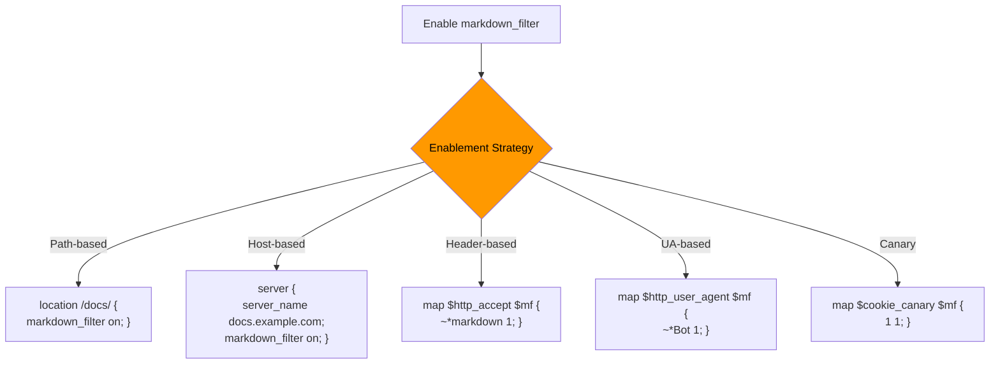

# Rollout Cookbook — Controlled Enablement Guide

## Table of Contents

1. [Overview](#overview)
2. [Before You Start](#before-you-start)
3. [Rollout Stages](#rollout-stages)
   - [Stage 1: Internal/Staging — Single Path](#stage-1-internalstaging--single-path)
   - [Stage 2: Internal/Staging — Multiple Paths](#stage-2-internalstaging--multiple-paths)
   - [Stage 3: Production — Single Low-Traffic Path](#stage-3-production--single-low-traffic-path)
   - [Stage 4: Production — Broader Scope](#stage-4-production--broader-scope)
4. [Selective Enablement Patterns](#selective-enablement-patterns)
   - [Path-Based Enablement](#path-based-enablement)
   - [Host-Based Enablement](#host-based-enablement)
   - [Accept-Header-Based Enablement](#accept-header-based-enablement)
   - [Bot / User-Agent-Based Enablement](#bot--user-agent-based-enablement)
   - [Internal-Only (IP-Range Gating)](#internal-only-ip-range-gating)
   - [Canary (Percentage-Based)](#canary-percentage-based)
   - [Header-Gated (Controlled Testing)](#header-gated-controlled-testing)
5. [Page Types Not Recommended for Initial Enablement](#page-types-not-recommended-for-initial-enablement)
   - [Why These Page Types Are Risky](#why-these-page-types-are-risky)
   - [Recommended Starting Points](#recommended-starting-points)
   - [Excluding Page Types from Conversion Scope](#excluding-page-types-from-conversion-scope)
6. [Conservative Default Configuration](#conservative-default-configuration)
   - [Why These Defaults Matter](#why-these-defaults-matter)
   - [Changing Defaults During Rollout](#changing-defaults-during-rollout)
7. [Observation Guidance](#observation-guidance)
   - [Metrics to Monitor](#metrics-to-monitor)
   - [Log Patterns to Check](#log-patterns-to-check)
   - [Checking the Metrics Endpoint](#checking-the-metrics-endpoint)
   - [Healthy Rollout Indicators](#healthy-rollout-indicators)
   - [Stop and Investigate Triggers](#stop-and-investigate-triggers)

---

## Overview

This cookbook walks you through enabling the Markdown filter module in a "start small, then expand" sequence. Each stage narrows the blast radius so you can observe behavior, confirm safety, and expand with confidence.

The recommended approach:

1. Pick a single, low-traffic, static-content path (for example `/docs` or `/help`).
2. Enable on an internal or staging host first.
3. Observe for at least one full traffic cycle before expanding.
4. Expand gradually — more paths, then more hosts.

All patterns in this cookbook use existing NGINX configuration primitives (`map`, `geo`, `split_clients`, `location` blocks) combined with the module's `markdown_filter $variable` capability. You need no new directives.

### Target Audience

- Site Reliability Engineers (SREs)
- DevOps Engineers
- System Administrators

### Related Documents

- [Decision Chain Model](../features/DECISION_CHAIN.md) — check order, reason codes, and outcome determination
- [CONFIGURATION.md](CONFIGURATION.md) — full directive reference
- [DEPLOYMENT_EXAMPLES.md](DEPLOYMENT_EXAMPLES.md) — deployment patterns and verification
- [OPERATIONS.md](OPERATIONS.md) — operational guide and metrics reference
- [streaming-rollout-cookbook.md](streaming-rollout-cookbook.md) — streaming-specific
  rollout and compressed-response verification

---

## Before You Start

### Verify Module Installation

Confirm the module loads and the converter initializes:

```bash
nginx -t
sudo tail -20 /var/log/nginx/error.log | grep markdown
# Expected: "markdown filter: converter initialized"
```

### Verify Metrics Endpoint

Confirm the metrics endpoint responds:

```bash
curl -s -H "Accept: text/plain; version=0.0.4" \
  http://localhost/markdown-metrics | head -5
```

### Record Baseline Metrics

Capture current metrics before enabling conversion:

```bash
curl -s -H "Accept: text/plain; version=0.0.4" \
  http://localhost/markdown-metrics > /tmp/baseline-metrics.prom
```

### Back Up Configuration

```bash
cp /usr/local/nginx/conf/nginx.conf \
   /usr/local/nginx/conf/nginx.conf.pre-rollout
```

### Recommended Initial Settings

Use these conservative defaults during rollout:

| Directive | Recommended Value | Rationale |
|-----------|-------------------|-----------|
| `markdown_filter` | `off` (global) | No conversion without explicit opt-in |
| `markdown_error_policy` | `pass` | Conversion failures serve original HTML |
| `markdown_accept` | `strict` | Only explicit `Accept: text/markdown` triggers conversion |
| `markdown_log_verbosity` | `info` | Decision log entries visible for all outcomes |

Keep `markdown_accept strict` during initial rollout. This limits conversion to clients that explicitly send `Accept: text/markdown`, preventing unexpected conversion for browsers sending `Accept: */*`.

Do not change `markdown_error_policy` to `fail_closed` during initial rollout. Fail-open (`pass`) ensures conversion failures never break client responses.

---

## Rollout Stages

### Stage 1: Internal/Staging — Single Path

Enable conversion for one path on an internal or staging host. Pick a low-traffic, static-content path such as `/docs` or `/help`.

#### Configuration

```nginx
load_module modules/ngx_http_markdown_filter_module.so;

http {
    markdown_filter off;
    markdown_error_policy pass;
    markdown_accept strict;
    markdown_log_verbosity info;
    markdown_limits conversion_memory=10m;
    markdown_limits conversion_timeout=5s parser_timeout=5s;

    server {
        listen 80;
        server_name staging.example.com;

        location /docs {
            markdown_filter on;
            proxy_pass http://backend;
        }

        location / {
            proxy_pass http://backend;
        }
    }
}
```

#### Apply

```bash
nginx -t && nginx -s reload
```

#### Observation Checkpoint

Wait at least 30 minutes, then verify:

```bash
# Check for conversion activity
curl -s -H "Accept: text/plain; version=0.0.4" \
  http://localhost/markdown-metrics | \
  grep -E "nginx_markdown_(requests_total|conversion_attempts_total|conversion_deliveries_total)"

# Check decision log entries
grep "markdown:" /var/log/nginx/error.log | tail -10

# Check for failure reason codes
grep "markdown:" /var/log/nginx/error.log | \
  grep -cE "outcome=(failed_open|failed_closed|aborted)"

# Verify a test request converts
curl -sD - -o /dev/null \
  -H "Accept: text/markdown" \
  http://staging.example.com/docs/
# Expected: Content-Type: text/markdown; charset=utf-8
```

#### Safe to Continue

- Conversion success rate > 95% (few or no `failed_open` / `failed_closed` request outcomes)
- No decision-log failure reasons. Inspect the `reason=` field for
  specific reason-registry keys (`ffi_panic`, `memory_budget_exceeded`,
  `timeout`, `conversion_error`, ...). Reserve the `category=` field for
  high-level classes (`conversion`, `resource_limit`, `system`). The
  reason values listed here are failure **reasons**, not categories
- Conversion latency within the configured `markdown_limits`
- No upstream error rate increase
- No `not_eligible` reason codes for requests you expect to convert

#### Stop and Investigate

- Sudden increase in `failed_open` or `failed_closed` counts
- Any `ffi_panic`, `memory_budget_exceeded`, `timeout`, or `conversion_error` reason codes
- Conversion latency exceeding `markdown_limits`
- Upstream error rate increase correlated with module enablement
- Unexpected `Content-Type` in converted responses

---

### Stage 2: Internal/Staging — Multiple Paths

Expand to additional paths on the same staging host.

#### Configuration

```nginx
http {
    markdown_filter off;
    markdown_error_policy pass;
    markdown_accept strict;
    markdown_log_verbosity info;
    markdown_limits conversion_memory=10m;
    markdown_limits conversion_timeout=5s parser_timeout=5s;

    server {
        listen 80;
        server_name staging.example.com;

        location /docs {
            markdown_filter on;
            proxy_pass http://backend;
        }

        location /help {
            markdown_filter on;
            proxy_pass http://backend;
        }

        location /blog {
            markdown_filter on;
            proxy_pass http://backend;
        }

        # Keep API and static assets excluded
        location /api {
            proxy_pass http://backend;
        }

        location / {
            proxy_pass http://backend;
        }
    }
}
```

#### Apply

```bash
nginx -t && nginx -s reload
```

#### Observation Checkpoint

Wait at least 1 hour, then verify:

```bash
# Check overall conversion metrics
curl -s -H "Accept: text/plain; version=0.0.4" \
  http://localhost/markdown-metrics | \
  grep -E "nginx_markdown_(requests_total|conversion_attempts_total|conversion_deliveries_total)"

# Check reason code distribution
grep "markdown:" /var/log/nginx/error.log | \
  grep -oP 'reason=\K[a-z_]+' | sort | uniq -c

# Check for failures across all enabled paths
grep "markdown:" /var/log/nginx/error.log | \
  grep -E "reason=failed_open\|reason=failed_closed" | \
  grep -oP 'uri=\K[^ ]+' | sort | uniq -c
```

#### Safe to Continue

- Same criteria as Stage 1, applied across all enabled paths
- No path-specific failure patterns (one path failing more than others)
- Stable or decreasing `failed_open` / `failed_closed` counts over the observation period

#### Stop and Investigate

- Same triggers as Stage 1
- One path showing significantly higher failure rate than others
- New `not_eligible` patterns indicating unexpected upstream responses

---

### Stage 3: Production — Single Low-Traffic Path

Enable on one production path with low traffic. Minimum observation period: 24 hours.

#### Configuration

```nginx
http {
    markdown_filter off;
    markdown_error_policy pass;
    markdown_accept strict;
    markdown_log_verbosity info;
    markdown_limits conversion_memory=10m;
    markdown_limits conversion_timeout=5s parser_timeout=5s;

    # Staging server (already enabled from Stage 2)
    server {
        listen 80;
        server_name staging.example.com;

        location /docs {
            markdown_filter on;
            proxy_pass http://backend;
        }

        location /help {
            markdown_filter on;
            proxy_pass http://backend;
        }

        location /blog {
            markdown_filter on;
            proxy_pass http://backend;
        }

        location / {
            proxy_pass http://backend;
        }
    }

    # Production server — single path enabled
    server {
        listen 80;
        server_name www.example.com;

        location /docs {
            markdown_filter on;
            proxy_pass http://backend;
        }

        location / {
            proxy_pass http://backend;
        }
    }
}
```

#### Apply

```bash
nginx -t && nginx -s reload
```

#### Observation Checkpoint

Wait at least 24 hours to cover a full traffic cycle, then verify:

```bash
# Check production conversion metrics
curl -s -H "Accept: text/plain; version=0.0.4" \
  http://localhost/markdown-metrics | \
  grep -E "nginx_markdown_(requests_total|conversion_attempts_total|conversion_deliveries_total)"

# Check for failure reason codes in the last 24 hours
grep "markdown:" /var/log/nginx/error.log | \
  grep -E "reason=failed_open\|reason=failed_closed" | wc -l

# Check reason code distribution
grep "markdown:" /var/log/nginx/error.log | \
  grep -oP 'reason=\K[a-z_]+' | sort | uniq -c

# Verify conversion latency samples are present; use histogram_quantile in PromQL
curl -s -H "Accept: text/plain; version=0.0.4" \
  http://localhost/markdown-metrics | \
  grep 'nginx_markdown_conversion_duration_seconds_bucket'
```

#### Safe to Continue

- All Stage 1 criteria hold over a full 24-hour period
- No increase in `failed_open` or `failed_closed` counts relative to conversion volume
- No `ffi_panic`, `memory_budget_exceeded`, `timeout`, or `conversion_error` reason codes
- Conversion latency within configured `markdown_limits`
- Stable or decreasing failure count over the 24-hour observation period
- No upstream error rate increase correlated with module enablement

#### Stop and Investigate

- All Stage 1 triggers apply
- Failure rate exceeding 5% of conversion attempts over any 1-hour window
- Latency spikes correlated with peak traffic periods
- Client reports of unexpected content
- One path failing significantly more than others: `grep "reason=failed_open\|reason=failed_closed" \| grep -oP 'uri=\K[^ ]+' \| sort \| uniq -c`
---

### Stage 4: Production — Broader Scope

Expand to additional production paths or hosts. Continue using 24-hour observation periods between expansions.

#### Configuration

Use a `map` directive for flexible path-based control instead of per-`location` enablement:

```nginx
http {
    map $uri $markdown_enabled {
        default         off;
        "~^/docs"       on;
        "~^/help"       on;
        "~^/blog"       on;
        "~^/guides"     on;
    }

    markdown_error_policy pass;
    markdown_accept strict;
    markdown_log_verbosity info;
    markdown_limits conversion_memory=10m;
    markdown_limits conversion_timeout=5s parser_timeout=5s;

    server {
        listen 80;
        server_name www.example.com;

        location / {
            markdown_filter $markdown_enabled;
            proxy_pass http://backend;
        }

        # Explicit exclusions for safety
        location /api {
            markdown_filter off;
            proxy_pass http://backend;
        }

        location ~* \.(js|css|png|jpg|jpeg|gif|ico|svg)$ {
            markdown_filter off;
            proxy_pass http://backend;
        }
    }
}
```

#### Apply

```bash
nginx -t && nginx -s reload
```

#### Observation Checkpoint

Wait at least 24 hours per expansion step, then verify:

```bash
# Full metrics snapshot
curl -s -H "Accept: text/plain; version=0.0.4" \
  http://localhost/markdown-metrics

# Reason code distribution
grep "markdown:" /var/log/nginx/error.log | \
  grep -oP 'reason=\K[a-z_]+' | sort | uniq -c

# Path-specific failure check
grep "markdown:" /var/log/nginx/error.log | \
  grep -E "reason=failed_open\|reason=failed_closed" | \
  grep -oP 'uri=\K[^ ]+' | sort | uniq -c

# Verify no internal system-failure categories
grep "markdown:" /var/log/nginx/error.log | \
  grep -c "category=system"
```

#### Safe to Continue

- All Stage 3 criteria hold across all enabled paths
- No path-specific failure patterns
- Conversion volume scales proportionally with traffic without latency degradation

#### Stop and Investigate

- All Stage 3 triggers apply
- Any single path showing failure rate above 5%
- Overall conversion latency trending upward over the observation period

---

## Selective Enablement Patterns



These patterns let you target conversion to specific traffic segments using NGINX configuration primitives and the module's `markdown_filter $variable` capability.

### Path-Based Enablement

Enable conversion for specific URL paths using `location` blocks or a `map` on `$uri`.

#### Using Location Blocks

The simplest approach — enable `markdown_filter on` in specific `location` blocks:

```nginx
http {
    markdown_filter off;
    markdown_error_policy pass;
    markdown_accept strict;

    server {
        listen 80;
        server_name example.com;

        location /docs {
            markdown_filter on;
            proxy_pass http://backend;
        }

        location /help {
            markdown_filter on;
            proxy_pass http://backend;
        }

        location / {
            proxy_pass http://backend;
        }
    }
}
```

#### Using map $uri

For flexible path patterns without creating many `location` blocks:

```nginx
http {
    map $uri $markdown_by_path {
        default         off;
        "~^/docs/"      on;
        "~^/help/"      on;
        "~^/blog/"      on;
        "~*\.html$"     on;
    }

    markdown_error_policy pass;
    markdown_accept strict;

    server {
        listen 80;
        server_name example.com;

        location / {
            markdown_filter $markdown_by_path;
            proxy_pass http://backend;
        }

        location /api {
            markdown_filter off;
            proxy_pass http://backend;
        }
    }
}
```

Start with a single low-traffic static-content path (for example `/docs` or `/help`) before expanding the `map` to broader patterns.

---

### Host-Based Enablement

Enable conversion for specific virtual hosts. Use this to test on a staging or internal host before enabling on production hosts.

#### Using Per-Server Blocks

```nginx
http {
    markdown_filter off;
    markdown_error_policy pass;
    markdown_accept strict;

    # Staging host — conversion enabled
    server {
        listen 80;
        server_name staging.example.com;

        markdown_filter on;

        location / {
            proxy_pass http://backend;
        }
    }

    # Production host — conversion disabled
    server {
        listen 80;
        server_name www.example.com;

        location / {
            proxy_pass http://backend;
        }
    }
}
```

#### Using map $host

For multi-host control from a single `server` block or shared configuration:

```nginx
http {
    map $host $markdown_by_host {
        default                 off;
        staging.example.com     on;
        internal.example.com    on;
    }

    markdown_error_policy pass;
    markdown_accept strict;

    server {
        listen 80;
        server_name staging.example.com www.example.com;

        location / {
            markdown_filter $markdown_by_host;
            proxy_pass http://backend;
        }
    }
}
```

Start with an internal or staging host before adding production hosts to the `map`.

---

### Accept-Header-Based Enablement

Enable conversion only for requests that explicitly include `Accept: text/markdown`. This targets clients that opt in to Markdown content.

#### Configuration

```nginx
http {
    # Parse Accept header — handles multi-value headers with q-factors
    # Matches "text/markdown" anywhere in the Accept value, including
    # comma-separated lists like "text/html, text/markdown;q=0.9"
    map $http_accept $markdown_by_accept {
        default                                     off;
        "~*(^|,)\s*text/markdown(\s*;|,|$)"         on;
    }

    markdown_error_policy pass;
    markdown_accept strict;

    server {
        listen 80;
        server_name example.com;

        location / {
            markdown_filter $markdown_by_accept;
            proxy_pass http://backend;
        }
    }
}
```

Keep `markdown_accept strict` (the default) during initial rollout. With `strict`, only explicit `text/markdown` in the Accept header triggers conversion. Clients sending `Accept: */*` or `Accept: text/*` receive HTML unchanged.

If you later want wildcard Accept values (for example `text/*`) to trigger conversion, set `markdown_accept wildcard` and expand the `map`:

```nginx
    map $http_accept $markdown_by_accept {
        default                                     off;
        "~*(^|,)\s*text/markdown(\s*;|,|$)"         on;
        "~*(^|,)\s*text/\*(\s*;|,|$)"              on;
    }

    server {
        listen 80;
        server_name example.com;

        location / {
            markdown_filter $markdown_by_accept;
            markdown_accept wildcard;
            proxy_pass http://backend;
        }
    }
```

---

### Bot / User-Agent-Based Enablement

Enable conversion for specific AI bots or crawlers identified by User-Agent. Combine UA detection with the module's `markdown_accept force` policy so bots that do not send `Accept: text/markdown` still receive Markdown.

#### Configuration

```nginx
http {
    # Detect known AI bots by User-Agent
    map $http_user_agent $is_ai_bot {
        default         off;
        "~*ClaudeBot"   on;
        "~*GPTBot"      on;
        "~*Googlebot"   on;
    }

    markdown_error_policy pass;

    server {
        listen 80;
        server_name example.com;

        location / {
            markdown_filter $is_ai_bot;
            markdown_accept force;
            proxy_pass http://backend;
        }

        location /api {
            markdown_filter off;
            proxy_pass http://backend;
        }
    }
}
```

UA-based targeting depends on clients sending accurate User-Agent strings. It is not a security boundary — any client can spoof a User-Agent. Use this pattern for convenience, not access control.

Note: the module evaluates the incoming request header itself. `proxy_set_header Accept` only modifies the header sent upstream. The `markdown_accept force` directive in this pattern is therefore the part that lets matching bots through when their original `Accept` header does not include `text/markdown`.

#### Verification

```bash
# Simulate ClaudeBot — should return Markdown
curl -sD - -o /dev/null -A "ClaudeBot/1.0" \
  http://example.com/docs/
# Expected: Content-Type: text/markdown; charset=utf-8

# Normal browser request — should return HTML
curl -sD - -o /dev/null -H "Accept: text/html" \
  http://example.com/docs/
# Expected: Content-Type: text/html
```

---

### Internal-Only (IP-Range Gating)

Enable conversion only for requests from internal IP ranges. This is the safest pattern for initial testing — external traffic is never affected.

#### Configuration

```nginx
http {
    # Define internal IP ranges
    geo $is_internal {
        default         0;
        10.0.0.0/8      1;
        172.16.0.0/12   1;
        192.168.0.0/16  1;
        127.0.0.1/32    1;
        ::1/128         1;
    }

    # Map internal flag to filter state
    map $is_internal $markdown_internal_only {
        0   off;
        1   on;
    }

    markdown_error_policy pass;
    markdown_accept strict;

    server {
        listen 80;
        server_name example.com;

        location /docs {
            markdown_filter $markdown_internal_only;
            proxy_pass http://backend;
        }

        location / {
            proxy_pass http://backend;
        }
    }
}
```

Trade-offs: safest pattern with zero external exposure, but limited to traffic originating from internal networks. Useful for initial validation before any external rollout.

---

### Canary (Percentage-Based)

Enable conversion for a small percentage of traffic using NGINX `split_clients`. This provides broader coverage through statistical sampling without enabling for all requests.

#### Configuration

```nginx
http {
    # Route 5% of traffic to conversion based on remote address
    split_clients $remote_addr $markdown_canary {
        5%      on;
        *       off;
    }

    markdown_error_policy pass;
    markdown_accept strict;

    server {
        listen 80;
        server_name example.com;

        location /docs {
            markdown_filter $markdown_canary;
            proxy_pass http://backend;
        }

        location / {
            proxy_pass http://backend;
        }
    }
}
```

Adjust the percentage as confidence grows (for example 5% → 25% → 50% → 100%). Follow each increase with a 24-hour observation period. Observe metrics between each step.

Trade-offs: broader coverage than internal-only, provides statistical sampling of real traffic. However, the same client may see different behavior across requests (conversion is not sticky per client). Use `$remote_addr` for rough client-level consistency, or `$request_id` for per-request randomization.

---

### Header-Gated (Controlled Testing)

Enable conversion only when a specific internal header is present. Use this for precise, on-demand testing — a developer or test harness sends the header to trigger conversion.

#### Configuration

```nginx
http {
    # Enable only when X-Markdown-Enable: true is present
    map $http_x_markdown_enable $markdown_header_gated {
        default     off;
        "true"      on;
        "1"         on;
    }

    markdown_error_policy pass;
    markdown_accept strict;

    server {
        listen 80;
        server_name example.com;

        location / {
            markdown_filter $markdown_header_gated;
            proxy_pass http://backend;
        }
    }
}
```

#### Verification

```bash
# With header — should convert
curl -sD - -o /dev/null \
  -H "Accept: text/markdown" \
  -H "X-Markdown-Enable: true" \
  http://example.com/docs/
# Expected: Content-Type: text/markdown; charset=utf-8

# Without header — should return HTML
curl -sD - -o /dev/null \
  -H "Accept: text/markdown" \
  http://example.com/docs/
# Expected: Content-Type: text/html
```

Trade-offs: precise control, ideal for integration testing and QA. Requires client cooperation (the header must be sent explicitly). Not suitable for broad rollout since real clients do not send this header.


---

## Page Types Not Recommended for Initial Enablement

Not all pages are good candidates for Markdown conversion. Some page types produce poor results, trigger eligibility skips, or risk breaking client functionality. Exclude these from your initial rollout scope and expand only after static content paths are stable.

### Why These Page Types Are Risky

| Page Type | Why Not Recommended | Relevant Check |
|-----------|---------------------|----------------|
| Single-Page Applications (SPAs) | SPAs render content via JavaScript after the initial HTML load. The upstream HTML is typically a minimal shell (`<div id="root"></div>`) with no meaningful content to convert. The resulting Markdown is empty or useless. | — (conversion produces poor output) |
| Pages with heavy interactive elements | Forms, dynamic widgets, and JavaScript-driven UI components do not have Markdown equivalents. Conversion strips interactivity and produces a degraded representation that may confuse consuming agents. | — (conversion produces poor output) |
| Authenticated / personalized pages | Pages behind authentication or with per-user content may vary per request, making caching and observation unreliable during rollout. The module detects authentication credentials and adjusts cache-control headers accordingly. When `markdown_auth_policy deny` is configured, the module will short-circuit authenticated requests to `not_eligible`. The default authentication policy is "allow". Exclude these pages from conversion scope using `location` blocks or `map` directives. | `not_eligible` — Auth policy denies conversion for authenticated requests (or exclude via configuration) |
| Non-text content pages | Pages serving images, video, downloads, or other binary content return a `Content-Type` other than `text/html`. The module skips these automatically. Enabling conversion scope for paths that serve mixed content types adds noise to your decision logs without producing conversions. | `not_eligible` — Content-Type not text/html |
| API endpoints (JSON / XML) | API endpoints return `application/json`, `application/xml`, or other non-HTML content types. The module skips these via the content-type eligibility check. Including API paths in your conversion scope produces `not_eligible` log entries with no benefit. | `not_eligible` — Content-Type not text/html |
| SSE / streaming endpoints | Server-Sent Events and streaming responses have no `Content-Length` or use chunked transfer with unbounded duration. The module detects these as streaming content and skips them. Attempting conversion on unbounded streams would block resources indefinitely. | `not_eligible` — unbounded streaming response |

### Recommended Starting Points

Start your rollout with content-heavy pages that have simple, static HTML structure:

- **Static documentation pages** (`/docs`, `/help`, `/guides`) — predictable HTML, low interactivity, high value for AI agents
- **Blog posts** (`/blog`) — article-style content converts cleanly to Markdown
- **Help articles and FAQs** (`/support`, `/faq`) — structured text content with headings and lists
- **Changelogs and release notes** (`/changelog`, `/releases`) — simple HTML, rarely personalized

These page types share common traits that make them ideal first candidates:
- Content is primarily text with headings, paragraphs, lists, and links
- HTML structure is simple and predictable
- Pages are not personalized or authenticated
- Content-Type is consistently `text/html`
- Response sizes are within typical `markdown_limits` limits

Once these paths are stable (conversion success rate > 95%, latency within `markdown_limits`), expand to additional content paths. Follow the [Rollout Stages](#rollout-stages) sequence for each expansion.

### Excluding Page Types from Conversion Scope

Use `location` blocks or `map` directives to keep risky page types out of your conversion scope.

#### Using Location Blocks for Explicit Exclusions

The most direct approach: set `markdown_filter off` in `location` blocks for paths you want to exclude. Then enable conversion only in specific content paths:

```nginx
http {
    markdown_filter off;
    markdown_error_policy pass;
    markdown_accept strict;

    server {
        listen 80;
        server_name example.com;

        # --- Excluded page types ---

        # API endpoints — return JSON/XML, not text/html
        location /api {
            markdown_filter off;
            proxy_pass http://backend;
        }

        # SPA routes — JavaScript-rendered, minimal HTML shell
        location /app {
            markdown_filter off;
            proxy_pass http://backend;
        }

        # Streaming / SSE endpoints
        location /events {
            markdown_filter off;
            proxy_pass http://backend;
        }

        # Authenticated / personalized pages
        location /account {
            markdown_filter off;
            proxy_pass http://backend;
        }
        location /dashboard {
            markdown_filter off;
            proxy_pass http://backend;
        }

        # Static assets — not text/html
        location ~* \.(js|css|png|jpg|jpeg|gif|ico|svg|woff2?|ttf)$ {
            markdown_filter off;
            proxy_pass http://backend;
        }

        # --- Enabled content paths ---

        location /docs {
            markdown_filter on;
            proxy_pass http://backend;
        }

        location /blog {
            markdown_filter on;
            proxy_pass http://backend;
        }

        location /help {
            markdown_filter on;
            proxy_pass http://backend;
        }

        # Default — conversion disabled
        location / {
            proxy_pass http://backend;
        }
    }
}
```

#### Using a map Directive for Pattern-Based Exclusions

For more flexible control, use a `map` on `$uri` to define both inclusions and exclusions in one place:

```nginx
http {
    map $uri $markdown_enabled {
        default         off;

        # Enabled — static content paths
        "~^/docs/"      on;
        "~^/blog/"      on;
        "~^/help/"      on;
        "~^/guides/"    on;
        "~^/faq"        on;

        # Excluded — even if a broader pattern above would match
        # (not needed here since default is off, but shown for
        # cases where you use a broad include pattern)
        "~^/api/"       off;
        "~^/app/"       off;
        "~^/events/"    off;
        "~^/account/"   off;
        "~^/dashboard/" off;
    }

    markdown_error_policy pass;
    markdown_accept strict;

    server {
        listen 80;
        server_name example.com;

        location / {
            markdown_filter $markdown_enabled;
            proxy_pass http://backend;
        }

        # Explicit override for API — belt and suspenders
        location /api {
            markdown_filter off;
            proxy_pass http://backend;
        }
    }
}
```

The `map` approach is easier to maintain as your rollout scope grows. You add or remove paths in the `map` block without creating new `location` blocks. Combine it with explicit `location` overrides for critical exclusions (like `/api`) as a safety net. NGINX `map` evaluation is not simple declaration order. Exact matches and masked prefixes or suffixes take precedence over regular expressions, and competing regular expressions apply in declaration order. Place critical map exclusions so they win under those rules. A specific exclusion that appears after a broad regex that matches it never reaches its branch.

Note: Even if a risky page type is accidentally included in your conversion scope, the module's eligibility checks provide a safety net. The module skips unsupported or unbounded response types via `not_eligible` (for example non-HTML content types, error statuses, or responses the module cannot convert). Large or chunked responses are a separate case: they may enter `markdown_streaming` and transition through bounded lowercase `event` values such as `engine_streaming` or `streaming_convert` — never `STREAMING_*` outcomes. The terminal outcome set stays `converted`, `failed_open`, `failed_closed`, and `skipped`. However, relying on eligibility checks alone adds noise to your decision logs and metrics. Explicit exclusions keep your rollout scope clean and your observation data meaningful. The safety net catches accidental scope mistakes. It does not replace explicit scope control.

---

## Conservative Default Configuration

The module ships with defaults chosen for production safety. Every capability that changes client-visible behavior requires explicit opt-in. This section explains the rationale behind each default and when (if ever) you should change them.

For a quick-reference table of these defaults, see [Before You Start — Recommended Initial Settings](#before-you-start).

### Why These Defaults Matter

#### `markdown_filter off`

The module performs no conversion unless you explicitly enable it per scope. With `off` as the default at the `http` level, adding the module to your NGINX build changes nothing about your site's behavior. Conversion only activates in `location` or `server` blocks where you set `markdown_filter on` or use a `map` variable.

This is the most important default: it means a module upgrade or installation never introduces conversion as a side effect. You control exactly which traffic segments see Markdown responses.

#### `markdown_error_policy pass`

When conversion fails before the module commits the response headers — the
pre-commit and full-buffer paths — the module serves the original HTML
response unchanged. The client never sees a 502 or broken response due to a
conversion problem in those paths.

Fail-open (`pass`) is the safe choice for production because conversion is an
enhancement, not a requirement. If the converter encounters HTML it cannot
handle before commit, the worst outcome is that the client receives the same
HTML. This equals the response without the module. Metrics and decision logs
still record the failure (as `failed_open`) so you can investigate. Client
experience stays unaffected. This makes `pass` the safe default. The module
never breaks responses on conversion errors before commit. It degrades to the
original HTML. The worst case equals no module at all. After the module commits the response headers (streaming post-commit),
`pass` cannot replay the original HTML: the module safe-finishes or aborts
the Markdown output instead.

#### `markdown_accept strict`

With `strict`, only requests containing an explicit `Accept: text/markdown`
media type trigger conversion. Wildcard Accept values like `Accept: */*` or
`Accept: text/*` — which browsers and many HTTP clients send by default — do
not trigger conversion. An explicit rejection (`Accept: text/markdown;q=0`,
or a wildcard with `q=0`) produces the `skipped_accept_reject` outcome.

This prevents accidental conversion of browser traffic. A standard browser
request (`Accept: text/html, */*`) does not match the strict policy and keeps
HTML. Use `markdown_accept wildcard` only for a scope where wildcard clients
are intentionally meant to receive Markdown.

#### `markdown_log_verbosity info`

At `info` level, the module emits a decision log entry for every request that enters the decision chain. This covers conversions, skips, and failures alike. This gives you full visibility into module behavior without requiring `debug` level. The `debug` level adds extended fields (filter value, Accept header, upstream status) and increases log volume. Choose `info` for rollout monitoring.

During rollout, `info` is the right level. You can see every decision the module makes, correlate with metrics, and diagnose unexpected behavior. After rollout stabilizes, you may raise verbosity to `warn` to reduce log volume. At that level, the module logs only failure outcomes (`failed_open`, `failed_closed`). The `warn` level logs failures only. Rollout uses `info` for full visibility. Steady state can drop to `warn`.

### Changing Defaults During Rollout

Most defaults should remain unchanged throughout your initial rollout. The table below summarizes when it is safe to adjust each setting.

| Directive | Safe to Change During Rollout? | Guidance |
|-----------|-------------------------------|----------|
| `markdown_filter` | Yes — this is how you roll out | Enable per scope following the [Rollout Stages](#rollout-stages) sequence |
| `markdown_error_policy` | No — keep `pass` | See warning below |
| `markdown_accept` | No — keep `strict` | Only enable after confirming no browser traffic reaches enabled scopes |
| `markdown_log_verbosity` | Yes — but keep `info` initially | Lower to `warn` only after rollout is stable and you no longer need full decision visibility |

#### Do not change `markdown_error_policy` to `fail_closed` during initial rollout

Setting `markdown_error_policy fail_closed` causes the module to return a 502 Bad Gateway when conversion fails. During initial rollout, you are still discovering which pages convert cleanly and which trigger edge cases in the converter. A single unexpected HTML structure could cause a conversion failure that, with `fail_closed`, returns a 502 to the client instead of the original HTML.

Keep `markdown_error_policy pass` until:

1. Your rollout has been stable for multiple traffic cycles (at least 48 hours in production).
2. Your `failed_open` count is zero or near-zero for all enabled scopes.
3. You have reviewed the failure reason codes (`conversion_error`, `memory_budget_exceeded`, `timeout`, `ffi_panic`) and resolved any underlying issues.
4. You have a specific operational reason to reject failed conversions. For example, you need to guarantee Markdown-only responses for a downstream consumer.

Even then, consider enabling `fail_closed` only in narrow scopes (specific `location` blocks) rather than globally, and monitor closely after the change. If failures appear, switch back to `pass` immediately by setting `markdown_error_policy pass` and running `nginx -s reload`.


---

## Observation Guidance

This section is the comprehensive reference for monitoring module behavior during rollout. The [Rollout Stages](#rollout-stages) observation checkpoints provide stage-specific commands. This section explains what to monitor, why, and how to interpret the results.

Use this guidance at every observation checkpoint and whenever you need to assess whether the module is behaving as expected.

### Metrics to Monitor

The module exposes `/markdown-metrics` as a localhost-only Prometheus text
0.0.4 endpoint. It always emits the exact twelve families listed in the
[Prometheus Metrics Guide](prometheus-metrics.md). The `Accept` header cannot
select a legacy JSON or human-readable representation.

The primary rollout ratios come from the frozen families. Distinguish the
request-based failure rate from the conversion-attempt-based failure rate:

```text
# clamp_min(..., 1e-9) is a divide-by-zero guard only; it does not change
# the rate units, so low-traffic ratios keep their true magnitude.
conversion_delivery_rate = sum(rate(nginx_markdown_conversion_deliveries_total[5m]))
                            / clamp_min(sum(rate(nginx_markdown_conversion_attempts_total[5m])), 1e-9)
# Conversion-attempt-based failure rate: failed outcomes per conversion attempt.
conversion_failure_rate = sum(rate(nginx_markdown_requests_total{outcome=~"failed_.*|aborted"}[5m]))
                          / clamp_min(sum(rate(nginx_markdown_conversion_attempts_total[5m])), 1e-9)
# Request-based failure rate: failed outcomes per request that entered the
# decision chain (includes skipped and disabled requests in the denominator).
request_failure_rate = sum(rate(nginx_markdown_requests_total{outcome=~"failed_.*|aborted"}[5m]))
                       / clamp_min(sum(rate(nginx_markdown_requests_total[5m])), 1e-9)
```

A healthy rollout keeps `conversion_failure_rate` within the pre-rollout
baseline and keeps the delivery rate stable. The request-based
`request_failure_rate` is always less than or equal to the
conversion-attempt-based rate, because its denominator includes skipped and
disabled requests. Equality occurs exactly when every request is a
conversion attempt. Use it only when you want the share of failed requests
over all requests, and do not compare it against the conversion-attempt-based
rate. Use decision logs for reason distributions.

### Log Patterns to Check

Decision log entries use the format `markdown decision: reason=<REASON_CODE> ...` and appear in the NGINX error log. Use these `grep` patterns to check for specific outcomes:

#### Check for conversion failures

```bash
# Count all conversion failures
grep "markdown:" /var/log/nginx/error.log | \
  grep -E "reason=failed_open\|reason=failed_closed" -c

# Show the most recent failures with full context
grep "markdown:" /var/log/nginx/error.log | \
  grep -E "reason=failed_open\|reason=failed_closed" | tail -10
```

#### Check for system-level failures

```bash
# category=system indicates internal errors — these should never appear
grep "markdown:" /var/log/nginx/error.log | \
  grep -c "category=system"
```

#### Check reason code distribution

```bash
# See the distribution of all reason codes
grep "markdown:" /var/log/nginx/error.log | \
  grep -oP 'reason=\K[A-Za-z_]+' | sort | uniq -c | sort -rn
```

#### Check for unexpected skip reasons

```bash
# Show all eligibility and Accept skip reasons; disabled is intentionally excluded.
grep "markdown:" /var/log/nginx/error.log | \
  grep -E "reason=(not_eligible|skipped_[a-z_]+)" | \
  grep -oP 'reason=\K[a-z_]+' | sort | uniq -c
```

#### Check failure sub-classification

```bash
# Break down failures by category (conversion, resource_limit, system)
# The category= field appears in decision log entries for failure outcomes
grep "markdown:" /var/log/nginx/error.log | \
  grep -oP 'category=\K[a-z_]+' | sort | uniq -c
```

#### Check per-URI failure patterns

```bash
# Identify which URIs are failing most often
grep "markdown:" /var/log/nginx/error.log | \
  grep -E "reason=failed_open|reason=failed_closed" | \
  grep -oP 'uri=\K[^ ]+' | sort | uniq -c | sort -rn | head -10
```

#### Check NGINX error-level messages from the module

```bash
# Look for module-level errors beyond decision log entries
grep -i "markdown" /var/log/nginx/error.log | \
  grep -E "\[(error|crit|alert|emerg)\]" | tail -10
```

### Checking the Metrics Endpoint

Use these `curl` commands to query the metrics endpoint directly. These are copy-pasteable — adjust the hostname and port to match your environment.

#### Quick health check

```bash
# Fetch the frozen Prometheus text format
curl -s -H "Accept: text/plain; version=0.0.4" \
  http://localhost/markdown-metrics
```

#### Full metrics snapshot

```bash
# Save a full snapshot for comparison
curl -s -H "Accept: text/plain; version=0.0.4" \
  http://localhost/markdown-metrics > /tmp/metrics-$(date +%s).prom
```

#### Compare metrics over time

```bash
# Take a before snapshot
curl -s -H "Accept: text/plain; version=0.0.4" \
  http://localhost/markdown-metrics > /tmp/metrics-before.prom

# ... wait for observation period ...

# Take an after snapshot and compare
curl -s -H "Accept: text/plain; version=0.0.4" \
  http://localhost/markdown-metrics > /tmp/metrics-after.prom

diff -u /tmp/metrics-before.prom /tmp/metrics-after.prom
```

#### Check skip reason distribution from metrics

```bash
# Show all skip reason codes from decision log
# (skip reasons are not in the metrics endpoint;
# use decision log grep patterns instead)
grep "markdown:" /var/log/nginx/error.log | \
  grep -E "reason=not_eligible|reason=skipped_" | \
  grep -oP 'reason=\K[A-Za-z_]+' | sort | uniq -c
```

#### Check failure stage distribution from metrics

```bash
# Show failure outcomes from the metrics endpoint
curl -s -H "Accept: text/plain; version=0.0.4" \
  http://localhost/markdown-metrics | \
  grep -E 'nginx_markdown_requests_total\{[^}]*outcome="(failed_[^"}]*|aborted)"'
```

#### Check latency histogram samples

```bash
# Show histogram samples from the metrics endpoint
curl -s -H "Accept: text/plain; version=0.0.4" \
  http://localhost/markdown-metrics | \
  grep 'nginx_markdown_conversion_duration_seconds_'
```

#### Check latency with human-readable summary

```bash
# Fetch the frozen histogram buckets:
curl -s -H "Accept: text/plain; version=0.0.4" \
  http://localhost/markdown-metrics | \
  grep 'nginx_markdown_conversion_duration_seconds_bucket'

# Compute p95 from the buckets (requires promtool; the finite buckets stop
# at 5s, so p95 is only meaningful below that bound):
curl -s -H "Accept: text/plain; version=0.0.4" \
  http://localhost/markdown-metrics > /tmp/markdown-metrics.txt
promtool query instant http://localhost:9090 \
  'histogram_quantile(0.95, sum by (le) (rate(nginx_markdown_conversion_duration_seconds_bucket[5m])))' \
  2>/dev/null \
  || echo "promtool/Prometheus not available — inspect the bucket output above for the distribution"
```

#### Verify a test request converts successfully

```bash
# Send a request with Accept: text/markdown and check the response headers
curl -sD - -o /dev/null \
  -H "Accept: text/markdown" \
  http://localhost/docs/
# Expected: Content-Type: text/markdown; charset=utf-8
```

### Healthy Rollout Indicators

A rollout is healthy when all of the following hold true during the observation period:

| Indicator | Threshold | How to Check |
|-----------|-----------|--------------|
| Conversion delivery rate | Stable vs baseline | `sum(rate(nginx_markdown_conversion_deliveries_total[5m])) / clamp_min(sum(rate(nginx_markdown_conversion_attempts_total[5m])), 1e-9)` from Prometheus |
| Failed request rate | Within baseline | `sum(rate(nginx_markdown_requests_total{outcome=~"failed_.*|aborted"}[5m])) / clamp_min(sum(rate(nginx_markdown_requests_total[5m])), 1e-9)` from Prometheus |
| Conversion latency | Within configured `markdown_limits` | Latency buckets show the vast majority of conversions completing before the timeout threshold |
| Failed request trend | Stable or decreasing | Compare `requests_total{outcome=~"failed_.*|aborted"}` snapshots over the observation period |
| Upstream error rate | No increase correlated with enablement | Compare upstream 5xx rates before and after enabling the module |
| Unexpected skip reasons | None for traffic you expect to convert | Check decision log `reason=not_eligible` — no unexpected `not_eligible` (content-type/size) for enabled paths |

When all indicators are green, it is safe to proceed to the next rollout stage.

### Stop and Investigate Triggers

Stop expanding rollout scope and investigate if any of the following occur:

| Trigger | What It Means | How to Detect |
|---------|---------------|---------------|
| Sudden increase in failed outcomes | Conversion failures are spiking — may indicate upstream HTML changes, resource pressure, or a converter bug | `grep -E "reason=(failed_open|failed_closed)" /var/log/nginx/error.log \| tail -20` or watch the failed `requests_total` series |
| Repeated internal failure reasons | Internal failure categories appear repeatedly, for example `memory_budget_exceeded` or `ffi_panic` — check the decision logs | Inspect the `category=` field in decision log entries and the NGINX logs; these categories do not appear as `requests_total` reason labels |
| Conversion latency exceeding `markdown_limits` | Conversions are taking too long — may indicate large pages, resource contention, or converter performance issues | Check latency buckets; look for conversions in the highest `le` bucket or timeouts in logs |
| Upstream error rate increase | The module may be causing upstream issues (unlikely but possible with decompression or buffering interactions) | Compare upstream 5xx rates before and after enablement |
| Unexpected `Content-Type` in responses | Converted responses have wrong Content-Type, or non-HTML responses are being processed | `curl -sD - -H "Accept: text/markdown" http://localhost/your-path/ \| grep Content-Type` |
| One path failing significantly more than others | Path-specific issue — the HTML structure on that path may not convert cleanly | Per-URI failure check: `grep "reason=failed_open\|reason=failed_closed" \| grep -oP 'uri=\K[^ ]+' \| sort \| uniq -c` |
| `not_eligible` or `disabled` for paths you expect to convert | Upstream responses changed — content type is no longer `text/html` or response size exceeds `markdown_limits` | Check skip reason distribution filtered by URI |

When a trigger fires:

1. Do not expand to the next rollout stage.
2. Check the decision logs and metrics to understand the scope of the issue.
3. If the issue appears on a single path only, consider narrowing your rollout scope to exclude that path. Isolated issues point to path-specific causes. Scope narrowing targets the affected path only. A single-path issue usually has a single cause. Exclude the path and observe.
4. If the issue is widespread, consider rolling back — see the Rollback Guide (`OPERATIONAL_ROLLBACK.md`) for procedures.
5. Resolve the underlying issue before resuming rollout expansion.


## Document Updates

| Version | Date | Author | Changes |
|---------|------|--------|---------|
| 0.9.2 | 2026-08-15 | Kang | Failure-rate formulas split conversion-attempt vs request based; error-policy pass scoped to pre-commit |
| 0.9.2 | 2026-08-15 | Hermes | Update failure reason values and point internal-failure triggers to decision logs |
| 0.9.1 | 2026-07-13 | Kang | Align legacy directive references with 0.9.0 Config V2 implementation (markdown_limits, markdown_error_policy, markdown_accept, markdown_cache_validation; retire the large-response threshold directive) |
| 0.6.2 | 2026-05-08 | Kang | Unified version narrative to 0.6.2 current release line |
| 0.5.0 | 2026-04-21 | docs-standardization | Standardized formatting, added mermaid diagrams where applicable, verified directive accuracy against code, added update tracking section |
