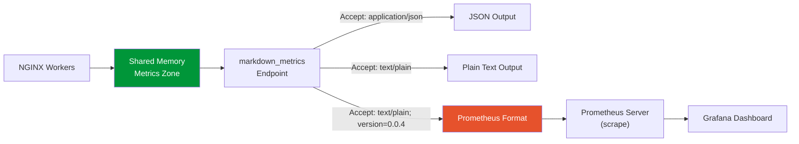

# Prometheus Metrics Guide

> **0.9.x schema note:** Reason strings use lowercase_snake_case. The catalog
> below describes the production C renderer. The Rust observability model is
> internal and is not a substitute for the wire schema. See the
> [Public Surface Inventory](../architecture/PUBLIC_SURFACE_INVENTORY.md#metrics-and-reason-code-contract)
> for the complete freeze inventory.

## Table of Contents

1. [Overview](#overview)
2. [Enabling Prometheus Format](#enabling-prometheus-format)
3. [Scrape Configuration](#scrape-configuration)
4. [Metric Catalog](#metric-catalog)
5. [Verifying the Endpoint](#verifying-the-endpoint)
6. [Prometheus Labels and Decision Log Reason Codes](#prometheus-labels-and-decision-log-reason-codes)
7. [Interpreting Metrics for Rollout Judgment](#interpreting-metrics-for-rollout-judgment)
8. [Token Savings Estimate](#token-savings-estimate)
9. [Metric Stability Policy](#metric-stability-policy)

---

## Overview



The NGINX Markdown filter module exposes module-level operational metrics via the existing `markdown_metrics` endpoint. Starting with version 0.4.0, the endpoint supports Prometheus text exposition format (`text/plain; version=0.0.4; charset=utf-8`) as an opt-in output format alongside the existing JSON and plain-text formats.

These metrics help operators answer three questions:

1. **Is the module working?** — Conversion success rate, failure breakdown, skip reasons.
2. **How effective is it?** — Byte reduction ratio, estimated token savings, conversion throughput.
3. **Is it safe to continue rollout?** — Fail-open rate, error trends, latency distribution.

Only module-internal semantics that generic NGINX exporters (such as `nginx-prometheus-exporter`) cannot recover are exposed. This is not a replacement for general NGINX monitoring.

### Target Audience

- Site Reliability Engineers (SREs)
- DevOps Engineers
- System Administrators operating the NGINX Markdown filter module

### Related Documents

- [CONFIGURATION.md](CONFIGURATION.md) — Full directive reference
- [OPERATIONS.md](OPERATIONS.md) — General operational guide and metrics reference
- [ROLLOUT_COOKBOOK.md](ROLLOUT_COOKBOOK.md) — Rollout planning and phased deployment

---

## Enabling Prometheus Format

Prometheus text exposition format is off by default. To enable it, add the `markdown_metrics_format` directive to the location block that serves the metrics endpoint.

### Configuration

```nginx
location /markdown-metrics {
    markdown_metrics;
    markdown_metrics_format prometheus;

    # Restrict access to localhost only
    allow 127.0.0.1;
    allow ::1;
    deny all;
}
```

### Directive Reference

| Directive | Values | Default | Context |
|---|---|---|---|
| `markdown_metrics_format` | `auto` \| `prometheus` | `auto` | http, server, location |

- `auto` — Existing behavior. JSON for `Accept: application/json`, plain text otherwise. Backward compatible with 0.3.0.
- `prometheus` — Prometheus text exposition format when the client explicitly negotiates it (e.g., `Accept: text/plain; version=0.0.4` or `Accept: application/openmetrics-text`). Plain `text/plain` without the version parameter and requests with no `Accept` header still return the legacy plain text format. `Accept: application/json` still returns JSON.

### Content Negotiation Behavior

When `markdown_metrics_format prometheus` is configured:

| Accept Header | Output Format |
|---|---|
| `application/json` | JSON |
| `text/plain; version=0.0.4` | Prometheus |
| `application/openmetrics-text` | Prometheus |
| `text/plain` | Plain text (backward compatible) |
| (any other / none) | Plain text (backward compatible) |

When `markdown_metrics_format auto` (default):

| Accept Header | Output Format |
|---|---|
| `application/json` | JSON |
| `text/plain` | Plain text (existing human-readable format) |
| (any other / none) | Plain text (existing human-readable format) |

Prometheus format is served only when the client explicitly requests it via `Accept: text/plain; version=0.0.4` or `Accept: application/openmetrics-text`. Plain `text/plain` without the version parameter falls back to the legacy human-readable format, preserving backward compatibility for operators who curl without a specific Accept header. No external dependencies, sidecars, or agents are required.

---

## Scrape Configuration

### Prometheus `prometheus.yml` Example

```yaml
scrape_configs:
  - job_name: 'nginx-markdown'
    scrape_interval: 15s
    metrics_path: '/markdown-metrics'
    static_configs:
      - targets: ['localhost:80']
    # Prometheus sends Accept: application/openmetrics-text by default,
    # which the module recognizes when markdown_metrics_format is prometheus.
```

If NGINX listens on a non-standard port or the metrics location uses a different path, adjust `targets` and `metrics_path` accordingly.

### Access Control

The metrics handler enforces loopback-only access (`127.0.0.1` and `::1`).
NGINX `allow`/`deny` rules can narrow access further, but they do not broaden
the module's built-in check. Keep the endpoint on a management listener and do
not expose it on the public internet.

**Security recommendations:**

- Expose the metrics endpoint only on internal networks.
- Use NGINX `allow`/`deny` directives for additional access control.
- Do not expose the metrics endpoint on the public internet.

---

## Metric Catalog

All metrics use the `nginx_markdown_` prefix. Counter metrics use the `_total` suffix. Byte-valued counters use `_bytes_total`.

### Counter Metrics (no labels)

| Metric Name | Type | Description |
|---|---|---|
| `nginx_markdown_requests_total` | counter | Total requests entering the module decision chain. This is the denominator for conversion rate calculations. |
| `nginx_markdown_conversions_total` | counter | Successful HTML-to-Markdown conversions. |
| `nginx_markdown_passthrough_total` | counter | Requests not converted (skipped or failed-open). Derived as the sum of all skip-reason counters plus fail-open count. |
| `nginx_markdown_failopen_total` | counter | Conversions failed with original HTML served (`markdown_error_policy pass`). |
| `nginx_markdown_large_response_path_total` | counter | Requests routed to the incremental processing path. |
| `nginx_markdown_input_bytes_total` | counter | Cumulative HTML input bytes from successful conversions. |
| `nginx_markdown_output_bytes_total` | counter | Cumulative Markdown output bytes from successful conversions. |
| `nginx_markdown_estimated_token_savings_total` | counter | Estimated cumulative token savings. Requires `markdown_token_estimate on` to produce non-zero values. See [Token Savings Estimate](#token-savings-estimate). |
| `nginx_markdown_decompression_failures_total` | counter | Failed decompression attempts. |
| `nginx_markdown_per_path_conversions_total` | counter | Aggregate conversions recorded by the bounded per-path store. |
| `nginx_markdown_per_path_conversion_time_ms_total` | counter | Aggregate conversion time recorded by the bounded per-path store. |
| `nginx_markdown_per_path_overflow_total` | counter | Paths folded into the bounded overflow bucket. |

### Counter Metrics (with labels)

| Metric Name | Type | Label Key | Label Values | Description |
|---|---|---|---|---|
| `nginx_markdown_skips_total` | counter | `reason` | `not_eligible`, `skipped_accept`, `skipped_no_accept`, `skipped_conditional`, `disabled` | Requests skipped by reason. |
| `nginx_markdown_failures_total` | counter | `reason` | `conversion_error`, `resource_limit`, `system_error` | Conversion failures by bounded category. |
| `nginx_markdown_decompressions_total` | counter | `format` | `gzip`, `deflate`, `brotli` | Decompression operations by compression format. |
| `nginx_markdown_path_conversions_total` | counter | `path` | bounded configured paths plus `__other__` | Conversions by retained path. |
| `nginx_markdown_path_conversion_time_ms_total` | counter | `path` | bounded configured paths plus `__other__` | Cumulative conversion time by retained path. |

### Cumulative Latency Counters

| Metric Name | Type | Label Key | Label Values | Description |
|---|---|---|---|---|
| `nginx_markdown_conversion_latency_bucket_total` | counter | `le` | `0.01`, `0.1`, `1.0`, `+Inf` | Cumulative conversion count per latency boundary. This is a counter family, not a native Prometheus histogram. |

### Per-Path Store Gauge

| Metric Name | Type | Description |
|---|---|---|
| `nginx_markdown_per_path_entries` | gauge | Number of retained path entries in the bounded per-path store. |

### Streaming Metrics (0.5.0+, `MARKDOWN_STREAMING_ENABLED`)

These metrics are only emitted when the module is compiled with `MARKDOWN_STREAMING_ENABLED`. They are absent from the output when the feature is not compiled in.

#### Streaming Counter Metrics (no labels)

| Metric Name | Type | Description |
|---|---|---|
| `nginx_markdown_streaming_path_total` | counter | Requests routed to the streaming processing path. |
| `nginx_markdown_streaming_budget_exceeded_total` | counter | Streaming memory budget exceeded count (auxiliary classification; terminal state depends on `markdown_error_policy`). |
| `nginx_markdown_streaming_shadow_total` | counter | Shadow mode comparison attempts (incremented unconditionally at entry, including init/feed/finalize failures). |
| `nginx_markdown_streaming_shadow_diff_total` | counter | Shadow mode comparisons where outputs differed. |
| `nginx_markdown_streaming_candidate_total` | counter | Requests evaluated as true-streaming candidates. |
| `nginx_markdown_true_streaming_selected_total` | counter | Requests that selected the true-streaming engine. |
| `nginx_markdown_streaming_output_bytes_total` | counter | Markdown bytes emitted by true streaming. |
| `nginx_markdown_excluded_content_type_total` | counter | Requests excluded by configured streaming content-type rules. |

#### Streaming Counter Metrics (with labels)

| Metric Name | Type | Label Key | Label Values | Description |
|---|---|---|---|---|
| `nginx_markdown_streaming_total` | counter | `result` | `success`, `failed`, `fallback` | Streaming conversion outcomes by result (mutually exclusive). |
| `nginx_markdown_streaming_failures_total` | counter | `stage` | `precommit_failopen`, `precommit_reject`, `postcommit_error` | Detailed streaming failures by stage. |
| `nginx_markdown_streaming_engine_choice_total` | counter | `engine` | `streaming`, `full_buffer`, `passthrough`, `not_eligible` | Engine selected by the streaming router. |
| `nginx_markdown_streaming_fallback_total` | counter | `phase`, `action` | `phase="precommit"` with `action="pass"` or `action="reject"` | Pre-commit fallback decisions. |
| `nginx_markdown_streaming_failure_total` | counter | `phase`, `action` | `phase="postcommit"` with `action="abort"` or `action="safe_finish"` | Post-commit failure handling decisions. |

#### Streaming Gauge Metrics

| Metric Name | Type | Description |
|---|---|---|
| `nginx_markdown_streaming_ttfb_seconds` | gauge | Last streaming time-to-first-byte in seconds (millisecond resolution). Recorded on the first successful non-empty downstream send; may be updated even if the request later fails post-commit. |
| `nginx_markdown_streaming_peak_memory_bytes` | gauge | Last streaming conversion peak memory estimate (bytes). Updated on each successful streaming conversion (primary path or shadow mode). |

### Runtime Correctness Metrics (0.7.0+)

These metrics are added in v0.7.0 to provide visibility into the decision
engine, delivery confirmation, decompression budget enforcement, and parse
resource limits.

#### Runtime Correctness Counter Metrics (no labels)

| Metric Name | Type | Description |
|---|---|---|
| `nginx_markdown_delivery_total` | counter | Successful deliveries confirmed after the downstream filter returns `NGX_OK`. Increments only when the client actually receives the response. |
| `nginx_markdown_decision_total` | counter | Decision engine evaluations. Increments each time the decision engine runs, regardless of outcome. Use with `delivery_total` to identify backpressure gaps. |
| `nginx_markdown_perf_decompression_budget_exceeded_total` | counter | Decompression terminated because the output exceeded `markdown_decompress_max_size`. |
| `nginx_markdown_decompression_format_error_total` | counter | Decompression failed due to invalid compressed format (corrupted or misidentified content). |
| `nginx_markdown_decompression_truncated_input_total` | counter | Decompression failed due to truncated/incomplete compressed input. |
| `nginx_markdown_decompression_io_error_total` | counter | Decompression failed due to an I/O error during the decompression operation. |
| `nginx_markdown_replay_buffer_errors_total` | counter | Replay buffer init or append failures (fail-open path triggered). |
| `nginx_markdown_parse_timeouts_total` | counter | Parse operations terminated because `markdown_parse_timeout` was exceeded. |
| `nginx_markdown_parse_budget_exceeded_total` | counter | Parse operations terminated because `markdown_parser_budget` was exceeded. |

#### Performance and Streaming Metrics (v0.9.1)

The following metrics are emitted by the performance metrics renderer
(`ngx_http_markdown_metrics_write_prometheus_perf`) and appear in the
Prometheus output alongside the runtime correctness counters above.

| Metric Name | Type | Description |
|---|---|---|
| `nginx_markdown_backpressure_total` | counter | Body-filter output returned `NGX_AGAIN` (backpressure events). |
| `nginx_markdown_backpressure_resume_total` | counter | Pending drain completed with `NGX_OK` (backpressure resumes). |
| `nginx_markdown_pending_output_high_watermark_bytes` | gauge | Peak pending output bytes buffered in the filter chain. |
| `nginx_markdown_inflight_current` | gauge | Requests currently holding an inflight conversion slot. |
| `nginx_markdown_inflight_high_watermark` | gauge | Peak concurrent inflight conversions. |
| `nginx_markdown_overload_total` | counter | Requests rejected by the inflight guard. |
| `nginx_markdown_decompression_streaming_total` | counter | Compressed responses routed to the streaming decompressor. |
| `nginx_markdown_decompression_fullbuffer_total` | counter | Compressed responses routed to the full-buffer decompressor. |
| `nginx_markdown_zero_copy_output_total` | counter | Chunks delivered via the zero-copy output path (`markdown_streaming_zero_copy on`). |
| `nginx_markdown_copied_output_total` | counter | Chunks delivered via the pool-copy output path. |

> **Note**: `nginx_markdown_perf_decompression_budget_exceeded_total` (listed
> above in the runtime correctness table) is also emitted by the performance
> renderer. The metrics in this table are additive (v0.9.1) and do not
> replace any existing metric.

### Time-Series Cardinality

The fixed families and bounded label values are listed above and in the
[Public Surface Inventory](../architecture/PUBLIC_SURFACE_INVENTORY.md#prometheus-families-currently-emitted).
There is intentionally no fixed total-series claim: streaming families depend
on the compiled feature set, and `markdown_metrics_per_path on` adds one series
per retained path to two per-path families. Per-path tracking is off by default,
is capped by `markdown_metrics_per_path_cardinality`, and aggregates overflow
under `path="__other__"`.

---

## Verifying the Endpoint

Use `curl` to verify the endpoint is producing valid Prometheus output.

### Basic Scrape

```bash
# Scrape Prometheus format (requires explicit Accept header)
curl -H "Accept: text/plain; version=0.0.4" http://localhost/markdown-metrics
```

### Explicit Accept Header

```bash
# Request Prometheus format explicitly
curl -H "Accept: text/plain; version=0.0.4" http://localhost/markdown-metrics
```

### JSON Format (still available)

```bash
# JSON output is always available regardless of markdown_metrics_format setting
curl -H "Accept: application/json" http://localhost/markdown-metrics
```

### Validate with promtool

If you have the Prometheus `promtool` CLI installed, validate the output:

```bash
curl -s -H "Accept: text/plain; version=0.0.4" http://localhost/markdown-metrics | promtool check metrics
```

Note: The explicit `Accept` header is required so the endpoint returns Prometheus text exposition format. Without it, the endpoint returns the legacy plain-text format, which `promtool` cannot parse. Alternatively, if `markdown_metrics_format prometheus` is configured and you prefer to omit the header, plain `text/plain` requests still return the legacy format — only `text/plain; version=0.0.4` or `application/openmetrics-text` triggers Prometheus output.

### Example Output

```text
# HELP nginx_markdown_requests_total Total requests entering the module decision chain.
# TYPE nginx_markdown_requests_total counter
nginx_markdown_requests_total 1250

# HELP nginx_markdown_conversions_total Successful HTML-to-Markdown conversions.
# TYPE nginx_markdown_conversions_total counter
nginx_markdown_conversions_total 1180

# HELP nginx_markdown_passthrough_total Requests not converted (skipped or failed-open).
# TYPE nginx_markdown_passthrough_total counter
nginx_markdown_passthrough_total 70
# HELP nginx_markdown_skips_total Requests skipped by reason.
# TYPE nginx_markdown_skips_total counter
nginx_markdown_skips_total{reason="not_eligible"} 46
nginx_markdown_skips_total{reason="skipped_accept"} 15
nginx_markdown_skips_total{reason="skipped_no_accept"} 0
nginx_markdown_skips_total{reason="skipped_conditional"} 0
nginx_markdown_skips_total{reason="disabled"} 5

# HELP nginx_markdown_failures_total Conversion failures by reason.
# TYPE nginx_markdown_failures_total counter
nginx_markdown_failures_total{reason="conversion_error"} 3
nginx_markdown_failures_total{reason="resource_limit"} 4
nginx_markdown_failures_total{reason="system_error"} 0

# HELP nginx_markdown_failopen_total Conversions failed with original HTML served (fail-open).
# TYPE nginx_markdown_failopen_total counter
nginx_markdown_failopen_total 7

# HELP nginx_markdown_large_response_path_total Requests routed to incremental processing path.
# TYPE nginx_markdown_large_response_path_total counter
nginx_markdown_large_response_path_total 12

# HELP nginx_markdown_input_bytes_total Cumulative HTML input bytes from successful conversions.
# TYPE nginx_markdown_input_bytes_total counter
nginx_markdown_input_bytes_total 52428800

# HELP nginx_markdown_output_bytes_total Cumulative Markdown output bytes from successful conversions.
# TYPE nginx_markdown_output_bytes_total counter
nginx_markdown_output_bytes_total 15728640

# HELP nginx_markdown_estimated_token_savings_total Estimated cumulative token savings (requires markdown_token_estimate on).
# TYPE nginx_markdown_estimated_token_savings_total counter
nginx_markdown_estimated_token_savings_total 15000

# HELP nginx_markdown_decompressions_total Decompression operations by format.
# TYPE nginx_markdown_decompressions_total counter
nginx_markdown_decompressions_total{format="gzip"} 160
nginx_markdown_decompressions_total{format="deflate"} 25
nginx_markdown_decompressions_total{format="brotli"} 20

# HELP nginx_markdown_decompression_failures_total Failed decompression attempts.
# TYPE nginx_markdown_decompression_failures_total counter
nginx_markdown_decompression_failures_total 1

# HELP nginx_markdown_conversion_latency_bucket_total Cumulative conversion count per latency boundary.
# TYPE nginx_markdown_conversion_latency_bucket_total counter
nginx_markdown_conversion_latency_bucket_total{le="0.01"} 140
nginx_markdown_conversion_latency_bucket_total{le="0.1"} 1030
nginx_markdown_conversion_latency_bucket_total{le="1.0"} 1170
nginx_markdown_conversion_latency_bucket_total{le="+Inf"} 1180
```

---

## Prometheus Labels and Decision Log Reason Codes

Prometheus metric label values use the same reason code strings as the module's decision log entries. This alignment allows operators to correlate metric spikes with specific log entries.

### Skip Reason Codes

| Prometheus Label Value | Decision Log Reason | Meaning |
|---|---|---|
| `not_eligible` | `not_eligible` | Request not eligible (method, status, range, content-type, size, or auth) |
| `disabled` | `disabled` | Module disabled by configuration (`markdown_filter off`) for this scope |
| `skipped_accept` | `skipped_accept` | Client `Accept` header present but does not request Markdown |
| `skipped_no_accept` | `skipped_no_accept` | No `Accept` header and `markdown_accept` is `strict` |
| `skipped_conditional` | `skipped_conditional` | Conditional request matched (304 Not Modified) |

### Failure Reason Codes

| Prometheus Label Value | Decision Log Reason | Meaning |
|---|---|---|
| `conversion_error` | `conversion_error` | HTML parsing or Markdown generation failed |
| `resource_limit` | resource-limit category | Size, memory, or timeout limit exceeded during conversion |
| `system_error` | system-error category | Allocation, FFI, or other internal system failure |

### Correlation Example

If `nginx_markdown_skips_total{reason="not_eligible"}` spikes, search the decision log for entries with `reason=not_eligible` to identify which specific requests are being skipped and from which upstream paths. The individual failing check (method, status, content-type, size, auth) is recorded in the structured log metadata.

```bash
# Find decision log entries matching a specific reason code
grep "reason=not_eligible" /var/log/nginx/error.log | tail -20
```

---

## Interpreting Metrics for Rollout Judgment

Use these metrics to assess whether the module is operating correctly during a phased rollout.

### Healthy Patterns

These patterns indicate normal, healthy operation:

- **Conversion rate is stable.** `nginx_markdown_conversions_total / nginx_markdown_requests_total` remains consistent over time (typically 60–90% depending on traffic mix).
- **Fail-open rate is near zero.** `nginx_markdown_failopen_total` grows slowly or not at all. A small number of fail-opens is acceptable; a sustained rate above 1% warrants investigation.
- **Skip reasons are expected.** The dominant skip reasons match your deployment (e.g., `skipped_accept` is high because most clients do not request Markdown).
- **Latency is concentrated below one second.** The rate difference between
  `le="+Inf"` (all conversions) and `le="1.0"` (conversions at or below one
  second) remains small.
- **Byte reduction is positive.** `nginx_markdown_output_bytes_total < nginx_markdown_input_bytes_total`, indicating Markdown output is smaller than HTML input.

### Problem Patterns

These patterns indicate issues that may require action:

- **Rising failure rate.** `sum(nginx_markdown_failures_total)` growing faster than `nginx_markdown_conversions_total`. Check the `reason` label breakdown to identify the failure category.
- **Fail-open rate above 1%.** `nginx_markdown_failopen_total / nginx_markdown_requests_total > 0.01` sustained over 5 minutes. The module is silently serving HTML instead of Markdown.
- **Latency drift above one second.** The rate difference between `le="+Inf"`
  and `le="1.0"` grows. This may indicate large documents, resource
  contention, or upstream slowness.
- **Unexpected skip reason spikes.** A sudden increase in `not_eligible` (or a specific `skipped_*` code, e.g., `skipped_accept`) may indicate upstream issues returning non-200 responses.
- **System errors.** Any non-zero `nginx_markdown_failures_total{reason="system_error"}` warrants immediate investigation — these indicate allocation, FFI, or other internal system failures.

### Recommended Alerting Thresholds

| Condition | Severity | Threshold | Action |
|---|---|---|---|
| Failure rate | Critical | > 10% for 5 min | Page on-call |
| Failure rate | Warning | > 5% for 10 min | Notify team |
| System error rate | Critical | > 1% for 5 min | Page on-call |
| Fail-open rate | Warning | > 1% for 5 min | Investigate |
| Slow conversions (>1s bucket) | Warning | > 5% of total for 10 min | Investigate |
| Decompression failure rate | Warning | > 1% of decompressions for 10 min | Investigate |

### PromQL Examples for Dashboards

```promql
# Conversion success rate (percentage, 5m window)
rate(nginx_markdown_conversions_total[5m])
/ clamp_min(rate(nginx_markdown_requests_total[5m]), 1e-10) * 100

# Failure rate (percentage, 5m window)
sum(rate(nginx_markdown_failures_total[5m]))
/ clamp_min(rate(nginx_markdown_requests_total[5m]), 1e-10) * 100

# Fail-open rate (percentage, 5m window)
rate(nginx_markdown_failopen_total[5m])
/ clamp_min(rate(nginx_markdown_requests_total[5m]), 1e-10) * 100

# Byte reduction ratio (percentage, lifetime)
(1 - nginx_markdown_output_bytes_total / clamp_min(nginx_markdown_input_bytes_total, 1)) * 100

# Skip breakdown by reason
nginx_markdown_skips_total

# Slow conversion ratio (>1s bucket as percentage of total conversions, 5m window)
(rate(nginx_markdown_conversion_latency_bucket_total{le="+Inf"}[5m])
  - rate(nginx_markdown_conversion_latency_bucket_total{le="1.0"}[5m]))
/ clamp_min(rate(nginx_markdown_conversion_latency_bucket_total{le="+Inf"}[5m]), 1e-10) * 100
```

---

## Token Savings Estimate

The `nginx_markdown_estimated_token_savings_total` metric provides a cumulative estimate of token savings achieved by serving Markdown instead of HTML.

### Disclaimer

**This value is an approximation, not a precise tokenizer count.** The estimate is computed using the module's built-in byte-ratio heuristic when `markdown_token_estimate on` is configured. Different LLM tokenizers produce different token counts for the same text. Use this metric as a directional indicator of value, not as an exact measurement.

### Prerequisites

The counter remains at zero unless `markdown_token_estimate on` is configured:

```nginx
location /docs {
    markdown_filter on;
    markdown_token_estimate on;
}
```

### Interpretation

- A growing `nginx_markdown_estimated_token_savings_total` indicates the module is reducing token consumption for AI agent consumers.
- Compare the growth rate of this counter against `nginx_markdown_conversions_total` to estimate average per-request savings.
- The estimate is most useful as a trend indicator over time, not as an absolute value.

---

## Metric Stability Policy

The module follows a metric stability policy to protect operator alerting rules and dashboards across upgrades.

### Guarantees

1. **No renames or removals without notice.** Once a metric name and its label set are published in a release, the metric name will not be renamed or removed in any subsequent 0.x release without a deprecation notice in the prior release's changelog.
2. **Label key sets are frozen.** For existing metrics, no label keys will be added or removed. The set of label keys for a metric is fixed at the release where the metric is introduced.
3. **New metrics may be added.** New metric names may be introduced in any release without a deprecation period.
4. **New label values may be added.** New values for existing label keys (e.g., a new `reason` code) may be added without a deprecation period. Operators should use label matchers that tolerate new values.
5. **The `nginx_markdown_` prefix is reserved.** All module metrics use this prefix. No other module or exporter should use it.

### Published Metrics (0.4.0)

All metrics listed in the [Metric Catalog](#metric-catalog) section are considered stable as of the 0.4.0 release. Their names, types, and label key sets are covered by the stability policy above.

| Metric Name | Type | Label Keys | Stability |
|---|---|---|---|
| `nginx_markdown_requests_total` | counter | — | Stable |
| `nginx_markdown_conversions_total` | counter | — | Stable |
| `nginx_markdown_passthrough_total` | counter | — | Stable |
| `nginx_markdown_skips_total` | counter | `reason` | Stable |
| `nginx_markdown_failures_total` | counter | `reason` | Stable |
| `nginx_markdown_failopen_total` | counter | — | Stable |
| `nginx_markdown_large_response_path_total` | counter | — | Stable |
| `nginx_markdown_input_bytes_total` | counter | — | Stable |
| `nginx_markdown_output_bytes_total` | counter | — | Stable |
| `nginx_markdown_estimated_token_savings_total` | counter | — | Stable |
| `nginx_markdown_decompressions_total` | counter | `format` | Stable |
| `nginx_markdown_decompression_failures_total` | counter | — | Stable |
| `nginx_markdown_conversion_latency_bucket_total` | counter | `le` | Stable |

### Published Metrics (0.5.0, Streaming)

These metrics are added in 0.5.0 and are only emitted when `MARKDOWN_STREAMING_ENABLED` is compiled in. Their names, types, and label key sets are covered by the stability policy above.

| Metric Name | Type | Label Keys | Stability |
|---|---|---|---|
| `nginx_markdown_streaming_path_total` | counter | — | Stable |
| `nginx_markdown_streaming_total` | counter | `result` | Stable |
| `nginx_markdown_streaming_failures_total` | counter | `stage` | Stable |
| `nginx_markdown_streaming_budget_exceeded_total` | counter | — | Stable |
| `nginx_markdown_streaming_shadow_total` | counter | — | Stable |
| `nginx_markdown_streaming_shadow_diff_total` | counter | — | Stable |
| `nginx_markdown_streaming_ttfb_seconds` | gauge | — | Stable |
| `nginx_markdown_streaming_peak_memory_bytes` | gauge | — | Stable |
| `nginx_markdown_streaming_engine_choice_total` | counter | `engine` | Stable |
| `nginx_markdown_streaming_fallback_total` | counter | `phase`, `action` | Stable |
| `nginx_markdown_streaming_failure_total` | counter | `phase`, `action` | Stable |
| `nginx_markdown_streaming_candidate_total` | counter | — | Stable |
| `nginx_markdown_true_streaming_selected_total` | counter | — | Stable |
| `nginx_markdown_streaming_output_bytes_total` | counter | — | Stable |
| `nginx_markdown_excluded_content_type_total` | counter | — | Stable |

### Published Metrics (0.7.0, Runtime Correctness)

These metrics are added in 0.7.0. Their names, types, and label key sets
are covered by the stability policy above.

| Metric Name | Type | Label Keys | Stability |
|---|---|---|---|
| `nginx_markdown_delivery_total` | counter | — | Stable |
| `nginx_markdown_decision_total` | counter | — | Stable |
| `nginx_markdown_decompression_budget_exceeded_total` | counter | — | Stable |
| `nginx_markdown_decompression_format_error_total` | counter | — | Stable |
| `nginx_markdown_decompression_truncated_input_total` | counter | — | Stable |
| `nginx_markdown_decompression_io_error_total` | counter | — | Stable |
| `nginx_markdown_replay_buffer_errors_total` | counter | — | Stable |
| `nginx_markdown_parse_timeouts_total` | counter | — | Stable |
| `nginx_markdown_parse_budget_exceeded_total` | counter | — | Stable |

### Delivery vs Decision Counter Semantics (v0.7.0)

The `failopen_count` metric tracks **delivery** events: it increments only
after the downstream filter returns `NGX_OK`, confirming the client received
the original HTML. The **decision** to fail-open is recorded separately in
the decision log at the time the decision is made. This separation ensures
that metrics reflect actual delivery to clients, not just internal module
state transitions.

**Bypass is not fail-open:** Conditional bypass (`Cache-Control:
no-transform`, Range requests) is a protocol/cache semantic, not a
conversion failure. Bypass responses do NOT increment `failopen_count`;
they are excluded from conversion metrics and recorded as a bypass event
in the decision log (no dedicated `reason` label in the Prometheus output).

In backpressure scenarios (downstream returns `NGX_AGAIN`), the decision is
recorded immediately but `failopen_count` is deferred until the pending
chain drains successfully. This prevents overcounting during retries.


---

## Core Outcome Families (0.9.0)

The production renderer consolidates skip and failure classifications into
reason-labelled families. Successful conversions and fail-open deliveries are
separate unlabeled counters. Not every value in the full decision reason
registry is emitted as a Prometheus label.

| Metric Family | Category | Description |
|---------------|----------|-------------|
| `nginx_markdown_conversions_total` | Success | Successful conversions |
| `nginx_markdown_skips_total` | Skip | Requests skipped (with `reason` label) |
| `nginx_markdown_failures_total` | Error | All error paths (with `reason` label) |
| `nginx_markdown_failopen_total` | Fail-Open | Fail-open deliveries |
| — | Fail-Closed | No dedicated production family; use failure counters and decision diagnostics |

All `reason` label values use lowercase snake_case. See the
[Rust observability model](../architecture/observability-schema-v1.md) for the
complete internal reason-code registry.

---

## Production Label Controls

The production C renderer uses bounded labels for fixed families and an
explicitly opt-in, capped `path` label for per-path metrics.

### Allowed Labels

| Label Key | Description | Example Values |
|-----------|-------------|----------------|
| `reason` | Skip/failure classification | `not_eligible`, `conversion_error` |
| `engine` | Runtime path outcome | `streaming`, `full_buffer`, `passthrough`, `not_eligible` |
| `result` | Streaming outcome | `success`, `failed`, `fallback` |
| `stage` | Streaming failure stage | `precommit_failopen`, `precommit_reject`, `postcommit_error` |
| `phase` / `action` | Streaming failure stage and handling action | `precommit` / `pass`, `postcommit` / `safe_finish` |
| `format` | Decompression format | `gzip`, `deflate`, `brotli` |
| `le` | Fixed latency boundary | `0.01`, `0.1`, `1.0`, `+Inf` |
| `path` | Per-path series when explicitly enabled | bounded retained paths plus `__other__` |

Request IDs, trace IDs, client addresses, user agents, and hosts are not emitted
as metric labels. The Rust `MetricLabel` whitelist is an internal helper and is
not the C renderer's wire-label registry. Path is the sole request-derived
label; it is opt-in and bounded as described above.

---

## PromQL Examples (0.9.0 Outcome Families)

These examples use the 0.9.0 unified metric families with the `reason` label.

```promql
# Conversion success rate (5m window)
rate(nginx_markdown_conversions_total[5m])
/ (
    rate(nginx_markdown_conversions_total[5m])
  + sum(rate(nginx_markdown_skips_total[5m]))
  + sum(rate(nginx_markdown_failures_total[5m]))
)

# Error rate by reason code
rate(nginx_markdown_failures_total[5m])

# Top error reasons
topk(5, sum by (reason) (rate(nginx_markdown_failures_total[5m])))

# Failed-open ratio
rate(nginx_markdown_failopen_total[5m])
/ (
    rate(nginx_markdown_conversions_total[5m])
  + rate(nginx_markdown_failopen_total[5m])
)

# Skip breakdown by reason
sum by (reason) (rate(nginx_markdown_skips_total[5m]))

# Current inflight conversions
nginx_markdown_inflight_current
```

### Grafana Dashboard Tips

- Use `sum by (reason)` to break down skips, errors, and fail-open by cause.
- Set alert on `rate(nginx_markdown_failures_total[5m]) > 0` for any new error type.
- Use `nginx_markdown_failopen_total` as the primary safety indicator: a rising
  rate means conversions are failing but traffic is unaffected.

---

## Document Updates

| Version | Date | Author | Changes |
|---------|------|--------|---------|
| 0.9.1 | 2026-07-13 | Kang | Align skip/failure reason labels with actual C-module output (remove non-existent skipped_accept_reject; correct bypass_no_transform reference) |
| 0.9.0 | 2026-07-01 | Kang | Breaking: outcome families, lowercase reason codes, and PromQL examples |
| 0.7.0 | 2026-05-17 | Kang | Added v0.7.0 metrics (delivery_total, decision_total, decompression_budget_exceeded, parse_timeouts, parse_budget_exceeded, replay_buffer_errors) and delivery/decision counter semantics |
| 0.6.2 | 2026-05-08 | Kang | Unified version narrative to 0.6.2 current release line |
| 0.5.0 | 2026-04-21 | docs-standardization | Standardized formatting, added mermaid diagrams where applicable, verified directive accuracy against code, added update tracking section |
