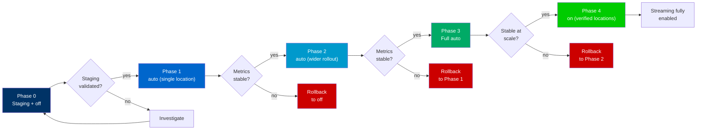

# Streaming Rollout Cookbook

This guide describes how to safely enable the true streaming conversion engine
introduced in v0.8.0 using a phased rollout approach.  Each phase includes
configuration examples, verification steps, and decision criteria for
continuing, pausing, or rolling back.

> **v0.8.0 context**: The streaming engine now performs bounded-memory
> incremental conversion for large responses.  The default mode is `auto`,
> which selects streaming for eligible responses above the
> `markdown_stream_threshold` (default `1m`).  Setting
> `markdown_streaming off` produces behavior identical to 0.7.x.

---

## Prerequisites

- NGINX built with the Markdown module (streaming is compiled in by default
  since v0.8.0; no separate feature flag required at build time)
- Rust converter library compiled with the `streaming` feature
- Metrics endpoint enabled (`markdown_metrics;` in a location block)
- Familiarity with new directives (see [MIGRATION-0.8.md](MIGRATION-0.8.md))

---

## Staged Rollout Strategy

The recommended rollout follows a conservative progression: start with
streaming disabled, validate in staging, enable `auto` for low-risk paths,
then gradually widen.



### Phase Overview

| Phase | Configuration | Purpose |
|-------|--------------|---------|
| 0 | `markdown_streaming off` | Upgrade safely; validate staging |
| 1 | `auto` for one low-risk location | Canary streaming on a single path |
| 2 | `auto` for multiple locations | Gradual rollout |
| 3 | `auto` everywhere (default) | Full auto-mode deployment |
| 4 | `on` for verified locations | Force streaming for known-good paths |

### Phase 0: Upgrade with Streaming Disabled

Start the upgrade with streaming explicitly off.  This ensures zero behavioral
change from 0.7.x while you validate the new binary in staging.

```nginx
http {
    # Disable streaming — identical to 0.7.x behavior
    markdown_streaming off;

    server {
        location / {
            markdown_filter on;
            proxy_pass http://backend;
        }
    }
}
```

**Validation**:
- Run `nginx -t` to confirm deprecated directives are removed
- Verify full-buffer conversion works as before
- Check metrics endpoint returns streaming counters at zero

**Proceed when**: Staging is green for at least one deploy cycle.

### Phase 1: Single Location with Auto Mode

Enable `auto` for a single, low-risk location.  Auto mode only activates
streaming for responses meeting the size threshold.

```nginx
location /docs/ {
    markdown_filter on;
    markdown_streaming auto;
    markdown_stream_threshold 1m;
}

location / {
    markdown_filter on;
    markdown_streaming off;
}
```

**Verification**:
```bash
# Check streaming candidates and selections (JSON)
curl -s -H 'Accept: application/json' \
  http://localhost/markdown-metrics | \
  python3 -c "import sys,json; d=json.load(sys.stdin); \
  s=d.get('streaming',{}); \
  print(f\"requests={s.get('requests_total',0)}\"); \
  print(f\"succeeded={s.get('succeeded_total',0)}\")"

# Check for fallbacks
curl -s -H 'Accept: application/json' \
  http://localhost/markdown-metrics | \
  python3 -c "import sys,json; d=json.load(sys.stdin); \
  print(f\"fallback={d.get('streaming',{}).get('fallback_total',0)}\")"
```

**Decision thresholds**:

| Metric | Continue | Pause | Rollback |
|--------|----------|-------|----------|
| Streaming success rate | ≥ 99.9% | < 99.5% | < 99% |
| Pre-commit fallback rate | ≤ 1% | > 5% | > 10% |
| Post-commit failure rate | ≤ 0.01% | > 0.01% | > 0.1% |

**Proceed when**: Metrics stable for ≥ 1 hour of production traffic.

### Phase 2: Wider Rollout

Expand `auto` to additional locations. The streaming policy is a fixed
configuration value; it does not accept NGINX variables. For percentage
rollout, use `split_clients` to gate `markdown_filter`, which is
variable-capable, while keeping the streaming policy explicit:

```nginx
split_clients $request_id $markdown_canary {
    20%  on;
    *    off;
}

server {
    markdown_streaming auto;
    location / {
        markdown_filter $markdown_canary;
    }
}
```

### Phase 3: Full Auto Mode

Remove per-location overrides and let the default `auto` apply everywhere:

```nginx
http {
    markdown_filter on;
    markdown_streaming auto;
    markdown_stream_threshold 1m;

    server {
        location / {
            proxy_pass http://backend;
        }
    }
}
```

### Phase 4: Force Streaming for Verified Locations

For locations where streaming is proven safe and you want to bypass the
threshold check, set `force` explicitly:

```nginx
location /large-api/ {
    markdown_filter on;
    markdown_streaming force;
}
```

> **Note**: `force` selects streaming for all eligible responses regardless of
> size.  Only use this for paths where streaming behavior is fully validated.
> High-risk locations should remain at `auto` or `off`.

### Alternative Rollout Strategies

#### By Host

```nginx
server {
    server_name default.example;
    markdown_streaming off;
}

server {
    server_name canary.example staging.example;
    markdown_streaming auto;
}
```

#### By Header (canary flag)

```nginx
map $http_x_canary $markdown_canary {
    default  off;
    "true"   on;
}

server {
    markdown_filter $markdown_canary;
    markdown_streaming auto;
}
```

#### By User-Agent

```nginx
map $http_user_agent $markdown_bot {
    default                off;
    "~*GPTBot"             on;
    "~*ClaudeBot"          on;
}

server {
    markdown_filter $markdown_bot;
    markdown_streaming auto;
}
```

---

## Monitoring Guidance

Effective monitoring during streaming rollout requires watching three signal
categories: engine selection decisions, pre-commit safety, and post-commit
health.  All metrics are exposed at the `/markdown-metrics` endpoint in
both Prometheus and JSON formats.

For the complete metrics reference, see
[Streaming Observability](../features/streaming-observability.md) and
[Prometheus Metrics Guide](prometheus-metrics.md).

### Key Metrics (What Matters vs What's Noise)

| Metric | What It Tells You | Actionable? |
|--------|-------------------|-------------|
| `nginx_markdown_streaming_fallback_total{phase,action}` | Pre-commit fallbacks — streaming could not handle content before committing headers | **Yes** — high rate means streaming is ineffective |
| `nginx_markdown_streaming_failure_total{phase,action}` | Post-commit failures — headers already sent, client may see truncation | **Yes** — any sustained rate is critical |
| `nginx_markdown_streaming_engine_choice_total{engine}` | Which engine was selected for each request | **Yes** — confirms streaming is actually engaged |
| `nginx_markdown_streaming_candidate_total` | How many requests were evaluated for streaming | **Denominator** — needed for rate calculations |
| `nginx_markdown_true_streaming_selected_total` | Requests that completed streaming engine selection | **Denominator** — confirms selection funnel |
| `nginx_markdown_streaming_output_bytes_total` | Total Markdown bytes emitted via streaming | Informational — useful for throughput dashboards |
| `nginx_markdown_excluded_content_type_total` | Requests excluded by content type list | Informational — usually expected and stable |

### Health Thresholds and Alerting

| Condition | Threshold | Action |
|-----------|-----------|--------|
| Fallback rate | > 5% of candidates | Investigate — check reason codes in info-level logs |
| Post-commit failure rate | > 1% of streaming requests | Consider rollback — clients may receive truncated responses |
| Memory budget exceeded | `precommit_budget` or `postcommit_budget_exceeded` trending up | Tune `markdown_stream_precommit_buffer` or `markdown_parser_budget` |
| Zero streaming selections | `engine_choice{engine="streaming"}` stays 0 with traffic | Check `markdown_streaming` directive and `markdown_stream_threshold` |
| Streaming success rate | < 99% | Pause rollout and investigate |

### Prometheus Queries (PromQL)

Copy-paste these into Grafana or your Prometheus UI.

**Streaming selection rate** (what fraction of candidates become streaming):

```promql
rate(nginx_markdown_true_streaming_selected_total[5m])
  / rate(nginx_markdown_streaming_candidate_total[5m])
```

**Pre-commit fallback rate** (safe failures — original HTML served):

```promql
sum(rate(nginx_markdown_streaming_fallback_total[5m]))
  / rate(nginx_markdown_streaming_candidate_total[5m])
```

**Post-commit failure rate** (critical — client sees truncation):

```promql
sum(rate(nginx_markdown_streaming_failure_total[5m]))
  / rate(nginx_markdown_true_streaming_selected_total[5m])
```

**Engine choice breakdown** (pie chart or stacked graph):

```promql
sum by (engine) (rate(nginx_markdown_streaming_engine_choice_total[5m]))
```

**Fallback breakdown by action** (pass-through vs rejection):

```promql
sum by (action) (rate(nginx_markdown_streaming_fallback_total[5m]))
```

**Post-commit failure breakdown** (abort vs safe_finish):

```promql
sum by (action) (rate(nginx_markdown_streaming_failure_total[5m]))
```

**Alert rules** (Prometheus alerting):

```yaml
groups:
  - name: streaming_rollout
    rules:
      - alert: StreamingFallbackRateHigh
        expr: |
          sum(rate(nginx_markdown_streaming_fallback_total[5m]))
          / rate(nginx_markdown_streaming_candidate_total[5m])
          > 0.05
        for: 5m
        labels:
          severity: warning
        annotations:
          summary: "Streaming fallback rate exceeds 5%"
          description: >-
            Check reason codes in info-level logs.
            Consider adjusting markdown_stream_threshold or investigating HTML issues.

      - alert: StreamingPostCommitFailures
        expr: |
          sum(rate(nginx_markdown_streaming_failure_total[5m]))
          / rate(nginx_markdown_true_streaming_selected_total[5m])
          > 0.01
        for: 2m
        labels:
          severity: critical
        annotations:
          summary: "Streaming post-commit failure rate exceeds 1%"
          description: >-
            Non-recoverable errors. Clients may receive truncated output.
            Consider rolling back with markdown_streaming off.
```

### JSON Metric Queries (curl)

The metrics endpoint supports JSON via the `Accept` header.

**Get all streaming metrics**:

```bash
curl -s -H 'Accept: application/json' http://localhost/markdown-metrics | \
  python3 -c "import sys,json; print(json.dumps(json.load(sys.stdin)['streaming'], indent=2))"
```

**Compute fallback rate**:

```bash
curl -s -H 'Accept: application/json' http://localhost/markdown-metrics | \
  python3 -c "
import sys, json
d = json.load(sys.stdin)['streaming']
candidates = d.get('candidate_total', 0)
fallbacks = d.get('fallback_total', 0)
rate = (fallbacks / candidates * 100) if candidates > 0 else 0
print(f'fallback_rate={rate:.2f}% ({fallbacks}/{candidates})')
"
```

**Compute post-commit failure rate**:

```bash
curl -s -H 'Accept: application/json' http://localhost/markdown-metrics | \
  python3 -c "
import sys, json
d = json.load(sys.stdin)['streaming']
succeeded = d.get('succeeded_total', 0)
failed = d.get('failed_total', 0)
total = succeeded + failed
rate = (failed / total * 100) if total > 0 else 0
print(f'postcommit_failure_rate={rate:.2f}% ({failed}/{total})')
"
```

**Check engine choice distribution**:

```bash
curl -s -H 'Accept: application/json' http://localhost/markdown-metrics | \
  python3 -c "
import sys, json
d = json.load(sys.stdin)['streaming']
print(f'streaming:    {d.get(\"engine_choice_streaming\", 0)}')
print(f'full_buffer:  {d.get(\"engine_choice_full_buffer\", 0)}')
"
```

**Scrape Prometheus format and filter streaming metrics**:

```bash
curl -s -H 'Accept: text/plain; version=0.0.4' \
  http://localhost/markdown-metrics | \
  grep -E '^nginx_markdown_streaming_'
```

### Reason Code Interpretation

When a streaming decision is made, a reason code is recorded in the
structured log and reflected in metrics.  Use these to diagnose why
requests are not streaming or why fallbacks occur.

| Code | Engine Path | Meaning | Operator Action |
|------|-------------|---------|-----------------|
| `eligible` | streaming | Request eligible for true streaming | None — healthy |
| `content_length_known` | full_buffer | Content-Length present, below `markdown_stream_threshold` | Expected for small responses |
| `below_threshold` | full_buffer | Response size below `markdown_stream_threshold` | Tune `markdown_stream_threshold` if too conservative |
| `config_disabled` | full_buffer | Streaming disabled by configuration | Expected when `off` is set |
| `excluded_content_type` | passthrough | Excluded by `stream_types` list | Check configuration if unexpected |
| `precommit_html_error` | fallback | HTML parse error in pre-commit phase | Investigate upstream HTML quality |
| `precommit_budget` | fallback | Memory budget exceeded pre-commit | Increase `markdown_stream_precommit_buffer` or `markdown_parser_budget` |
| `precommit_timeout` | fallback | Parse timeout pre-commit | Increase `markdown_parse_timeout`; investigate complex pages |
| `postcommit_parse_error` | failure | Parse error after headers sent | **Critical** — investigate content; exclude affected paths |
| `postcommit_budget_exceeded` | failure | Budget exceeded after commit | **Critical** — increase `markdown_parser_budget`; consider rollback |
| `postcommit_io_error` | failure | I/O error after commit | **Critical** — check upstream connectivity |

### What "Healthy" Looks Like Per Rollout Phase

**Phase 0 (Shadow Mode)**:
- `nginx_markdown_streaming_candidate_total` incrementing steadily
- Shadow diff rate ≤ 0.1%
- No error-level streaming log entries
- Engine choice metrics show candidates being evaluated

**Phase 1 (Single Location / Canary)**:
- `nginx_markdown_streaming_engine_choice_total{engine="streaming"}` > 0 and growing
- Fallback rate < 5% of candidates
- Post-commit failure rate = 0% (ideally)
- Reason codes in logs are predominantly `eligible`
- `output_bytes_total` growing (streaming is producing output)

**Phase 2 (10% Traffic)**:
- All Phase 1 indicators remain stable under higher load
- Fallback rate stable (not increasing with traffic volume)
- No new post-commit failure patterns
- Engine choice distribution consistent with split ratio

**Phase 3 (50% Traffic)**:
- No degradation from Phase 2 metrics
- Memory budget reason codes (`precommit_budget`) remain rare (< 1%)
- Fallback actions are predominantly `pass` (safe) not `reject`
- Output bytes ratio confirms streaming is effective

**Phase 4 (Full Rollout)**:
- Fallback rate < 5% sustained
- Post-commit failure rate < 0.1% sustained
- No `postcommit_budget_exceeded` or `postcommit_io_error` trends
- Streaming success rate ≥ 99.9%
- Reason code distribution stable over 24+ hours

---

## Emergency Disable

If streaming causes problems in production, disable it immediately without
a full rollback of the binary upgrade.

### Quick Disable (per-location)

```nginx
location /problem-path/ {
    markdown_streaming off;
}
```

Then reload:
```bash
nginx -s reload
```

### Global Disable

```nginx
http {
    markdown_streaming off;
}
```

### Verification After Disable

```bash
# Wait 30 seconds, then verify streaming counters have stopped incrementing
sleep 30
curl -s -H 'Accept: application/json' http://localhost/markdown-metrics | \
  python3 -c "import sys,json; d=json.load(sys.stdin); \
  print(f\"selected={d.get('streaming',{}).get('requests_total',0)}\")"

# Run again after another 30 seconds — value should not increase
```

### When to Emergency Disable

| Symptom | Action |
|---------|--------|
| Post-commit failure rate > 0.1% | Disable immediately |
| Client-visible truncated responses | Disable immediately |
| Memory usage growing unbounded | Disable and investigate budget settings |
| Upstream timeouts correlated with streaming | Disable for affected locations |

---

## Rollback Decision Table

Use this table to map observed metrics, structured logs, and reason codes to
the appropriate operator action.

### Metrics → Action

| Observed Signal | Severity | Operator Action |
|----------------|----------|-----------------|
| `nginx_markdown_streaming_fallback_total` rising, `nginx_markdown_streaming_failure_total` stable | Low | Monitor; fallbacks are safe |
| `nginx_markdown_streaming_failure_total` rising | High | `markdown_streaming off` for affected locations |
| Post-commit failures in logs (`postcommit_parse_error`, `postcommit_budget_exceeded`, `postcommit_io_error`) | Critical | `markdown_streaming off` globally |
| `excluded_content_type_total` unexpectedly high | Info | Review `markdown_stream_excluded_types` configuration |
| Memory usage exceeds expectations | Medium | Reduce `markdown_stream_threshold` or lower budget |

### Reason Codes → Action

| Reason Code | Meaning | Action |
|-------------|---------|--------|
| `eligible` | Response entered streaming candidacy | Normal operation |
| `content_length_known` | Content-Length present, below threshold | Normal — full-buffer used |
| `below_threshold` | Response below `markdown_stream_threshold` | Normal — full-buffer used |
| `config_disabled` | Streaming off by configuration | Expected when `off` is set |
| `excluded_content_type` | Type in exclusion list | Expected for excluded types |
| `precommit_html_error` | HTML parse error before commit | Investigate content; fallback is safe |
| `precommit_budget` | Memory budget exceeded pre-commit | Consider raising budget or threshold |
| `precommit_timeout` | Parse timeout pre-commit | Investigate slow content; fallback safe |
| `postcommit_parse_error` | Parse error after headers sent | **Rollback** — client sees truncation |
| `postcommit_budget_exceeded` | Budget exceeded after commit | **Rollback** — client sees truncation |
| `postcommit_io_error` | I/O error after commit | **Rollback** — client sees truncation |

### Structured Log → Action

| Log Pattern | Action |
|-------------|--------|
| `reason="precommit_*"` | Safe — investigate but no rollback needed |
| `reason="postcommit_*"` | Rollback streaming for affected path |
| `reason="excluded_content_type"` repeated | Adjust exclusion list or ignore |
| `reason="config_disabled"` unexpected | Check configuration inheritance |

### Escalation Path

1. **Self-serve**: `markdown_streaming off` + reload
2. **Budget tuning**: Adjust `markdown_stream_threshold` or `markdown_stream_precommit_buffer`
3. **Support escalation**: If post-commit errors persist after disable, or if
   metrics show anomalies unrelated to streaming, escalate to module maintainers

---

## Safety Guarantees

- **No silent fallback**: Every streaming-to-fullbuffer fallback is recorded in
  the decision log and metrics (`nginx_markdown_streaming_fallback_total`).
- **No silent truncation**: Every post-commit error increments
  `nginx_markdown_streaming_failure_total` and logs a reason code.
- **Bounded memory**: The streaming engine enforces memory budgets at every
  phase.  Budget exhaustion triggers the configured error policy.
- **Graceful degradation**: Setting `markdown_streaming off` instantly
  reverts to the proven full-buffer path with zero behavioral change from 0.7.x.

---

## Reason Code Quick Reference

| Code | Phase | Meaning |
|------|-------|---------|
| `eligible` | Candidacy | Response eligible for true streaming |
| `content_length_known` | Candidacy | Content-Length present, below threshold |
| `below_threshold` | Candidacy | Response size below auto threshold |
| `config_disabled` | Candidacy | Streaming disabled by configuration |
| `excluded_content_type` | Candidacy | Excluded by stream type list |
| `precommit_html_error` | Pre-Commit | HTML parse error before commit |
| `precommit_budget` | Pre-Commit | Memory budget exceeded before commit |
| `precommit_timeout` | Pre-Commit | Parse timeout before commit |
| `postcommit_parse_error` | Post-Commit | Parse error after headers sent |
| `postcommit_budget_exceeded` | Post-Commit | Budget exceeded after headers sent |
| `postcommit_io_error` | Post-Commit | I/O error after headers sent |

---

## Common Scenarios

**Scenario: High fallback rate in Phase 1**
- Check logs for `precommit_html_error` or `precommit_budget` reason codes
- This indicates content that the streaming engine cannot handle before commit
- Fallbacks are safe — original HTML is served to the client
- Consider raising `markdown_stream_threshold` to reduce streaming candidates

**Scenario: Post-commit errors appearing**
- Check logs for `postcommit_*` reason codes
- These indicate errors after Markdown headers were already sent
- Client sees truncated output — this is a critical signal
- Disable streaming for the affected location immediately

**Scenario: Streaming engaged but no TTFB improvement**
- Verify responses actually exceed `markdown_stream_threshold`
- Check `markdown_stream_flush_min` — a high value delays first flush
- Lower `markdown_stream_flush_min` (e.g., `4k`) for latency-sensitive paths

**Scenario: Unexpected content types entering streaming**
- Review `markdown_stream_excluded_types` configuration
- Add problematic types to the exclusion list
- Built-in exclusions (`text/event-stream`, `application/x-ndjson`,
  `application/stream+json`) are always enforced

---

## Performance Optimization Rollback (0.9.1)

For rollback procedures specific to 0.9.1 performance optimizations (zero-copy
streaming output, streaming decompression routing), see the dedicated
[Performance Rollout and Rollback Guide](performance-rollout-091.md).

For profile comparison, tuning guidance, and deployment-pattern recommendations,
see the [Performance Profile Comparison and Tuning Guide](performance-profiles.md).

---

## Document Updates

| Version | Date | Author | Changes |
|---------|------|--------|---------|
| 0.9.1 | 2026-07-05 | Kiro  | Added 0.9.1 performance optimization rollback cross-reference |
| 0.8.3 | 2026-06-26 | Kang | No changes; version alignment with 0.8.3 release |
| 0.8.0 | 2026-06-16 | Kang  | Rewritten for v0.8.0 true streaming: updated directive names, added staged rollout strategy, monitoring guidance, emergency disable, rollback decision table |
| 0.8.0 | 2026-06-16 | Kang  | Expanded Monitoring Guidance: health thresholds, PromQL alert rules, JSON curl examples, reason code interpretation table, per-phase health indicators |
| 0.6.2 | 2026-05-08 | Kang | Unified version narrative to 0.6.2 current release line |
| 0.5.0 | 2026-04-21 | docs-standardization | Initial rollout cookbook with shadow mode phases |
