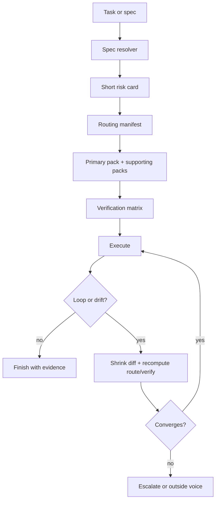
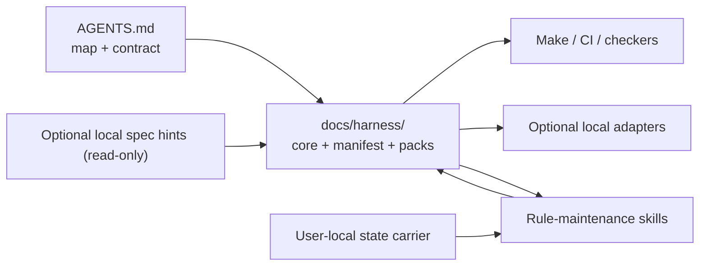

# Harness Overview

This directory is the repo-owned entrypoint for the spec-native harness.

Use it when you need to answer one of these questions quickly:

- what is the harness flow for a new task
- which risk pack owns the current change surface
- which checks are cheap blockers vs deeper validation
- where Kiro adapters should point instead of inventing local truth

Start here, then branch out:

| Need | Read |
|------|------|
| Overall workflow, conflict policy, and escalation rules | [core.md](core.md) |
| Canonical machine-readable routing source | [routing-manifest.json](routing-manifest.json) |
| Human-readable routing summary | [routing-manifest.md](routing-manifest.md) |
| Risk-pack index | [risk-packs/README.md](risk-packs/README.md) |
| System design and rationale for the harness itself | [../architecture/HARNESS_ARCHITECTURE.md](../architecture/HARNESS_ARCHITECTURE.md) |
| Contributor maintenance workflow for evolving harness rules | [../guides/HARNESS_MAINTENANCE.md](../guides/HARNESS_MAINTENANCE.md) |

## Harness Flow

## Truth Surfaces

## Guardrails

- `AGENTS.md` remains the Codex-first contract.
- `docs/harness/` owns reusable harness truth, not domain semantics already documented elsewhere.
- Optional local spec inputs are read-only and must not be used as a cache or
  annotation store for repository truth.
- Optional local adapter layers can summarize and link, but they do not define
  independent rules.
- Outside voice is advisory. A different model family can challenge the current path, but it does not overrule the user.

## Canonical References

- [../architecture/HARNESS_ARCHITECTURE.md](../architecture/HARNESS_ARCHITECTURE.md)
- [../guides/HARNESS_MAINTENANCE.md](../guides/HARNESS_MAINTENANCE.md)
- [../architecture/ADR/0005-repo-owned-harness.md](../architecture/ADR/0005-repo-owned-harness.md)
- [../architecture/README.md](../architecture/README.md)
- [../testing/README.md](../testing/README.md)
- [../DOCUMENTATION_DUPLICATION_POLICY.md](../DOCUMENTATION_DUPLICATION_POLICY.md)

## Optional Local Skill

For local agent workflows, a repo-tracked helper skill is available at:

- [../../skills/nginx-harness-maintenance/SKILL.md](../../skills/nginx-harness-maintenance/SKILL.md)
- Setup guide for contributors and local IDE/agent wiring:
  [../guides/HARNESS_SKILL_SETUP.md](../guides/HARNESS_SKILL_SETUP.md)

This skill is an execution choreographer only. It must route and verify against
repo-owned truth surfaces (`AGENTS.md`, `docs/harness/`, `tools/harness/`,
`Makefile`, CI), and must not redefine runtime semantics.
