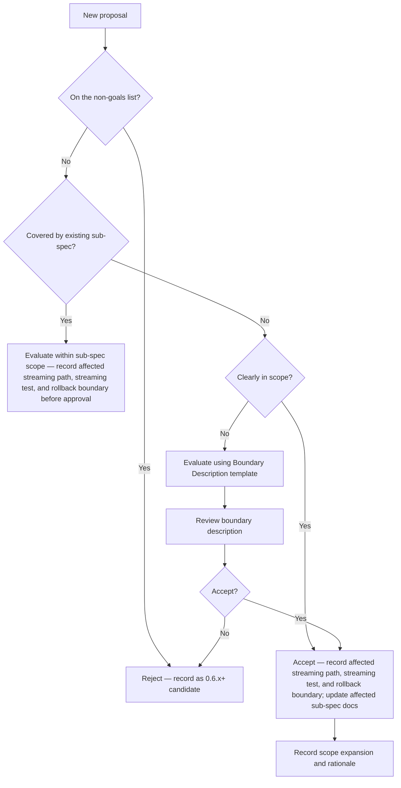

# 0.5.0 Scope Creep Evaluation Workflow

## Overview

This document defines the process for evaluating and rejecting out-of-scope proposals. It keeps the 0.5.0 release focused on the streaming architecture transition.

## Core Criterion

**Does the work directly serve the streaming mainline?**

All scope evaluations use this as the core criterion. The team must demote or
defer work that cannot demonstrate a strong coupling to the streaming mainline.
Direct service to the streaming mainline is a mandatory gate. A proposal
cannot reach approval until the reviewer records the affected streaming path,
test, and rollback boundary.

## Evaluation Flow

## Non-Goals List

The following topics are explicitly out of scope for 0.5.0 (referenced from `docs/project/release-gates-0-5-0.md`):

1. New output format negotiation: JSON, text/plain, MDX
2. OpenTelemetry / tracing platform integration
3. High-cardinality metrics or per-request analytics
4. apt/yum/brew package distribution, Helm, Kubernetes Ingress packaging
5. GUI / dashboard / control plane
6. Precise tokenizer integration
7. Parser ecosystem expansion unrelated to streaming
8. Content-aware heuristic pruning / readability-style extraction
9. Richer agent integrations / control-plane ideas

## Evaluation Rules

1. The evaluator must check any new proposal against the non-goals list
   **first**: a proposal matching the non-goals gets rejected immediately
   and recorded as a 0.6.x+ candidate before any sub-spec coverage check.
   Only proposals that do not match the non-goals proceed to the sub-spec
   coverage check against the 0.5.0 goal boundary. Check before work begins
2. The process rejects proposals matching non-goals and records them as 0.6.x+ candidates
3. Ambiguous proposals require evaluation using the Boundary Description template followed by review
4. The reviewer approves a proposal only after recording all three streaming evidence fields in the scope-expansion record (see the template below). The three fields are the affected streaming path, the streaming test, and the rollback boundary. A record missing any of the three fields does not authorize approval, regardless of the evaluation result
5. Approved scope expansions must record rationale and reflect in affected sub-spec documents
6. P1 items may ship but must not block the release. When P1 work threatens the release timeline, defer rather than block

## Scope Expansion Record Template

| Date | Proposal Description | Evaluation Result | Rationale | Affected Sub-Specs | Affected Streaming Path | Streaming Test | Rollback Boundary |
|------|---------------------|-------------------|-----------|-------------------|-------------------------|----------------|------------------|
| — | — | Accept/Reject | — | — | — | — | — |

## Document Updates

| Version | Date | Author | Changes |
|---------|------|--------|---------|
| 0.9.2 | 2026-08-24 | Kang | Existing-sub-spec evaluation branch now records affected streaming path, test, and rollback boundary before approval |
| 0.9.2 | 2026-08-15 | Kang | Three streaming evidence fields required before approval |
| 0.5.0 | 2026-04-21 | docs-standardization | Added update tracking section |
