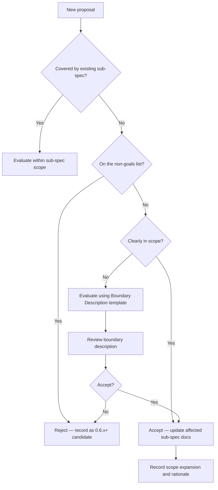

# 0.5.0 Scope Creep Evaluation Workflow

## Overview

This document defines the process for evaluating and rejecting out-of-scope proposals, ensuring the 0.5.0 release stays focused on the streaming architecture transition.

## Core Criterion

**Does the work directly serve the streaming mainline?**

All scope evaluations use this as the core criterion. Work that cannot demonstrate a strong coupling to the streaming mainline must be demoted to P1 or deferred.

## Evaluation Flow

## Non-Goals List

The following topics are explicitly out of scope for 0.5.0 (referenced from `docs/project/release-gates-0-5-0.md`):

1. New output format negotiation: JSON, text/plain, MDX
2. OpenTelemetry / tracing platform integration
3. High-cardinality metrics or per-request analytics
4. apt/yum/brew package distribution, Helm, Kubernetes Ingress packaging
5. GUI / dashboard / control plane
6. Precise tokenizer integration
7. Parser ecosystem expansion unrelated to streaming
8. Content-aware heuristic pruning / readability-style extraction
9. Richer agent integrations / control-plane ideas

## Evaluation Rules

1. Any proposal not covered by an existing sub-spec must be evaluated against the 0.5.0 goal boundary and non-goals list before work begins
2. Proposals matching non-goals are rejected and recorded as 0.6.x+ candidates
3. Ambiguous proposals require evaluation using the Boundary Description template followed by review
4. Approved scope expansions must record rationale and be reflected in affected sub-spec documents
5. P1 items may ship but must not block the release; when P1 work threatens the release timeline, defer rather than block

## Scope Expansion Record Template

| Date | Proposal Description | Evaluation Result | Rationale | Affected Sub-Specs |
|------|---------------------|-------------------|-----------|-------------------|
| — | — | Accept/Reject | — | — |
